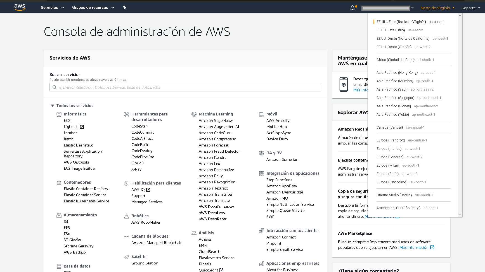
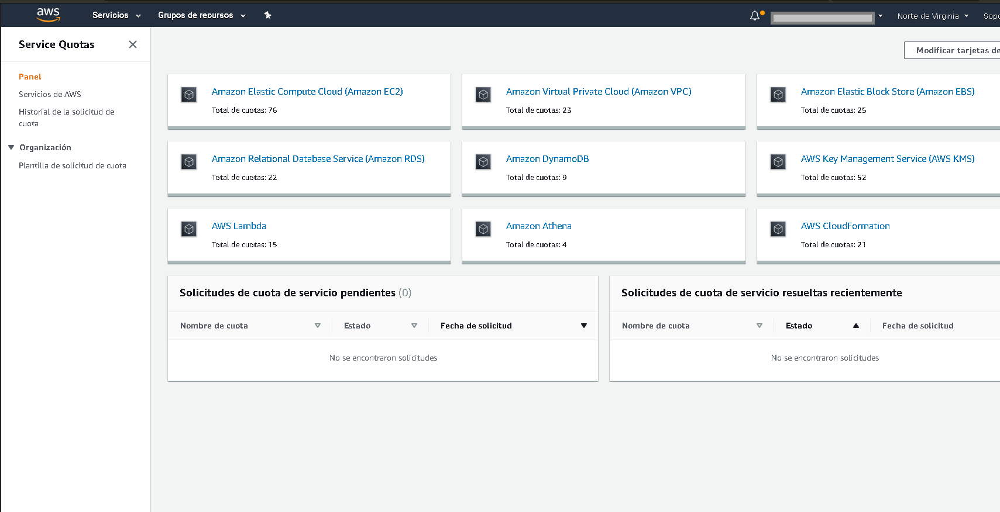
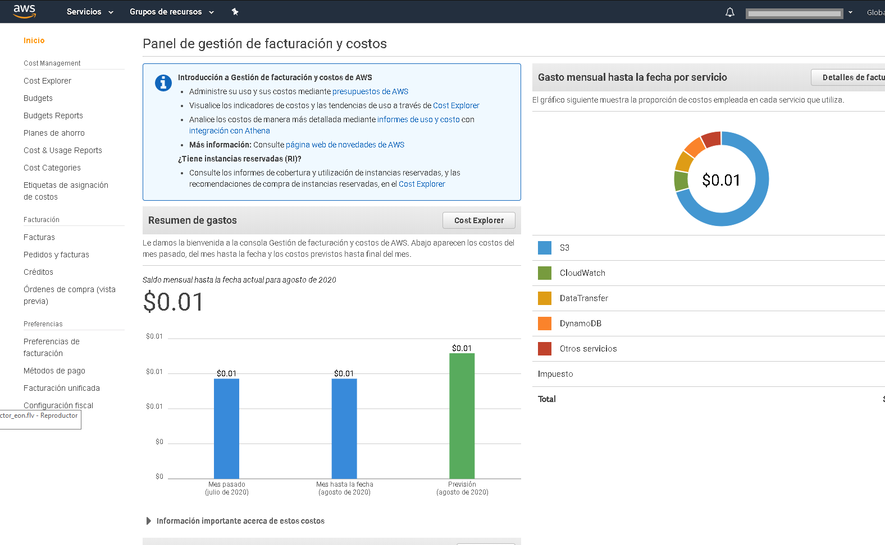
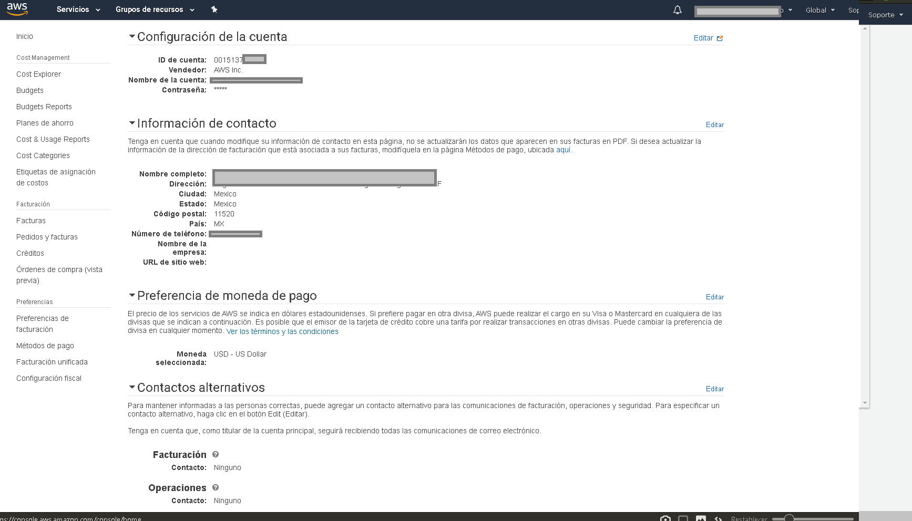
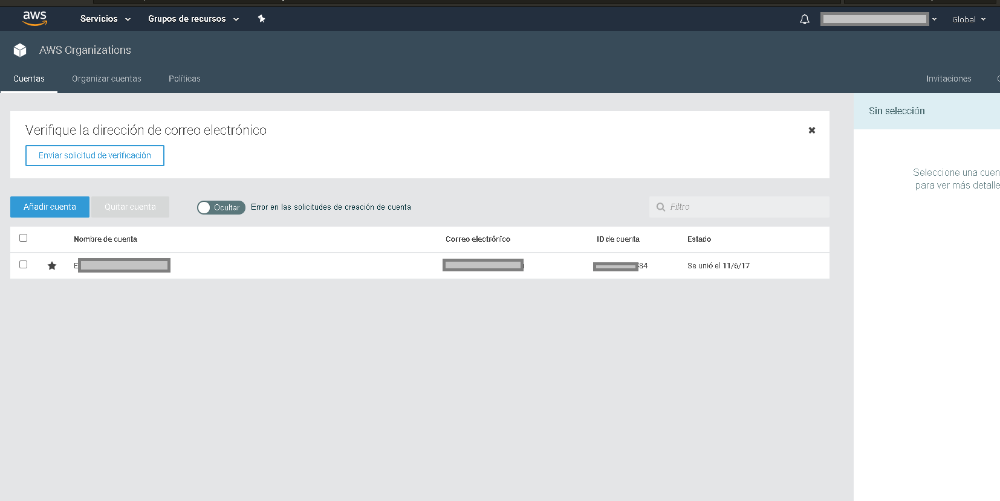
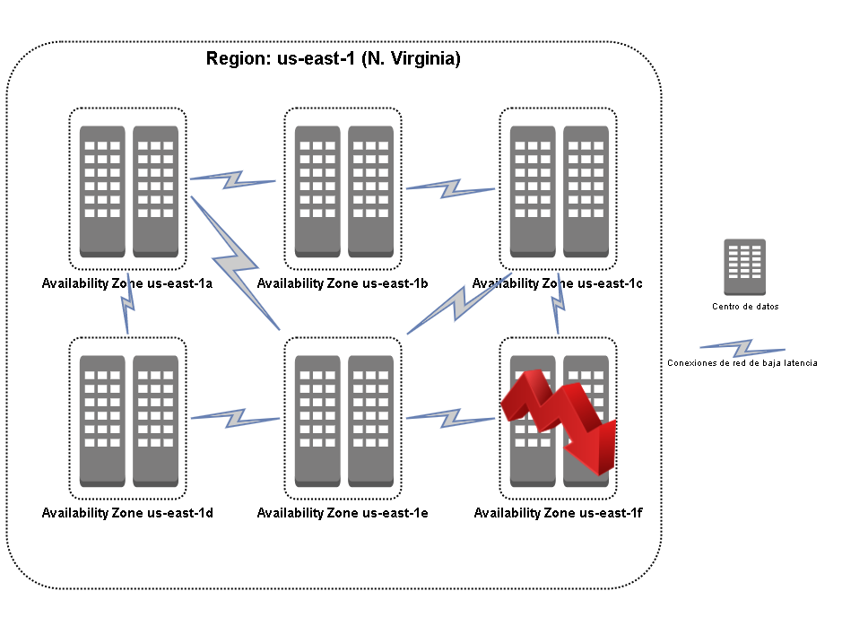
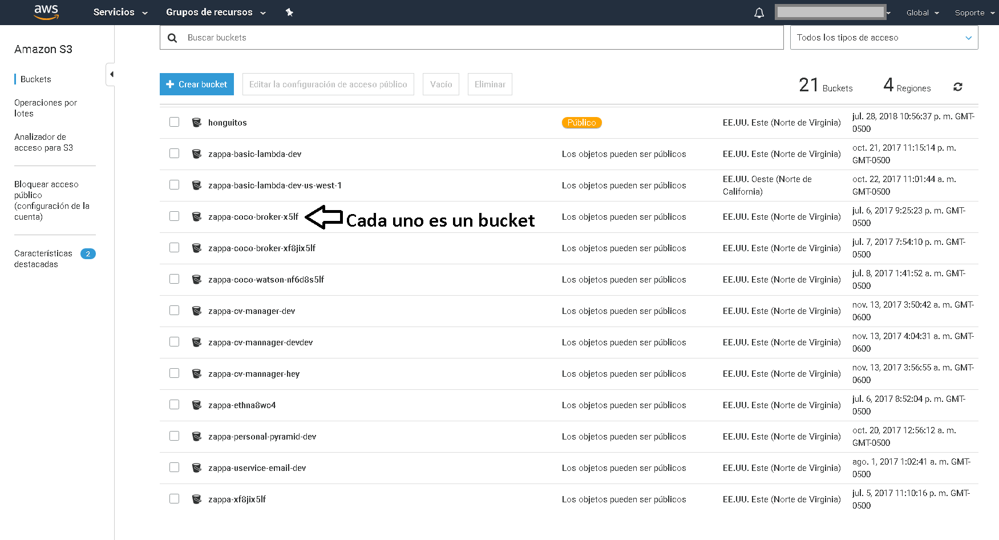
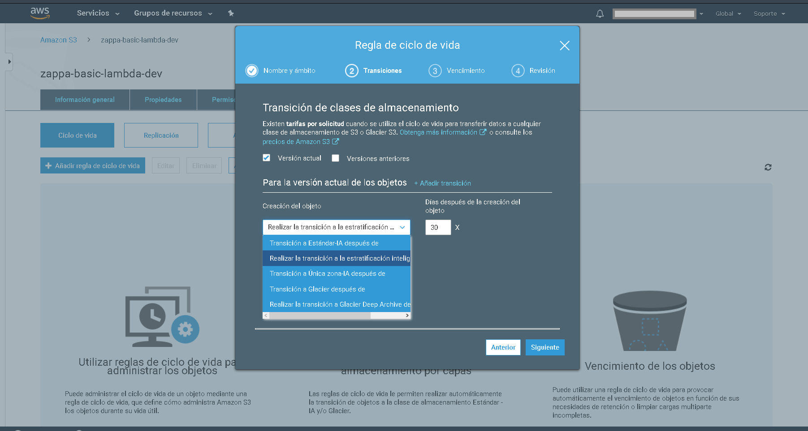
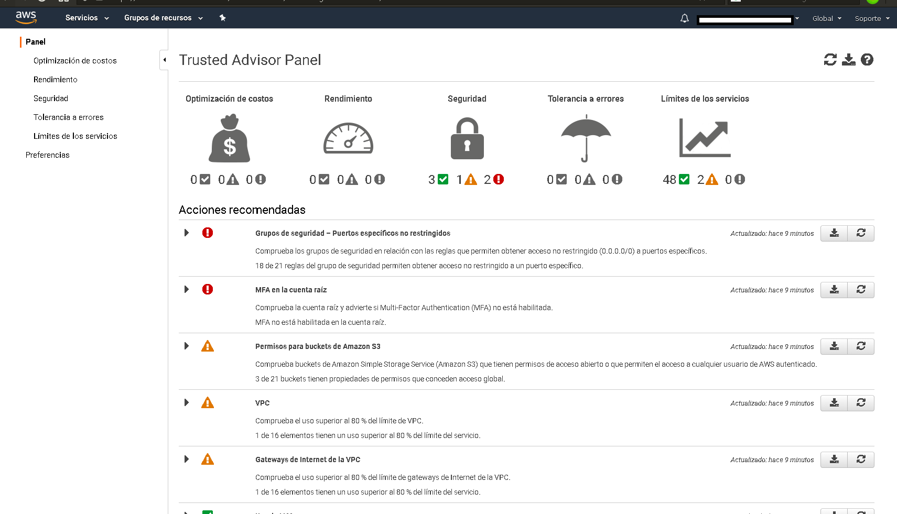
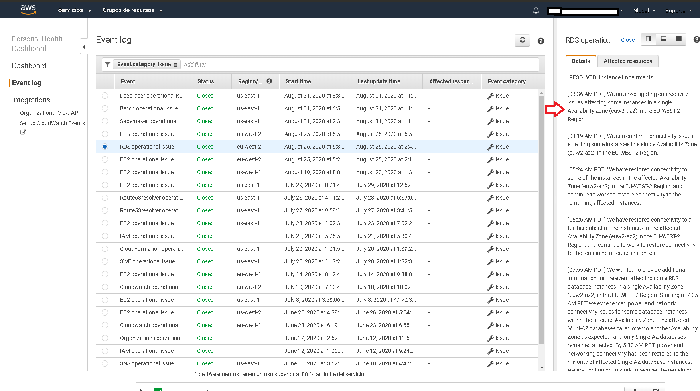

# ¿Por que AWS?

# Interactuando con AWS y configuración de cuentas

# AWS Console, AWS CLI & AWS SDK
En general podemos interactuar con los recursos y servicios que brinda AWS de 3 modos distintos. 

## AWS Console: 
Para la gente visual, esta es la forma mas natural para tener un primer acercamiento con AWS, puedes entral al [portal web](console.aws.amazon.com/) de la consola de AWS y acceder para ver y gestionar los diferentes recursos que ofrece AWS.

Esta es la apariencia que tiene la consola de administración de AWS hasta Agosto del 2020.

El elemento principal de la consola es buscador de los servicios que ofrece, sin el buscador es fácil perderse entre los 175 que se ofrecen.
Desde aquí se pueden manejar: 

- Cuotas: Hay servicios de AWS que tienen límites predefinidos, por ejemplo con las instancias de máquinas virtuales (EC2) son [estos](https://docs.aws.amazon.com/AWSEC2/latest/UserGuide/ec2-on-demand-instances.html#ec2-on-demand-instances-limits).
, desde esta sección se puede apelar a aumentar las cuotas de los servicios si la operación de la organización así lo requiere. Es importante señalar que hay cuotas de tipo `soft` que pueden ser cambiadas solicitanto a AWS un aumento y de tipo `hard` que no pueden ser cambiadas. [Por ejemplo](https://docs.aws.amazon.com/mediapackage/latest/ug/live-quotas.html).

- Facturación: Tener visibilidad de los costos, presupuestos y métodos de pago es muy importante para la correcta gestión y estrategia en los activos de TI hospedados en AWS
. Aquí hay mucha ayuda visual sobre la cantidad de ninero gastada mes a mes, se puede entrar al detalle de la factuación para saber cuánto dinero es gastado por cada recurso de AWS, se pueden establecer presupuestos y alarmas si es que dichos presupuestos se rebasan, tambien puedes configurar el envpio de reportes con detalle para personas de tu organización en intervalos definidos.

- Configuración de la cuenta: Hay datos propios de la cuenta como nombre del propietario de al cuenta, algunos datos personales como teléfono y dirección, gestión de contraseña.

- Organizaciones: AWS provee los mecanismos necesarios para el manejo de múltiples cuentas centralizadamente.
. Puedes por ejemplo manejar desde ahi las cuentas de tus clientes si provees algun servicio de consultoría, así tus clientes no tienen que darte acceso a su cuenta principal.

## AWS CLI

También existe la opción de manejar los recursos de AWS por medio de línea de comandos  disponible para los sistemas [operativos mas comunes](https://docs.aws.amazon.com/cli/latest/userguide/install-cliv2.html), es cómodo usar la línea de comandos ante tareas repetitivas que exijan automatización, ¿tienes que descargar archivos a diario desde S3?, puedese generar un script de linea de comandos que lo haga por ti, así no tienes que preocuparte por entrar a la consola web que tiende a ser mas lento el proceso.

# AWS SDK
Para los programadores tanbién hay opcion de manejar los servicios de AWS desde su [lenguaje de programación](https://aws.amazon.com/es/tools/) de preferencia, Ruby, Python, PHP, Node.js, .NET, JavaScript, C++, Go y Java son los lenguajes soportados. ¿Cómo lo puedo usar?, Puedese generar una aplicación web que en lugar de guardar las imágenes de las identificaciones de los usuarios en el disco duro del servidor las quieras guardar directamente en el servicio de S3 de AWS.

# Infraestructura Global de AWS (AWS Regions, Availability Zones, AWS Edge Locations, and Local Zones)

El concepto de nube puede sonar un tanto abstracto, pero al final no hay que dejar de recordar que son un conjunto de máquinas agrupadas en un edificio en algún lugar del planeta.

Amazon Web Services tiene centros de datos lleno de servidores por todo el planeta buscando brindar a los usuarios disponibilidad, rendimiento, escalabilidad, y flexibilidad.

Los conceptos claves que nos ayudarán a comprender como AWS tiene distribuidos todos sus servidores por el mundo son:
- Zonas de disponibilidad:
Los distintos centros de datos de Amazon por el mundo los agrupa en zonas de disponibilidad, las zonas de disponibilidad se encuentran físicamente muy cercanas unas de otras formando pequeñas agrupaciones. Cada zona de siponibilidad puede constar de mas de un centro de datos, cada zona de disponibilidad se comunica con otras zonas de diponiblidad por medio de enlaces de baja latencia.
La razón de sergmentar una zona de disponibilidad en varios centros de datos con algunos kilómetros de distancia es ser resilientes ante un desastre naturales, falla de energía eléctrica, atentados, o algún otro inconveniente, más adelante veremos que podemos maximizar la tolerancia a fallos de nuestros aplicativos si los alojamos en mas de una Zona de disponibilidad.

- Regiones: 
Son puntos geográficos distantes donde se agrupan varias zonas de disponibilidad.
AWS ocupa actualmente 245 países con 24 regiones lanzadas, anunciadas 3 por lanzar en Indonesia, Japón y España.

- Local Zones:
Aún en una etapa temprana de desarrollo, solo se eunuentra una local zone disponible en Los Angeles California, pretende proveer servicios de baja latencia a usuarios finales acercando la infraestructura de AWS sin necesidad de tener una zona de disponibilidad cercana.

- Wavelength:
Ofrecerá acceso ópimo en latencia a recursos de AWS por medio de redes 5G. Aún es un servicio muy cerrado a los Estados unidos de América.

- Edge locations:
Son centros de datos manejados por partners certificados de AWS que tiene conexion directa a la infraestructura de AWS. Es usado por los servicios como ROute53 (servicio de DNS), CloudFront (Content Delivery Network) y API Gateway (Creación publicacion y mantenimiento de API). La idea es proporcionar baja latencia a los usaurios finales no importando si se encuentran cerca de una región de AWS.

Ejemplo de las zonas de disponibilida de la región 1, en ella se aprecian las zonas de disponibilidad (conunto de centros de datos) conectadas por redes de baja latencia. Así si la zona de disponibilidad us-east-1f tiene bajo performance por fallas por energía eléctrica nuestras aplicaciones pueden seguir operando si están distribuidas en mas de una zona de disponibilidad. Algunos servicios como RDS te obligan al [provisionar](www.redhat.com/en/topics/automation/what-is-provisioning) una base de datos con redes en dos zonas de disponibilidad como mínimo. 

### Nota: En general los servicios de AWS son muy resistentes a fallas, hay que evaluar bien si la aplicacion a ejecutar justifica el uso de recursos replicados en mas de una zona de disponibilidad, ya que los recursos replicados aunque no se usen al final cuestan prácticamente lo mismo que los recursos que si se estan utilizando, dicho de otro modo, la infraestructura total cuesta aproxiamdamente el doble.

En general todos los servicios que ofrece AWS son inherentes a una región específica, si deseas provisionar una servidor virtual (EC2) en China habrá que desplazarse en la consola AWS (o especificar en aws-cli o aws-sdk) a la región deseada. Aunque hay algunas excepciones, servicios como IAM (gestión de usuarios, políticas de acceso y permisos), Cloud CloudFront (Content Ddelivery Network) y S3 (Almacenamiento masivo de archivos) se consideran que no pertencen a ninguna región específica, son considerados servicios globales. 

# Servicios Centrales
Los siguientes servicios son centrales para tener una unidad de procesamiento computacional operando en AWS:

- IAM: Por un lado nos encontramos con Identity and Access Management, desde aquí se pueden configurar las cuentas que podrán acceder a la AWS Console y a la AWS CLI y AWS SDK, con ellas no solo controlamos la autorización (es decir que nos acrediten ser quienes decimos que somos), tambien controlamos la Autenticación (sabemos quien tiene acceso a hacer que cosa), esto es una herramienta clave (no es la única) a la hora de cumplir con regulaciones tanto internas como externas a nuestra organización como  [PCI DSS](https://www.pcisecuritystandards.org/pci_security/)
Los conceptos clave para entender IAM son:

* - Políticas (Policies): Responde a la pregunta ¿A qué debo dar permiso acceder?, una política define los `servicios` a los cuales se tendrá permitido acceder, las `acciones` que puede hacer en el servicio como lectura y/o escritura (cada servicio tiene su set de acciones permitidas), tambien se deben definir los `recursos`, los recursos especifican de manera muy granular dentro de un servicio (por ejemplo S3) que no se permita el acceso a todos los buckets de S3 existentes si no solo dar acceso a buckets muy específicos (aunque se puede dar acceso a todos) normalmente por medio del ARN del recurso (ejemplo del arn de un bucket real arn:aws:s3:::aws-athena-query-results-001513791584-us-east-1) y finalmente se especifican las `condiciones`, cuando una cuenta de consola, cli/sdk generan un acción (como leer un archivo) esta petición (`request`) lleva un contexto, es decir lleva juto con la accion información extra, en concreto La accion de la operación, el recurso, datos de entorno coo dirección ip, user agent, SSL y la hora y fecha. Con esos datos de contexto podemos definir por ejemplo que solo sea aplicable la política siempre que se quiera acceder al sistema desde una IP específica.
Así cuando se quiere escribir (acción) nuestro archivo en un bucket (recurso) de S3 (servicio) AWS verifica que estemos autenticados, después procesa el contxto de la petición para ver si la política debe aplicar o no, evalúa la política que será aplicada (se reevaluan las políticas ya que múltiples políticas pueden ser aplicadas a un mismo recurso), una vez hecho todo esto se determina si la accion es una accion autorizada, de no serlo se rechaza la ejecución.

* - Roles: No solo es posible conceder acceso a AWS por medio de credenciales específicas, se puede conceder acceso a entidades como otros servicios de AWS y Otras cuentas de AWS, el caso de uso: Tengo una lambda con la que quiero para tomar los archivos previamente alojados en S3 los procese y finalmente guarde todo en base de datos cada 15 minutos, podemos en ese caso diseñar un rol específico donde por medio de uan política asociada a ese rol le dé acceso al bucket de s3 muy concreto.

* - Usuarios (users): Básicamente es la representación de una persona on una aplicación. No es en el sentido estrictto un usuario, se puede ver como una entidad que puede acceder a un recurso de AWS ya sea por medio de la consola, del cli/sdk u ambos. AWS tambien llama a estas figuras `principals`

* - Grupos (groups) : Por buena práctica de seguridad deberíamos crear tantos usuarios como accesos por distintas entidades requieran acceso a nuestros recursos, lo que fácilmente se puede salir de control, por ello los grupos se vuelven una herramienta valiosa para que nos permite asocial políticas y usuarios (entiendase usuario al concepto anterior), en resumen, le podemos decir a AWS: "a este conjunto de usuarios necesito que le aplique esta o esta serie de políticas", el caso de uso: puedo generar un rol de auditor, donde a ese sol le asocio políticas necesarias para restringir el acceso a los recursos de AWS necesarios, despues puedo conceder acceso a varios de esos usuarios que deberían cada uno de ellos tener su propia cuenta de suaurio, así, en lugar de asociar una política (o varias) a cada usuario basta con solo asociar al usuario al grupo y en automático le aplicarían todas las políticas esocidas al grupo. Cabe señalar que los prupos no pueden contener a otros grupos, solamente usuarios, aunque un usuario si puede pertenecer a mpultiples grupos. Un grupo nunca accede de manera directa a los recursos de AWS, simplemente es uan entidad que ayuda a la administración de permisos.

# TODO Una ilustracion que ejemplifique estos conceptos

- VPC (Virtual Private Cluod):
Los recursos de AWS deben comunicarse unos con otros. Las maquinas virtuales ejecutadas por el servicio EC2, las funciones Lambda, las bases de datos de RDS son solo algunos ejemplos de servicios que requieren especificar una conexión de red para poder funcionar. 
El espacio donde se pueden configurar esas redes se conoce como VPC, que no es mas que una entidad lógica que contiene distintos componentes de red en una región dada.
Una región puede tener configuradas varias VPC, podemos configurar una VPC para cada departamento de una organizacón, así, tendríamos una VPC para todo el departamento financiero y una para todo el departamento de IT, ¿que se gana?, asilamiento, por defecto los recursos contenidos dentro de una VPC no pueden comuncarse, aunque si hay forma de hacerlo, si podemos establecer un  [AWS PrivateLink](https://aws.amazon.com/es/privatelink/) que en conjunto con un touter de AWS podemos redireccionar ese trafico subredes muy específicas, si ese tráfico aun queremos asegurarlo más podemos configurar las ACL (Network access control list) a una o varais subredes configurando el tiopde trafico que será permitido entrar y salir, si asún eso no es suficiente podemos a configurar un firewall más que opera a nivel de máquina virtual EC2 llamado security group.
Todo eso funciona cuando es trafico interno, pero cuando llegue el moment de comunicar servicios desde y hacia internet tenemos que agregar a nuestra VPC los llamados NAT gateways y los Internet Gateways, el primero hace posible comunicar recursos que se encuentran en una subred que no debe tener acceso directo a internet como pueden ser redes dedicadas de base de datos, de hecho la forma para hacer un asubred privada es que no tenga forma de routear tráfico hacia un Internet Gateway, Por otro lado un Internet Gateway es el mecanismo que da acceso desde internet hacia nuestros recursos mapeando 1:1 una IP pública [(Elastic IP)](https://docs.aws.amazon.com/vpc/latest/userguide/vpc-eips.html), el tráfico hacia internet también es gestionado por Internet Gateway. Sólo puede haber un solo Internet Gateway por VPC, AWS nos garantiza que no se convertirá en un cuello de botella o un punto único de falla ya que tras bambalidas el Internet Gateway es redundante y escalable.

En general forma en que se organizan las redes en AWS no es muy diferente a como se hacen en un centro de datos tradicional, en AWS esxiste el concepto análogo de subred sobre la cual podemos definir el espacio de direcciones IP [(CDIR)](https://whatismyipaddress.com/cidr) que nuestra red puede solventar.
Las subredes aqui tienen la particularidad que estan sociadas a una y solo una zona de disponiblidad, al generar las subredes habra que tener cuidado donde las creamos  y que niveles de alta disponibilidad deseamos y claro, que presupuesto tenemos por que los datos entre zonas de disponiblidad tienen costo pro GB en ambas direcciones.
Para la redirección y manejo del tráfico se cuentan en AWS con Routers, donde podemos definir reglas o rutas que determinan a donde será dirigido el tráfico.
Podemos comunicad nuestras subredes desde y hacia internet con NAT Gateway e Internet Gateway.
Podemos hacer uso para conectar una VPC con nuestras instalaciones por VPN con un  Virtual Private Gateway, habilitando así el acceso a la red híbrida conectando infraestructura propia con la nube brindando lo mejor de los dos mundos.

Para dejar mas claro los conceptos tocados, analicemos el siguiente diagrama de la Universidad de COrnell.

Podemos ver que la configuración tiene una VPC con mascara 22, lo que nos dice que podemos tener disponibles 1022 IP para host, esta VPC tiene si Internet Gateway para comunicar las redes publicas hacia internet y desde internet.
Ellos configuran 2 redes públicas (que pueden ser accedidas desde internet) y dos privadas (no pueden ser accedidas desde internet directamente), hay que notar que cada par está alojado en zonas de disponiblidad distintas, esto para brindar cierta tolerancia a fallos. 
Tambien tenemos las redes, cada una con un espacio de direcciones IP de 252 hosts ya que cada red tiene una mascara 24, con lo que podemos tener en cada red 252 dispositivos que necesiten una IP, no necesariamente tienen que ser 252 instancias, puede haber instancias que sean configuradas con 2 direcciones IP o mas.
También observamos el NAT gateway que reside en una red pública, con él las redes privadas tendrán acceso hacia internet, muchas veces apra configurar un servidor requerimos acceso a repositorios de software externos.
Finalmente tenemos un VPG (virtual private Gateway) que dá la flexibilidad de conectar por medio de una VPN las instalaciones de la propia universodad con AWS. 

¿Qué hacer y tomar en cuenta a la hora de construir una VPC?
Algo a tener en cuenta es que las VPC tienen un límite, AWS por defecto limita a 5 VPC por región por defecto, este límite se puede superar pero solo hasta 100 VPCs, de la misma forma, los bloques de direcciones IP  permitidos en cada VPC es un máximo de 50 sin poder aumentar este límite.
Al establecer el tamaño del bloque VPC y de las subredes se tiene que tomar en cuenta qu este valor ya no puede ser modificado, la VPC y las subredes ya se quedan con el numero de IP definidas desde la creación, así que si esperas un crecimiento rápido de recursos en tu VPC es mejor ser generoso con el bloque de direcciones IP.
Tomar en cuenta que las subredes pertenecen a una zona de disponibilidad, tome en cuenta a la hora de diseñar las subredes y tome en cuenta los costos asocuados a tener una arquitectura de Zona mpultiple.
No todas las redes deben tener acceso directo desde internet, hay que ser cuidadoso a la hora de configurar el routing para asegurar que las redes que queremos que sean privadas en realidad lo sean.
En la mayoría de los casos es buena práctica manejar multiples capas de acceso en la infraestructura, podemos tener una VPC para produccion, subdividida con una red públida destinada a los servodores web y otra subred privada para las bases de datos.

- S3 (`S`imple `S`torage `S`ervice):
EL servicio para guardado de datos prácticamente "infinito", de simple no tiene nada, es un servicio muy interesante donde podemos guardar gigas y gigas de archivos (tambien conocidos como objetos) sin necesidad de tener conectado este storage a ningún sistema operativo, simplemente con una conexion http podemo ahacer uso de él. Tiene un 99.999999999% de durabilidad de archivos por año, lo que quiere decir que si se almacenan 10000 objetos se espera en una perdida de un objecto cada 10,000,000 de años, aunque esto dependerá mucho de como configuremos nuestros buckets. 
Los buckets son la unidad lógica mínima donde guardaremos información, antede de poder guardar cualquier tipod e archivo debemos crear un bucket, a grandes rasgos podemos verlo como una carpeta con configuraciones bien definidas para cifrado, niveles de servicio, políticas de acceso, replicación, manejo del ciclo de vida de los archivos, esta útlima muy interesante, podemos definir cuando nuestros archivos pueden moverse a otros niveles de servicio de s3 en pro de reducir costos, ej: mueve todas las facturas del bucket a un nivel mas barato si en 90 días no se usan. 
S3 proporciona mecanismo para brindar almacenamiento en distintos niveles de servicio, podemos guardar archivos a precios mas baratos pero no ofrecería acceso de manera inmediata si no que puede tardar el acceso a los archivos desde varios minutos hasta varias horas, tambien podemos escoger una configuracion especial para guardar archivos sin replicación entre zonas de disponibilidad, por defecto S3 replica la información por medio de varias zonas de disponibilidad, de poner nuestros archivos en esta configuración se pueden poerder si es que AWS pediera por algún motivo la zona de desponibilidad donde se encuentran alojados. 

|                          Storage | Precio                   | Desempeño y latencia                        | Disponibilidad | Durabilidad   |
|---------------------------------:|--------------------------|---------------------------------------------|----------------|---------------|
| S3 Estándar                      | 0,023 USD por GB / Mes   | Baja latencia y alto nivel de procesamiento | 99,99%         | 99.999999999% |
| S3 Intelligent-Tiering           | 0.023 USD por GB / mes   | Mismo de S3 Estándard                       | 99.99%         | 99.999999999% |
| Estándar – Acceso poco frecuente | 0.0125 USD por GB / mes  | Mismo de S3 Estándard                       | 99.9 %         | 99.999999999% |
| S3 Única zona                    | 0.01 USD por GB / mes    | Mismo de S3 Estándard                       | 99.5%          | 99.999999999% |
| S3 Glacier                       | 0,004 USD por GB / mes   | Minutos u horas                             | 99.99%         | 99.999999999% |
| Glacier Deep Archive             | 0.00099 USD por GB / Mes | Horas                                       | 99.99%         | 99.999999999% |
| Reduced Redundancy Storage       | 0.024 USD por GB / Mes   | Mismo de S3 Estándard                       | 99.99%         | 99.99%        |

Los conceptos clave de la tabla anterior son durabilidad y disponibilidad, la primera refiere a la probabilidad de perder un objeto cada año, la segunda es el porcentaje de tiempo que un objeto será accesible en un año.

Ejemplos de buckets.

Transición a los distintos almacenamientos:

Un uso interesante ademas de guardar la sfacturas de nuestros clientes que por reglamentación oficial en México debemos tenerlas almacenadas por 5 años a bajo costo por ejemplo, es la posibilida de habilitar un bucket de S3 como un servidor web estático. Hay algunas consideraciones, para poder darle un dominio a ese bucket el DNS de nuestro dominio debe ser manejado por el servicio Route53, y para poder habilitar el certificado https debemos ahcer uso de AWS CloudFront. 

- EC2 y EBS
Elastic Compute Cloud, o EC2, es uno de los servicios de AWS enfocados en proveer una capa de cómputo a nuestras aplicaciones. EC2 en particular permite la creación de máquinas virtuales, también conocidas como instancias, a las cuales se les asigna una capacidad de cómputo específica en términos de la cantidad y tipos de CPU, la cantidad de memoria RAM y el espacio en disco para almacenamiento. 

Adicionalmente, EC2 permite seleccionar el sistema operativo que se desea instalar en la instancias y con esto entrega una máquina virtual completamente funcional en cuestión de segundos, sobre las cuales los usuarios podrán desplegar aplicaciones y servicios de la misma manera que lo harían en un servidor on-premise o en una máquina virtual desplegada en cualquier otro hipervisor

Las instancias EC2 requieren de una conexion de red en aws para funcionar... Aqui es donde tenemos que ya tener previamente clnfihurada nuestra VPC con las.subredes, grupos de seguridad, routing y niveles de disponibilidad necesarios antes de crear una maquina virtual.

Otro elemento fundamental en las instancias ec2 es el storage donde los datos serán alojados y el propio sistema operativo seran alojados. Este storage es conocido como elastic block storage Amazon EBS proporciona volúmenes de almacenamiento duraderos a nivel de bloque que puede adjuntar a una instancia en ejecución.  Puede utilizar Amazon EBS como dispositivo de almacenamiento principal para los datos que requieren actualizaciones frecuentes y granulares.  Por ejemplo, Amazon EBS es la opción de almacenamiento recomendada cuando ejecuta una base de datos en una instancia.

Un volumen de EBS se comporta como un dispositivo de bloque externo sin formato y sin formato que puede adjuntar a una sola instancia.  El volumen persiste independientemente de la vida útil de una instancia.  Una vez que se adjunta un volumen de EBS a una instancia, puede usarlo como cualquier otro disco duro físico.

Muchas instancias pueden acceder al almacenamiento desde discos que están conectados físicamente a la computadora host.  Este almacenamiento en disco se denomina almacén de instancias.  El almacén de instancias proporciona almacenamiento temporal a nivel de bloque para las instancias.  Los datos en un volumen de almacenamiento de instancias persisten solo durante la vida de la instancia asociada;  Si detiene o finaliza una instancia, se perderán los datos de los volúmenes del almacén de instancias.

# Todo desarrollar mas el concepto.

# Infraestructura, recursos y herramientas de soporte***
# Niveles y planes de AWS Support

El hecho de no contar con servidores físicos y evitar todo el mantenimiento que conlleva no quiere decir necesariamente que no necesitemos de algun respado o soporte en algun momento.
La nube de AWS cuenta con 175 servicios al momento, desde storage, redes, bases de datos, analitica, despliegue y desarrollo por mencionar algunas, por lo que no es difícil perderse en algún momento.

Todas las cuentas cuentan desde que son creadas cuentan con un plan Basic Support, donde puedes tener un soporte básico en la [documentacion](https://docs.aws.amazon.com/), y [foros de soporte](https://forums.aws.amazon.com/index.jspa).

También se cuenta con la herramienta Trust Advisor que nos da algunas recomendaciones y alertas en nuestra cuenta de AWS con restricciones si no se cuenta con un plan mas avanzado.

Tambien se cuenta con la herramienta [`Personal Health Dashboard`](https://aws.amazon.com/es/premiumsupport/technology/personal-health-dashboard/) que nos dice si hay problemas con los servicios de AWS y en que medida. 

En la siguiente imagen podemos observar que hay varios problemas que potencialmente pueden afectar a nuestra aplicación, ejemplo: si usamos un balanceador de carga y se reporta por parte de AWS en este panel que el servicio de balanceo de carga (Elastic Load Balancer) tiene pérdida de paquetes, no habrá mucho que podamos hacer pero por lo menos tendremos visibilidad de que puede estar fallando.

Los siguientes son los niveles de soporte ofrecidor pode AWS, cada uno nos da mas respaldo de el anterior, son: Developer,  BUssiness y Enterprise.
Si tu aplicativo es relacionado con la industria espacial, sistemas de aguas de una ciudad, sistema de un hospital tal vez requieras tiempos de asesoramiento técnico de menos de 4 horas, asesoría por parte de un experto en cuanto a arquitectura por mencionar algo tal vez el plan mas ideneo para este caso es Enterprise, aunque hay que tomar en cuenta que no es un servicio asequible, ya que tendrás que estar consumiendo por lo menos 150 000 USD o pagar 15 000 USD al mes para poder acceder a él.

Si tienes una aplicacion mas modesta donde es tolerable una falla de algunas horas no crítica para la organizacion, puedes optar por el nivel Bussiness, si facturas por lo menos 100 dólares al mes ya puedes obtenerlo.

### NOTA: no es difícil alcanzar 100 dólares de cuenta al final de mes, una instancia de RDS de base de datos, un servidor EC2 con 100 GB de storage y un bucket con algunas decenas de gigas rondan alrededor de 67 USD de gastos al mes. Esta aplicación no es una aplicación de alta demanda, es un portal web para alta y baja de personal.

A continuación se detalla.

|||||
|--- |--- |--- |--- |
||Desarrollador|Business|Enterprise|
||Se recomienda si está realizando pruebas en AWS.|Recomendado si tiene cargas de producción en AWS.|Recomendado si tiene cargas de trabajo críticas o empresariales en AWS.|
|Comprobaciones de prácticas recomendadas de AWS Trusted Advisor|7 comprobaciones principales|Conjunto completo de comprobaciones|Conjunto completo de comprobaciones|
|Soporte técnico mejorado|Acceso por email a los socios de soporte en la nube durante el horario comercial** Casos ilimitados, 1 contacto principal|Acceso por teléfono, email y chat a los socios de soporte en la nube las 24 horas y los 7 días de la semana Casos ilimitados, contactos ilimitados (compatible con IAM)|Acceso por teléfono, email y chat a los socios de soporte en la nube las 24 horas y los 7 días de la semana Casos ilimitados, contactos ilimitados (compatible con IAM)|
|Gravedad de los casos / plazos de respuesta*|Asesoramiento general: < 24 horas**  Fallo en el sistema: < 12 horas**|Asesoramiento general: < 24 horas  Fallo en el sistema: < 12 horas  Fallo en el sistema de producción: < 4 horas  Sistema de producción inactivo: < 1 hora|Asesoramiento general: < 24 horas  Fallo en el sistema: < 12 horas  Fallo en el sistema de producción: < 4 horas  Sistema de producción inactivo: < 1 hora  Sistema crítico para la empresa inactivo: < 15 minutos|
|Asesoramiento sobre arquitecturas|Aspectos generales|Contextualizado a sus casos de uso|Asesoramiento y revisión consultiva en función de sus aplicaciones|
|Administración de casos de programación||API de AWS Support|API de AWS Support|
|Soporte para software de terceros||Interoperabilidad, orientación sobre configuración y solución de problemas|Interoperabilidad, orientación sobre configuración y solución de problemas|
|Programas proactivos||Acceso a Infrastructure Event Management por una tarifa adicional|Infrastructure Event Management Revisiones de Well-Architected Revisiones de operaciones El director técnico de cuenta (TAM) coordina el acceso a los programas y otros expertos de AWS según sea necesario|
|Administración técnica de cuentas|||Director técnico de cuenta (TAM) asignado para que monitoree de forma proactiva el entorno y apoye con los asuntos relacionados con la optimización|
|Capacitación|||Acceso a laboratorios autoguiados online|
|Asistencia para cuentas|||Equipo de soporte Concierge|
|Precios|A partir de 29 USD al mes*** o bien 3 % del consumo mensual de AWS       Consulte los detalles sobre precios y un ejemplo.|A partir de 100 USD al mes*** o bien 10 % del consumo mensual dACe AWS para los primeros 0 a 10 000 USD 7 % del consumo mensual de AWS desde 10 000 hasta 80 000 USD 5 % del consumo mensual de AWS desde 80 000 hasta 250 000 USD 3 % del consumo mensual de AWS por encima de 250 000 USD Consulte los detalles sobre precios y un ejemplo.|A partir de 15 000 USD o bien, 10 % del consumo mensual de AWS para los primeros 0 a 150 000 USD 7 % del consumo mensual de AWS desde 150 000 hasta 500 000 USD 5 % del consumo mensual de AWS desde 500 000 hasta 1 000 000 USD 3 % del consumo mensual de AWS por encima de 1 000 000 USD Consulte los detalles sobre precios y un ejemplo.|

# Cloud Economics
# Creación de presupuestos con AWS Budget
# Organización y optimización de costos en AWS
# AWS TCO Calculator, AWS Simple Monthly Calculator & Cost Explorer