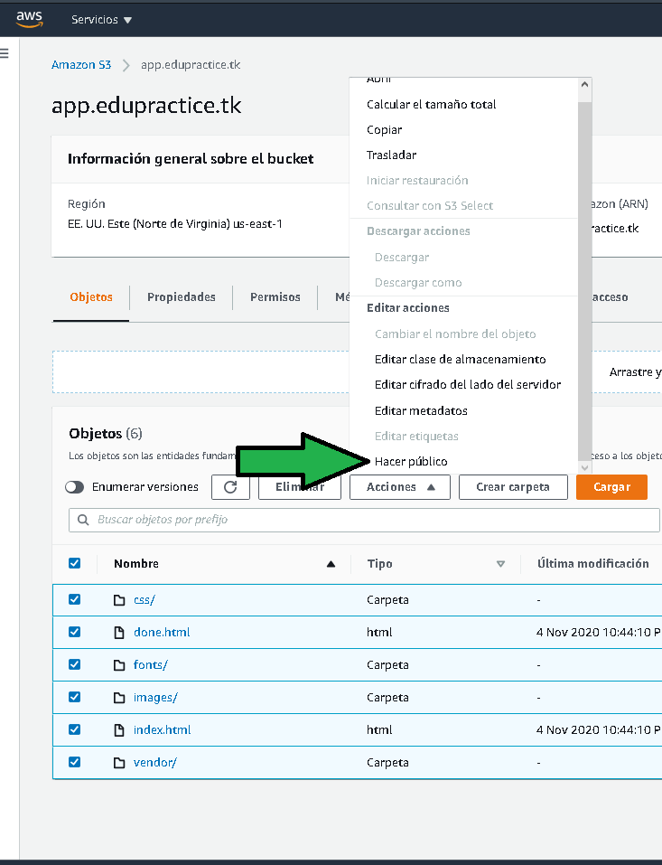
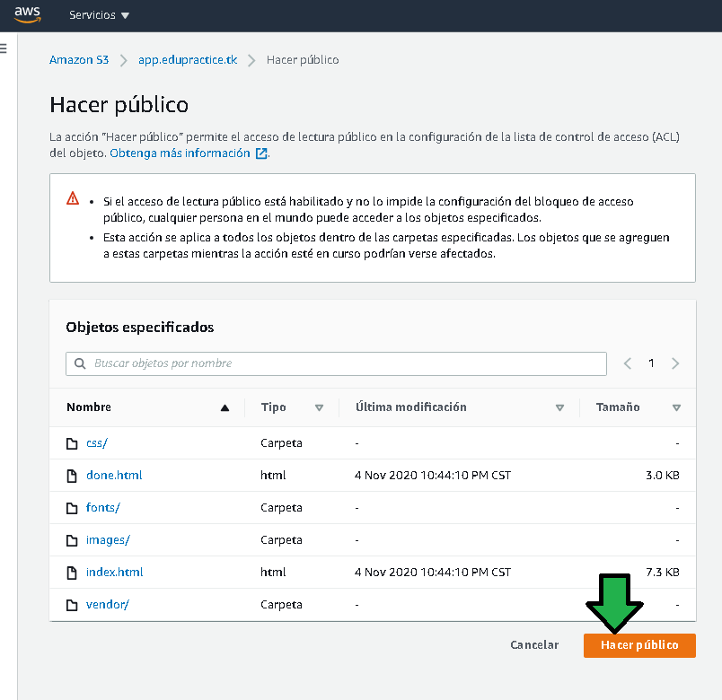

## Postwork Sesión 2

### 1. Objetivo :dart:
- Configurar un bucket S3 con un sitio estático servido por un nombre de dominio propio.

### 2. Requisitos :clipboard:
- AWS CLI instalado y funcionando. 
- Acceso a AWS Console.

### 3. Desarrollo :bookmark_tabs:
1. Generar un bucket con el nombre del subdominio donde será servido el sitio estático, para el ejemplo será
**app.edupractice.tk**

2. Copiar el contenido del sitio estático, para este ejemplo se copiará desde un bucket S3 ya existente.

3. Habilitar el bucket para servir como servidor web sitios estáticos.

 
 4. Configurar el DNS para que las peticiones sean resueltas hacia el bucket, habrá que generar un nuevo registro en la zona alojada
 
 

5. Click en "Crear un registro"

6. Seleccionar la política de redireccionamiento como "Direccionamiento sencillo"

7. Dar Click en "Definir un registro "

8. Generar el subdominio del registro, en este caso "app" el nombre del registro debe coincidir con el nombre del bucket (a), especificar que el registro debe resolver un bucket de S3 (b) , notar que es una funcionalidad no estándard de DNS, es una funcionalidad añadida por tener el DNS configurado con AWS. Especificar la Zona donde trabaja el bucket  (c),  us-east-1 para el ejemplo. Seleccionar el nombre del bucket destinado a servir como servidor web estático (d), deshabilitar la evaluación de estado del destino (e).

9. Observar como el registro generado con el subdominio redirigirá el tráfico no a una dirección IP como lo haría normalmente el protocolo DNS, lo hará a un bucket S3.

10. Se verifica la generación del registro. 

11. Pasados unos minutos al hacer ping se verá que el subdominio resuelve a una dirección IP.

12. Al ingresar al dominio por le navegador se nota un error:

Esto es por que aún falta dar permiso explícitamente a los archivos en el bucket, para lo que habrá que dirigirse a los archivos en AWS Console, seleccionar todos los archivos y seleccionar "Hacer público"

13. Confirmar el acceso público.

14. Felicidades, el bucket esta preparado para alojar el sitio web estático del proyecto. En el futuro bastará con reemplazar los archivos.

