## Sesión 2 - Ejemplo 1 - Usando AWS CLI

### 1. Objetivo :dart:
- Gestionar los recursos de AWS por línea de comandos con AWS CLI.

### 2. Requisitos :pushpin:
- Sistema operativo actualizado.
- Python 3.4+ instalado. [¿Cómo instalar?](https://aws.amazon.com/es/blogs/developer/deprecation-of-python-2-6-and-python-3-3-in-botocore-boto3-and-the-aws-cli/)
- Fecha y hora correcta en el equipo local.

### 3. Desarrollo :bookmark_tabs:


Instalación en Windows:

1. En Windows basta con descargar e instalar el siguiente [MSI](https://awscli.amazonaws.com/AWSCLIV2.msi)
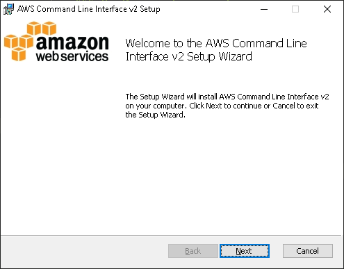

2. Aceptar términos y condiciones, después especificar el directorio de instalación.
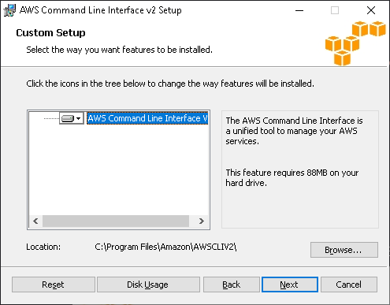

3. Esperar a finalizar la instalación.
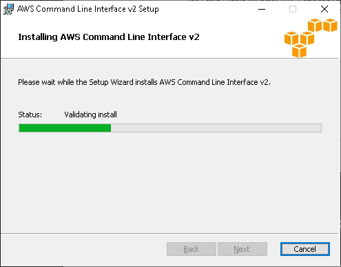

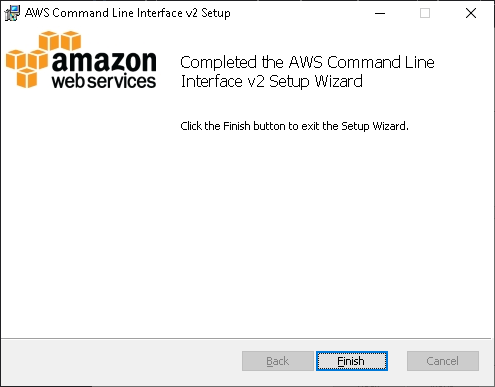

4. Verificar la instalación abriendo una consola CMD ejecutando el comando `aws --version`
 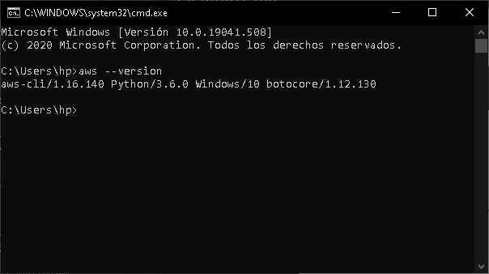


Instalación Linux:
1. Descargar el instalador para Linux con el comando:
```sh
curl "https://awscli.amazonaws.com/awscli-exe-linux-x86_64.zip" -o "awscliv2.zip"
```

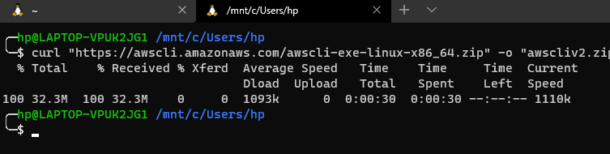
2. Descomprimir el zip descargado con el comando 
```sh
unzip awscliv2.zip
```
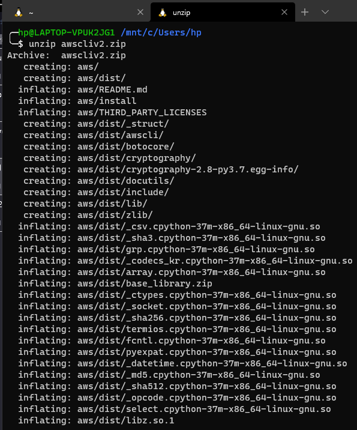
3. Ejecutar instalador.
```bash
sudo ./aws/install
```
Ingresar el password para sudo, esperar por la instalación.
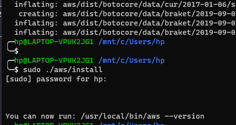

4. Comprobar la instalación con el comando
```bash
aws --version
```
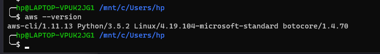


Instalación en MAC:
1. Descargar el instalador pkg [desde](https://awscli.amazonaws.com/AWSCLIV2.pkg).
2. Iniciar el instalador dando doble click al archivo instalado.

-------------Configuración---------------------
Ya instalado AWS CLI, es necesario configurarlo.

1. Ejecutar el comando:
```bash
aws configure
```

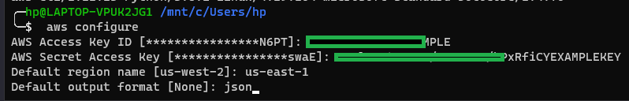

Nota: Se recomienda seleccionar la región con menos latencia, se puede medir con [https://ping.psa.fun](https://ping.psa.fun)

Para obtener las claves de acceso pasar a la siguiente sección del ejemplo.

2. Con el comando ```aws help``` se puede consultar la ayuda.
3. Para obtener los usuarios en la cuenta AWS el comando es:
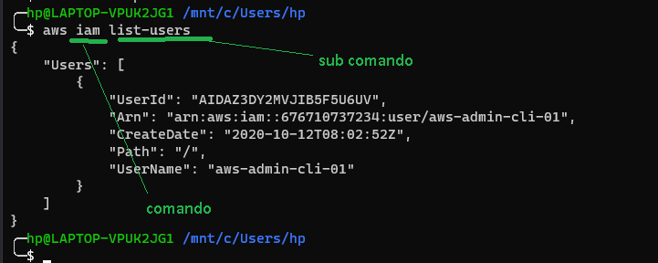

4. Se puede obtener una lista de los subcomandos disponibles, por ejemplo, para obtener los subcomandos disponibles para el comando "iam" ejecutar el comando 
```bash
aws iam help
```
El punto clave es el argumento "help"

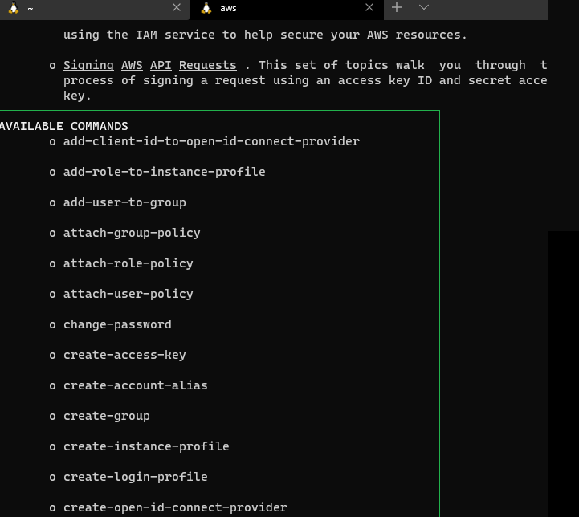


¿De dónde salen las claves Access Key ID y Secret Access Key?

1. Ir a la [consola](https://console.aws.amazon.com/iam/)
2. Seleccionar Usuarios, después "Añadir usuario(s)" 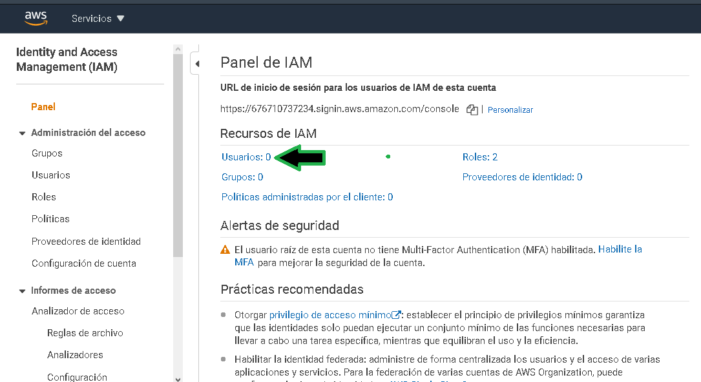

3. Especificar el nombre del usuario y seleccionar "Acceso mediante programación"
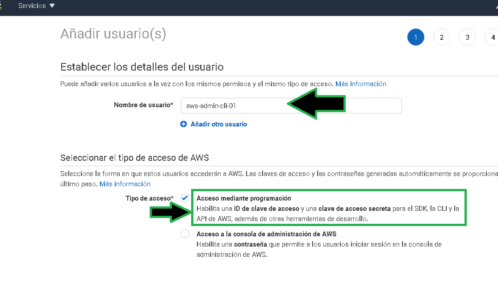

4. Seleccionar la política (permisos) que aplicará al usuario.
 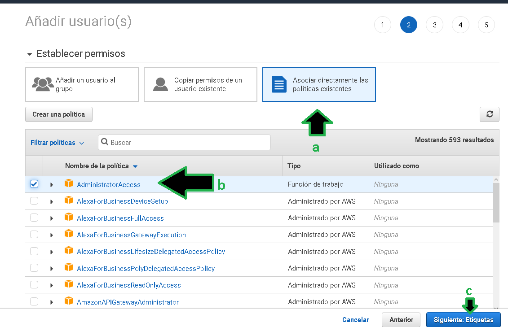

5. Siempre es recomendable agregar TAGS (etiquetas de identificación) cuando sea posible, ayudará para la administración.
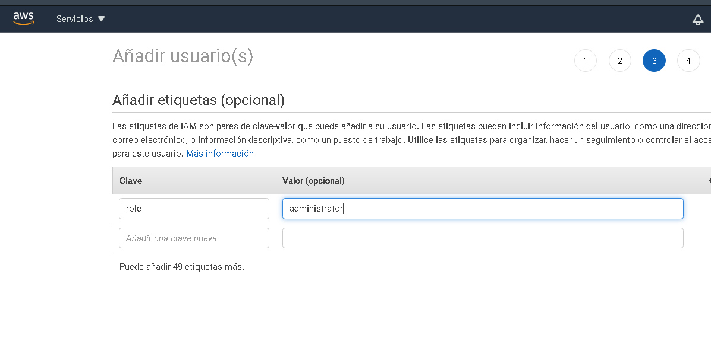

6. Generado el usuario ya se pueden obtener las claves de acceso, la clave de acceso secreta solo se puede ver si se da click en "mostrar", esta es la única vez que aparecerá la clave de acceso secreta, es necesario guardarla, de preferencia en un gestor de contraseñas.
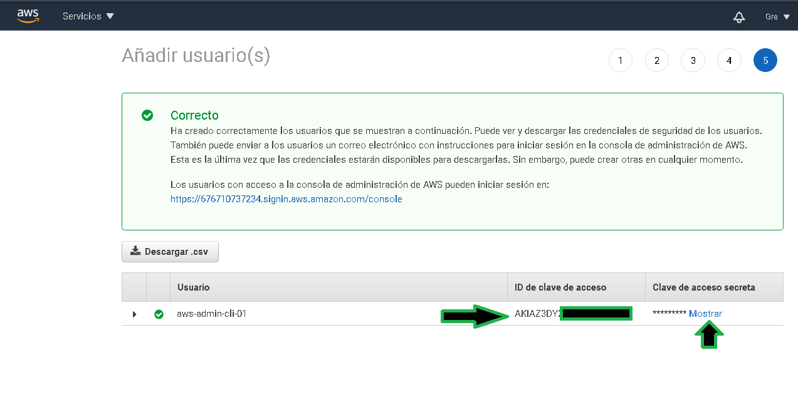
