## Sesión 2 - Ejemplo 3 - Servidor web estático

### 1. Objetivo :dart:
- Poner en marcha un bucket S3 como un servidor web estático.

### 2. Requisitos :pushpin:
- Git instalado localmente. [¿Cómo instalar git?](https://git-scm.com/book/en/v2/Getting-Started-Installing-Git)
- Repositorio en local https://github.com/mdn/beginner-html-site-styled

### 3. Desarrollo :bookmark_tabs:

1. Ingresar a la consola de AWS y seleccionar S3.

2. Dar click en nuevo bucket.
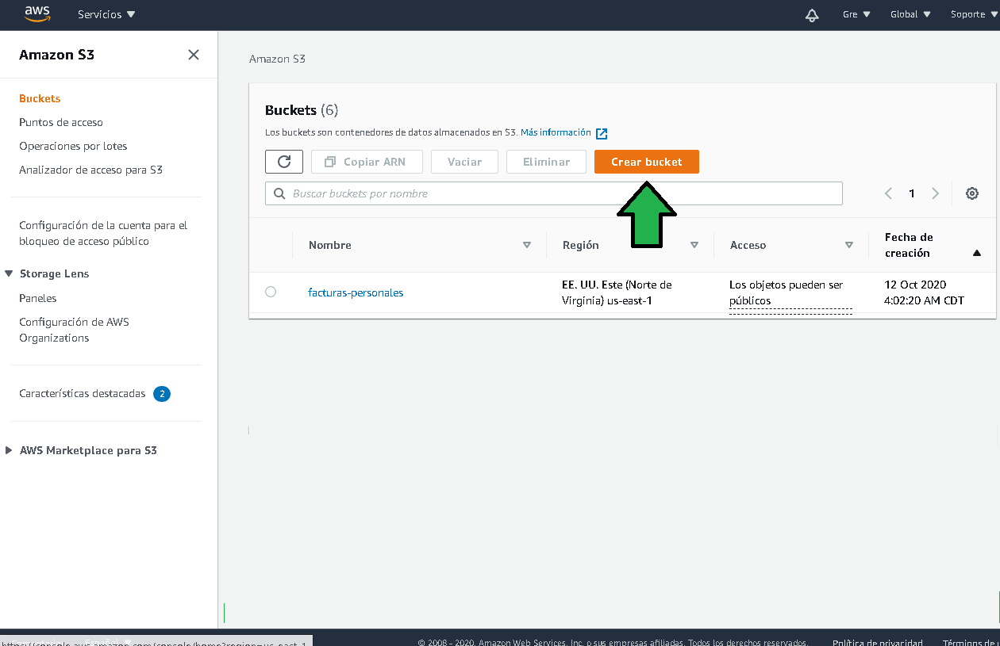

3. Seleccionar un nombre para el bucket, recordar que el nombre debe ser único es decir que no se haya repetido en ninguna otra cuenta de AWS.
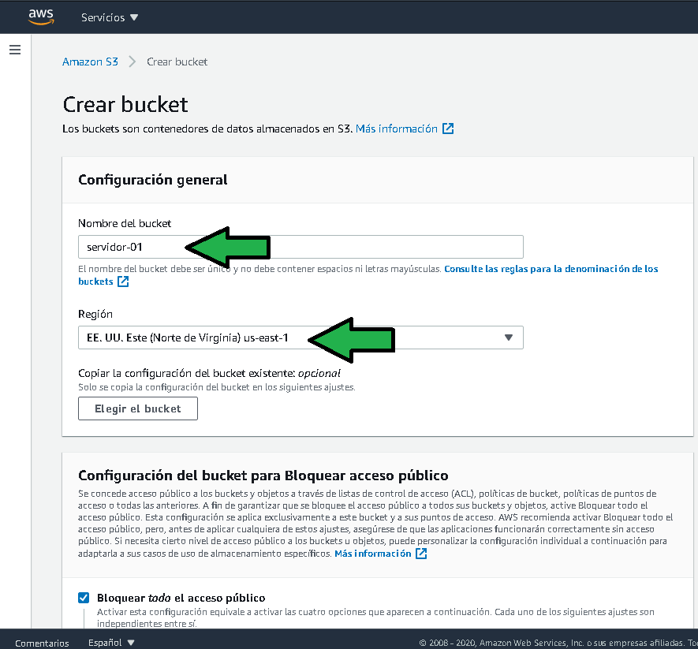

4. Establecer etiquetas para el bucket.
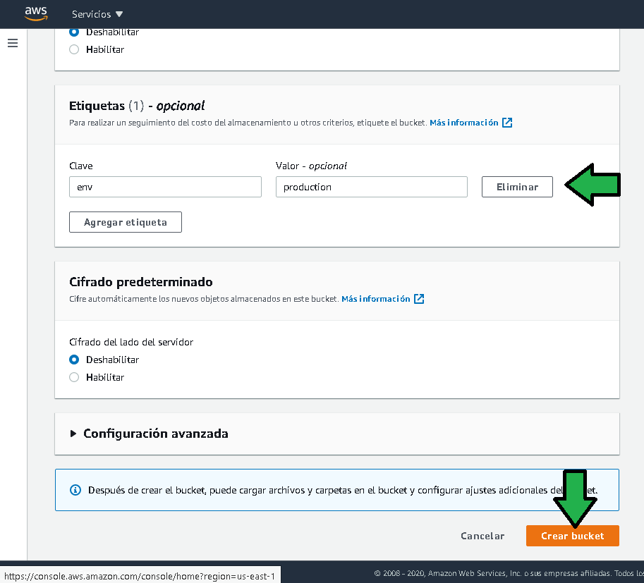
5. Dejar la configuración de acceso por defecto
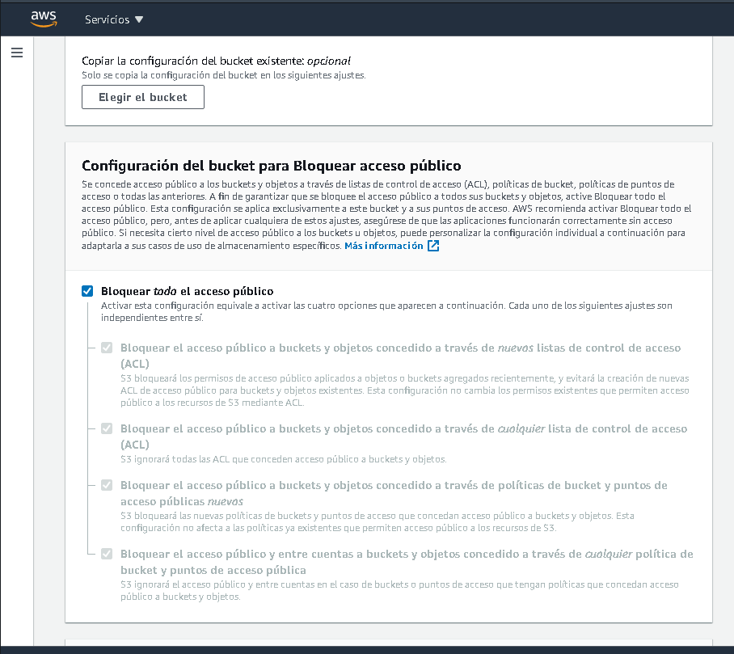

6. Dar click en "Crear bucket"

Observar la generación del bucket:
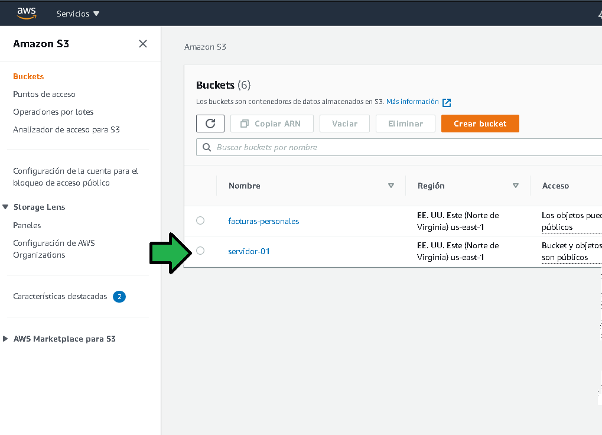

7. Descargar el zip del [repositorio](https://github.com/mdn/beginner-html-site-styled), descomprimir el contenido.

8. Dar click en "Cargar"
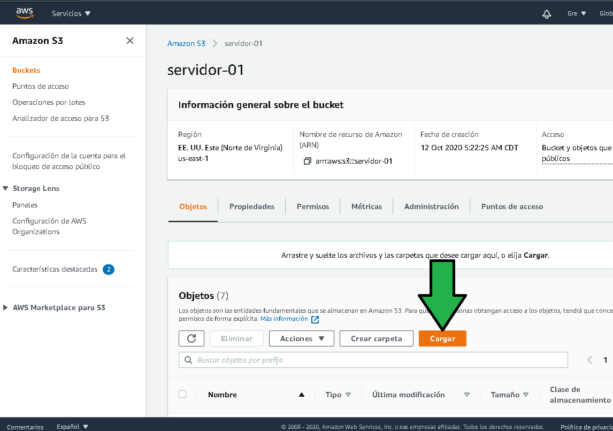

9. Arrastrar los archivos y carpetas, si no se arrastran las carpetas no pueden ser seleccionadas. Dar click en "Cargar"
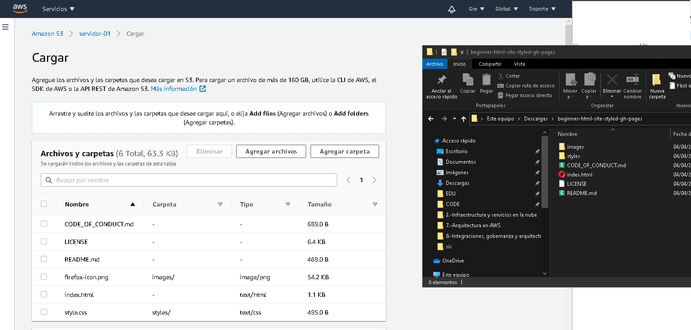
Los archivos serán cargados y se podrán ver en la consola de AWS S3.
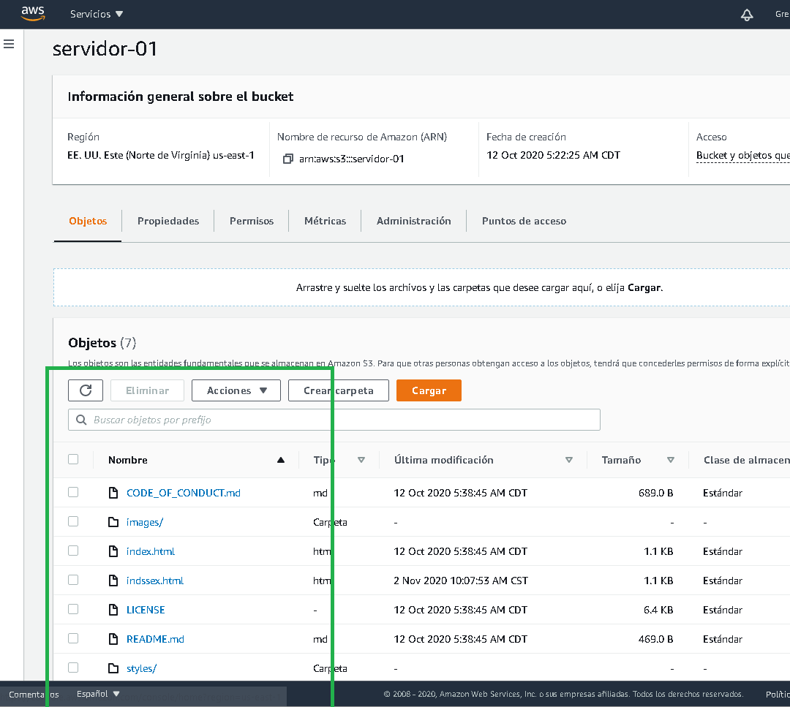

Al dar click en el archivo index.html se visualizan una serie de propiedades (metadatos), entre ellas se tiene la "URL del objeto"
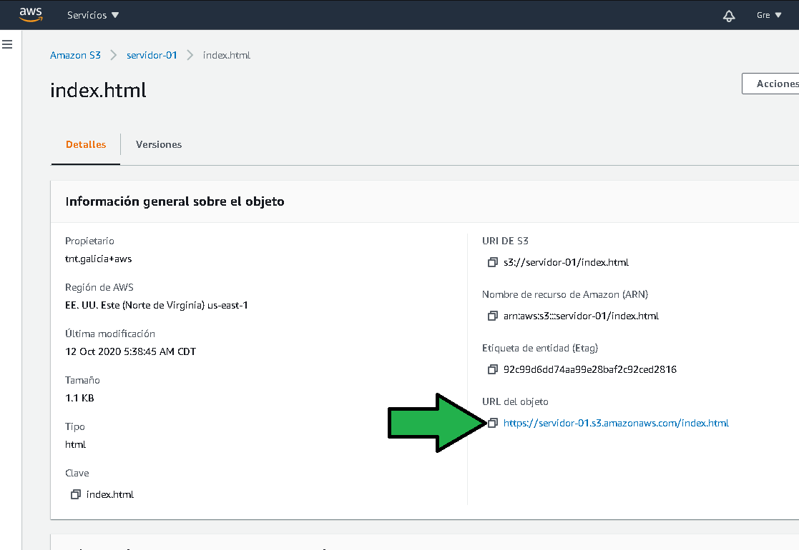
Al dar click en la URL tenemos el siguiente error.

Aún faltan pasos antes de que el archivo sea visible desde internet.
Los pasos siguientes son:

10. Regresando al nivel de bucket (a), dar click en propiedades (b), seleccionar "Alojamiento de sitios web estáticos"
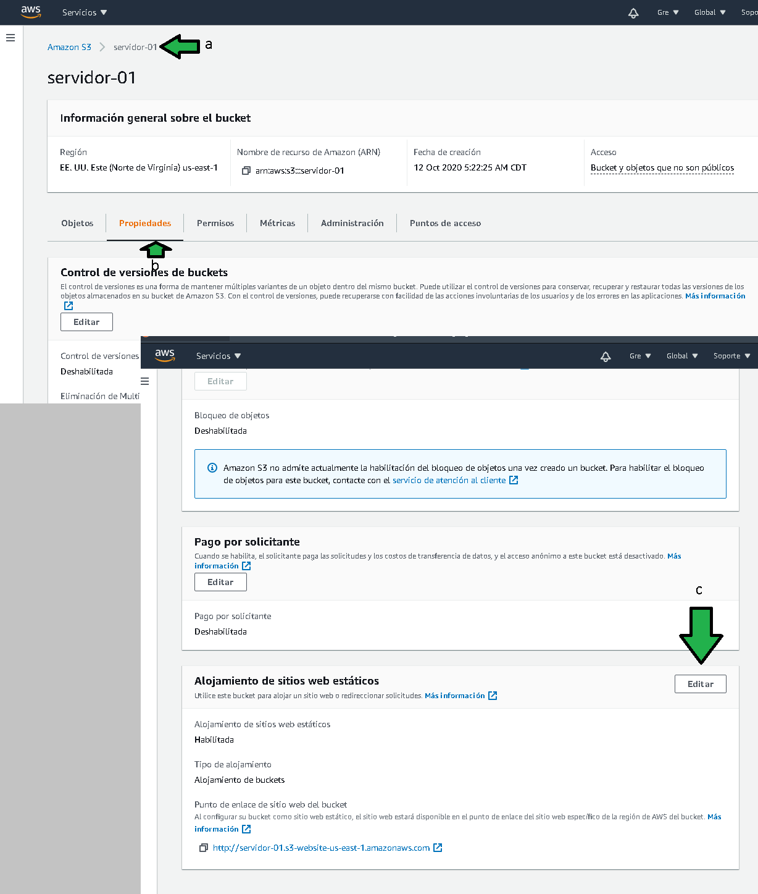

11. Establecer la configuración de alojamiento estático (a), proporcionar el nombre del archivo que será servido por default (b), click en guardar (c).
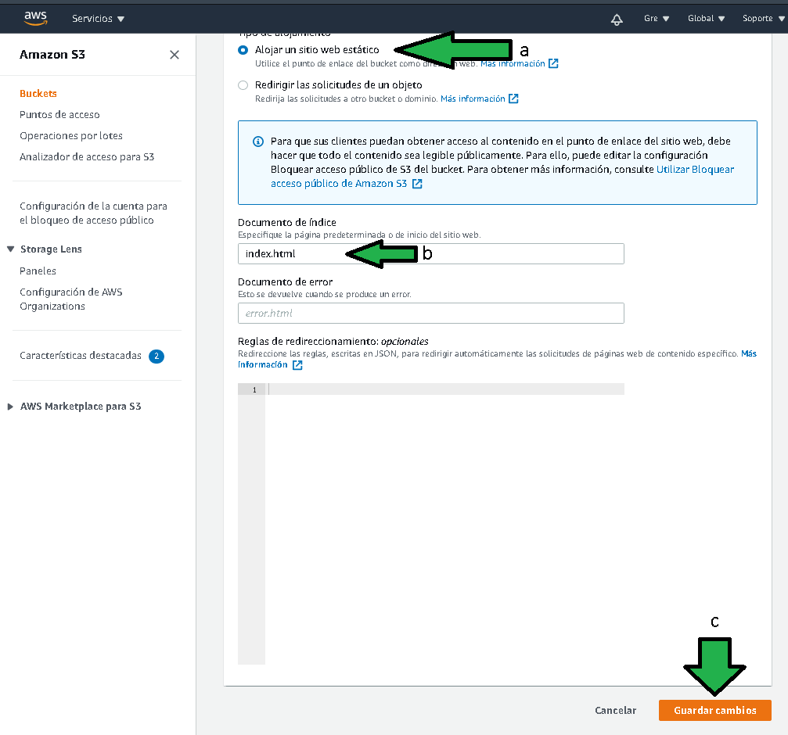
 
 12. A nivel bucket pasar a "Permisos" (a), editar (b) y desactivar la opción bloquear todo acceso público (d), guardar cambios.
 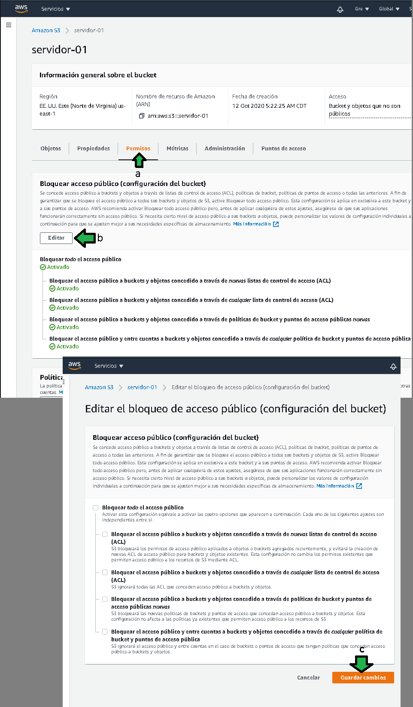

13. En información general a nivel de búcket (a), seleccionar todos los archivos (b), después click en "Hacer público".
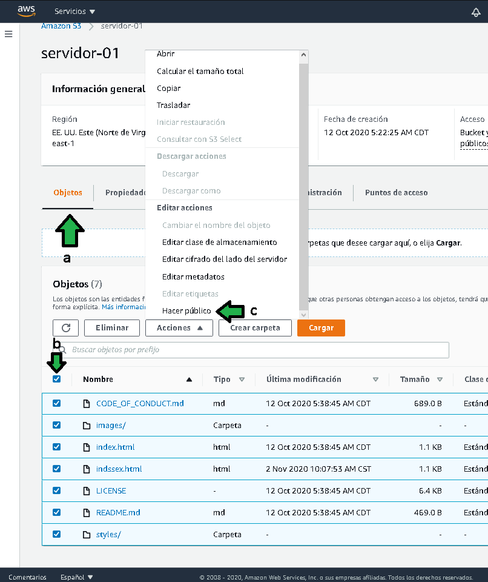

14. Hechos los  pasos anteriores la página web esta lista para ser servida.

