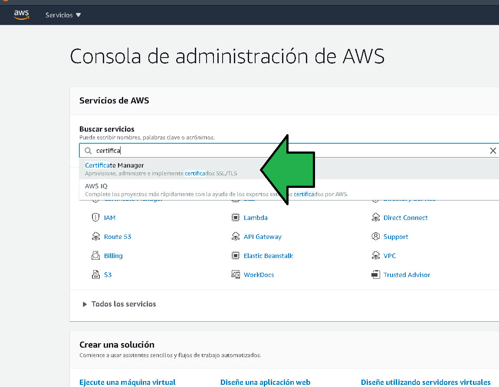
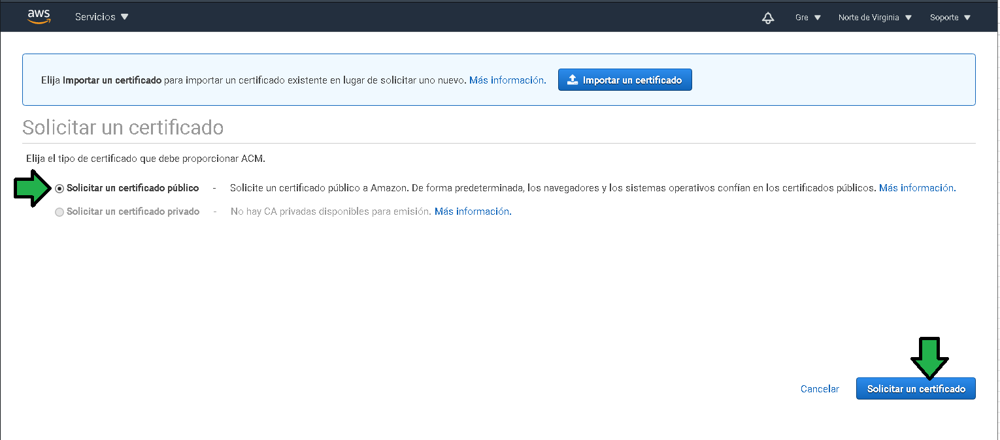

## Postwork Sesión 3

### 1. Objetivo :dart:
- Asegurar el cifrado de información en reposo y tránsito para el bucket configurado como servidor web estático de la sesión 2.

### 2. Requisitos :clipboard:
- Acceso a una cuenta de AWS por medio de AWS Console

### 3. Desarrollo :bookmark_tabs:

Para asegurar el tráfico sobre el protocolo https se generará un certificado de seguridad. Para ellos seguir los pasos:

1. Acceder a la Consola de administración, seleccionar "Certificate Manager"

2. Seleccionar "Aprovisionar certificados"

3. Seleccionar "Solicitar un certificado público"

4. Se deberá especificar el o los subdominios para los que el certificado será emitido, como ejemplo se emitirá un certificado wildcard para el dominio edupractice.tk

5. Antes de seguir con la generación del certificado se debe comprobar la propiedad del dominio, en este caso se hará la comprobación por medio de un registro en el DNS.

6. Especificar las etiquetas que el recurso tendrá, útiles a la hora de analizar costos o administrar recursos.

7. Revisar el o los dominios para los que se solicitará el certificado, proceder con la solicitud

8. Las instrucciones para comprobar la propiedad del certificado son generadas, en el caso de manejar el DNS con Route 53 el registro CNAME es generado automáticamente, en caso de no manejar el DNS con Route 53 se tendrá que generar el registro CNAME de forma manual con los valores que aparecen en las instrucciones.

9. El registro DNS se genera y el certificado será generado al cabo de unos minutos.

---------------------
Crear linamientos e instrucciones exactas y específicas que el alumno pueda seguir en cada postwork para que pueda complementar su proyecto postwork que iran realizando el clase y casa