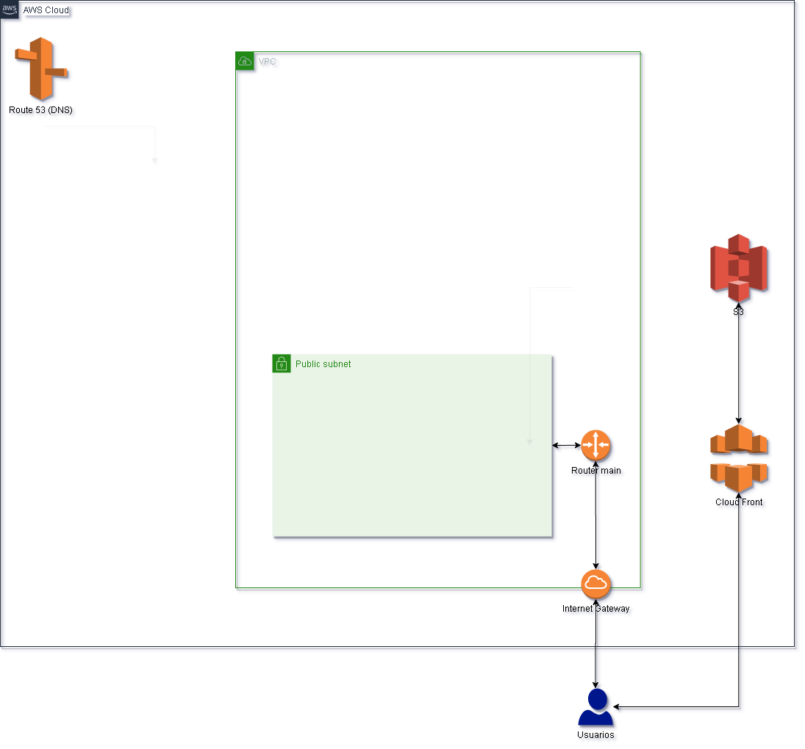

## Postwork Sesión X

### 1. Objetivo :dart:
- Conocer y configurar un entorno de red con subred pública como piedra angular en el establecimiento de una infraestructura.

### 2. Requisitos :clipboard:
- Acceso a AWS Console.
- Diagrama del proyecto a la mano.
- Calculadora CIDR

### 3. Desarrollo :bookmark_tabs:

Antes de generar un esquema de red y subredes es necesaria la generación de un diagrama con los elementos principales a fin de conocer los requerimientos de red de estos.
En el diagrama del proyecto se identifican como elementos dependientes de una VPC o red a la base de datos RDS, las instancias EC2 y balanceadores de carga.

Para generar un esquema DMZ donde la capa de persistencia de datos (bases de datos) sean inaccesibles desde el mundo exterior se requerirá generar una res pública y privada.
La red pública puede ser alcanzada por cualquier dispositivo desde internet, la red privada no puede ser alcanzada desde internet directamente.

1. Acceder a la sección VPC desde la consola de administración de AWS.

2. Se observan ya algunos dispositivos a pesar de no haber configurado nada previamente, esto sucede ya que todas las regiones tienen una VPC por defecto, para que esta VPC funcione se hay dispositivos adicionales que deben ser configurados como Security Groups, DHCP, Routing Table, Internet Gateway y Network ACL. Dar click en "VPCs"

3. Se accederá al panel de redes VPC, se observará una red VPC por defecto, dar clic en "Create VPC"

4. Se establecen:
a) Nombre de la VPC, se recomienda un nombre descriptivo, en este caso se hace referencia a la región a la que pertenece y el entorno en este producción, una forma de segmentar entornos de desarrollo y stagging es por medio de redes VPC.
b) Se debe asignar el bloque de direcciones IP que tendrá la red completa, para el ejemplo, esta red con máscara 16 dará para configurar aproximadamente 256 redes con 256 direcciones IP disponibles en cada red. (Es aproximado por que AWS tomas algunas IP para su gestión interna, se recomienda en este punto interactuar con la calculadora IP)
c) No se usará IPv6
d) Se selecciona la opción default para decir a AWS que no se desea hardware de red dedicado.
e) Asignar alguna Tag con fines administrativos y de identificación.

Después de algunos segundos la VPC ha sido creada.

5. Para la generación de la res pública se deberá seleccionar  "Subnets"

6. Se observan varias subredes, observando el espacio de direcciones IP de cada una y la VPC a la que pertenecen se deduce que son redes de la VPC por defecto. Se deberá dar click en "Create Subnet"

7. Se establecen los siguientes valores para la configuración de la red pública:
a) El nombre que la red tendrá.
b) La VPC a la que pertenecerá esta subred, seleccionar la VPC recién generada.
c) Se permite que AWS seleccione la zona de disponibilidad.
d) Se establece el tamaño de una subred, para este caso se establece un bloque con máscara 24 lo que quiere decir que este bloque tendrá 256 direcciones IP disponibles (marca menos porque AWS toma algunas para gestión interna). Cabe mencionar que este es solo un bloque de direcciones de los 256 que se pueden hacer por la mascara 16 seleccionada para la VPC.

Después de algunos segundos la red es creada.

8. Para dar acceso a la red pública desde internet y hacia internet hay que crear un Internet Gateway.

Habrá que dirigirse al menú izquierdo a la parte de "Internet Gateway" (a), después hacer click en "Create internet gateway".

9. Establecer un nombre al internet gateway, click en "Create internet gateway" para generarlo.

10. Una vez creado el Internet Gateway (a.k.a IG) se puede observar que no se encuentra asociado a ninguna red VPC, para asociarlo habrá que hacer click en "Attach in VPC" (a)

11. Seleccionar la VPC acabada de crear y dar click en "Attach internet gateway"

12. En este punto se ha configurado la subred que debe tener acceso desde y hacia internet por medio de un Internet Gateway. Es momento de redirigir el tráfico que no es local hacia el Internet Gateway para dar salida a internet. Por defecto todos los dispositivos agregados a una subred se pueden comunicar entre ellos pero en caso de requerir acceso al repositorio de Ubuntu de actualizaciones para actualizar el sistema operativo en http://archive.ubuntu.com/ubuntu el tráfico simplemente no alcanzará la URL por que no se ha especificado el mecanismo para redirigir el tráfico. Al generar la VPC se genera una tabla de routeo por defecto, y cada vez que se genera una subred la subred es asociada a esta tabla de routeo por defecto. La tabla de routeo por defecto tiene lo necesario para comunicar los los dispositivos en la misma red. Al ingresar a las Tablas de Routeo en el menú (a) se pueden ver los detalles.

13. Para redireccionar el tráfico habrá que ir al menú "Route Tables" (a), de ahí dar click en "Edit routes" (b)

14. Agregar una nueva ruta en "Add route" (1), generando el nuevo registro con destino 0.0.0.0/0 (a) apuntando el tráfico hacia el Internet Gateway (b). Hay que notar como nombrar los elementos con una nomenclatura lo suficientemente explícita ayuda a la hora de configurar. Dar click en "Save routes"

Con este cambio todo el tráfico que no sea local (no vaya dirigido a una ip de la red 10.0.0.0/16 en este caso) será dirigido al Internet Gateway dando acceso hacia y desde internet.

Hasta ahora el avance en el proyecto es el siguiente. ¡Felicidades!

