# Amazon Virtual Private Cloud (VPC)

AWS VPC es una red virtual aislada de otras redes virtuales donde podremos conectar recursos de AWS como instancias EC2, como toda red, esta red puede ser dividida en subredes para mejor administración del espacio de direcciones IP.
Hay una red virtual VPC generada en cada región por defecto, cuenta con conexión hacia y desde internet con al finalidad de conectar servicios de AWS rápidamente.
Dependiendo de la arquitectura de las soluciones a desplegar no siempre será deseado que los recursos puedan ser accedidos desde internet directamente, típicamente el ejemplo es la conexión a base de datos, las bases de datos normalmente se encuentran asiladas del acceso desde internet directamente siendo accedidas por medio de un servidor web en las llamadas DMZ.
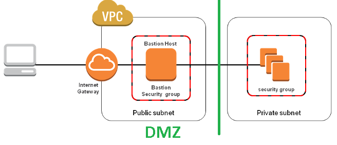

Las redes virtuales VPC se conforman de un gran bloque de direcciones IP, la VPC por defecto cuenta con una máscara de subred /16 (podemos conectar 65,534 dispositivos con este espacio de direcciones IP), se cuenta con la suficiente flexibilidad para generar redes VPC con máscara de subred de tamaño 28.

Para mejorar el tráfico de las redes y mejorar la administración del espacio de direcciones IP las VPC pueden ser divididas en espacios de direcciones IP mas pequeños, estos espacios son llamados `subredes`, la división del espacio de direcciones IP en VPC corresponde a la notación CIDR (Classless Inter-Domain Routing) tradicionalmente usada a la hora de administrar cualquier red.
En el siguiente ejemplo podemos ver como un espacio de direcciones IP puede ser manejado en redes mas pequeñas.
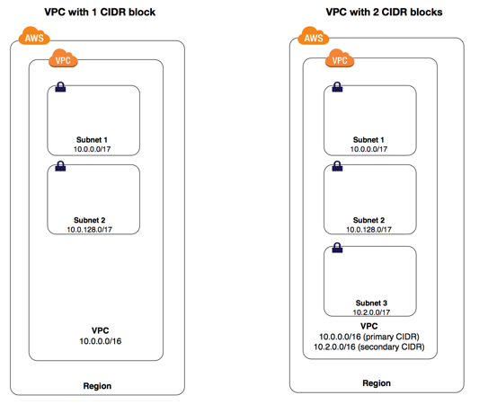

Para la mejora de la seguridad entre subredes es posible definir reglas que dicten que tipo de tráfico puede fluir entre ellas tanto de entrada como de salida por medio de ACL (Access Control List), las ACL se encuentran definidas a nivel de VPC y pueden ser asociadas con una o mas subredes.
Para manejo mas granular de la seguridad de tráfico de red es posible definir reglas que regulen el tipo de tráfico no solo entre subredes si no entre instancias EC2 (o instancias RDS o Lambdas por ejemplo) por medio de los `Security Groups`, pueden ser vistos como un firewall muy básico asociado a una instancia, así es posible definir un servidor Web EC2 con cara hacia internet, en el Security Group asociado a esta instancia EC2 podemos permitir solo el acceso desde internet por los puertos 80 y 443.

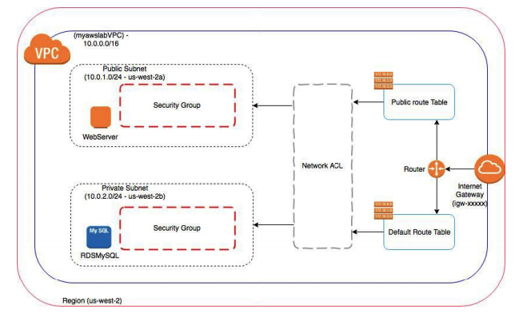

A continuación podemos ver el detalle de un Security Group definiendo reglas de entrada de tráfico a la instancia sólo a tráfico http y https:
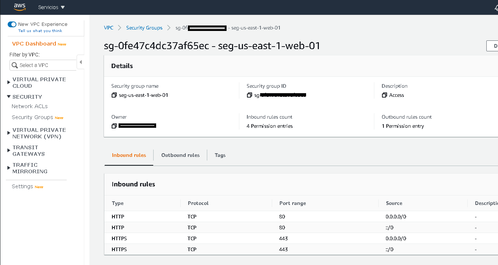

Para conectar las redes VPC a internet se hace uso de un `Internet Gateway`, un IG es un componente de VPC de escala horizontal, redundante y de alta disponibilidad sin riesgos de disponibilidad ni limitaciones de ancho de banda.

Al hablar de subredes es necesario hablar de routeo, AWS define tablas de routeo que dictan como será dirigido el tráfico desde y hacia internet, por defecto todas las subredes de una VPC pueden comunicarse con otras subredes sin definir explícitamente reglas de routing, las reglas de routing aplican para el trafico entrante y saliente de la subred.
Una red privada es definida si no tiene routing de su tráfico hacia un Internet Gateway sin embargo muchas veces es necesario tener acceso para descargar software o actualizaciones en nuestras instancias, para lo cual hay un mecanismo que permite conectar estas instancias en redes privadas hacia internet solamente, el mecanismo es un llamado `NAT Gateway`, con el podemos definir en la tabla de routeo que si una instancia desea conectarse a internet desde una red privada en lugar de hacerlo por un Internet Gateway de la VPC (El internet Gateway es bidireccional) lo haga por medio de un NAT Gateway, con ellos podemos tener las instancias privadas conectadas hacia internet.

# Conectividad con VPNs y Amazon Direct Connect

Una red pública es básicamente el tipo de red que nos proporciona un servicio de conexión o telecomunicaciones a nuestro equipo a cambio del pago de una cuota de servicio. 
Existen redes privadas en organizaciones en donde existen multitud de dispositivos ubicados dentro de un recinto y conectados a switchs a través de cables. En estas redes privadas, un usuario que sea externo a esta red no podrá conectarse a ella para acceder a Internet, el acceso solamente está restringido a los usuarios que estén en el interior de ella, en la mayoría de los casos claro.

Es la solución de AWS para conectar la red on-premises a la red de AWS en un enlace dedicado.

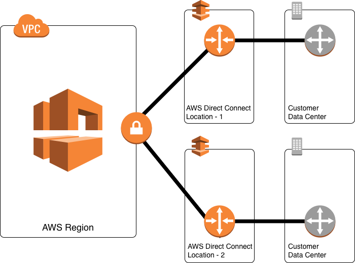

# Amazon Route 53
Amazon Route 53 proporciona una facilidad para registrar nombres de dominio, un servicio de Sistema de Nombres de Dominio (DNS ) para que los nombres de dominio se traduzcan a direcciones IP.

Al teclear example.com un servidor debe responder a la petición, pero los dispositivos de red funcionan con direcciones IP, para traducir example.com a una dirección IP con la que routers puedan dirigir la petición al servidor correcto el DNS buscará en su propia tabla la correspondencia de dominio y dirección IP, si el no la tiene preguntará a otro servidor hasta encontrar la equivalencia. 
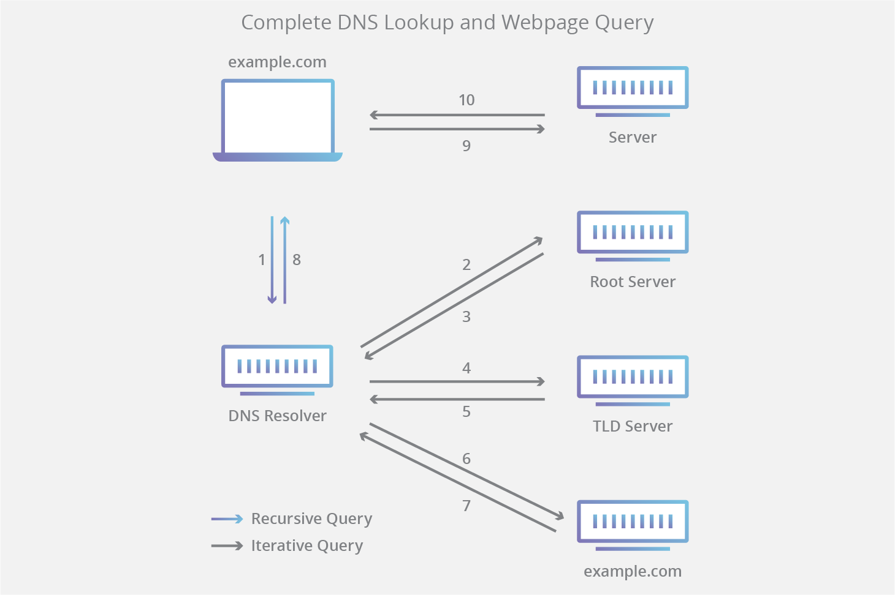
En Route53 es posible dar de alta múltiples dominios. En el siguiente ejemplo son 2.
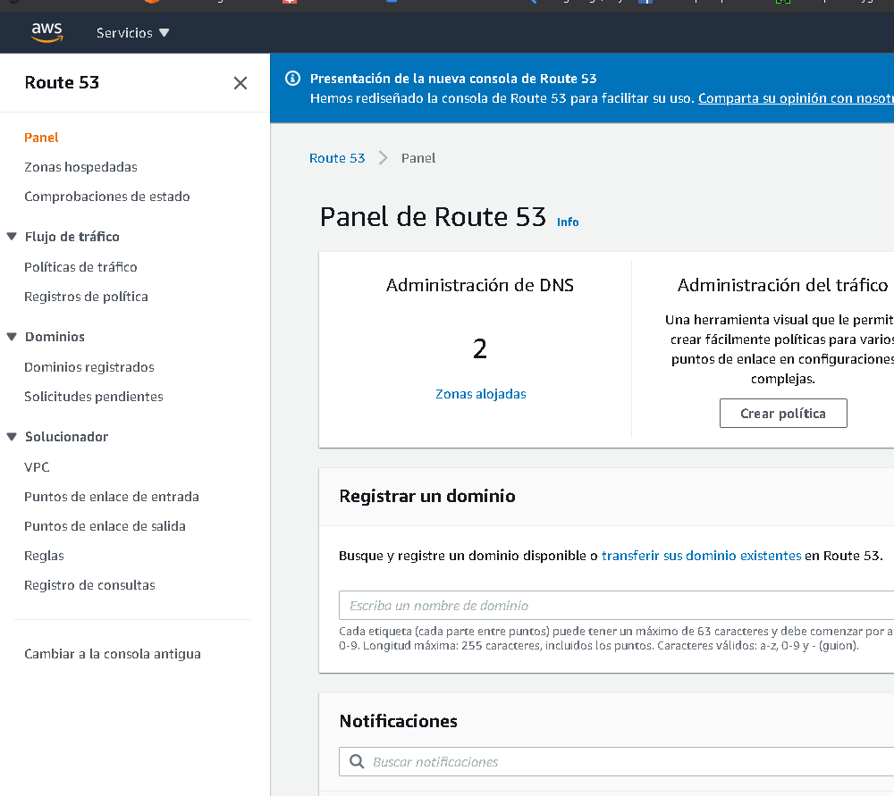

Al ingresar al detalle de la zona (una zona es un dominio DNS manejado por AWS) se visualizan los distintos tipos de registros DNS, MX, TXT, A..
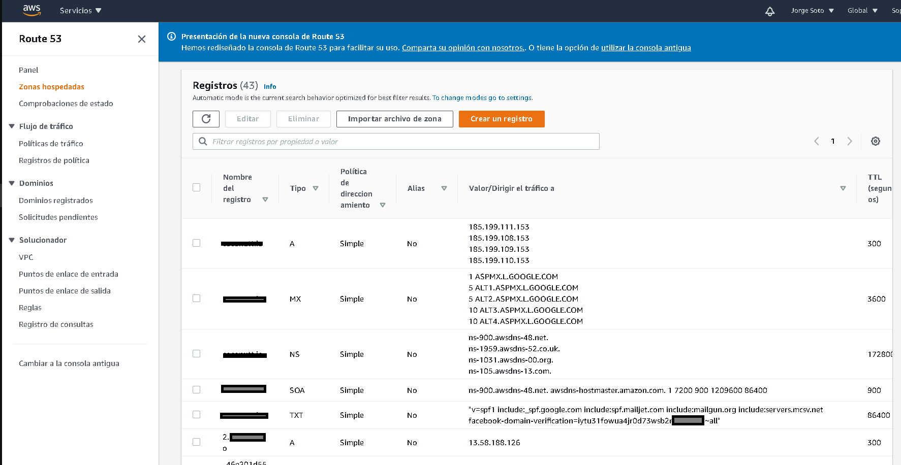
Al querer generar un nuevo registro en el DNS (tal ves deseamos agregar un nuevo subdominio para acceder a una nueva página web), será necesario seleccionar entre varias de política de redireccionamiento.
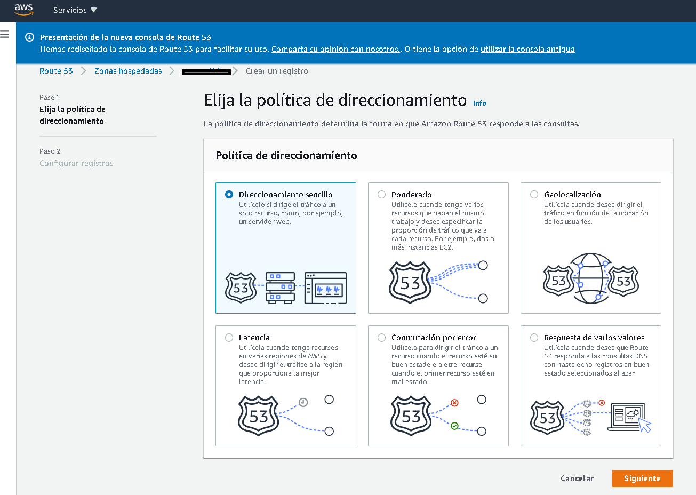

El routing simple redirige las peticiones a un servidor.
La opción ponderado dirige el tráfico a varios recursos en las proporciones diferentes, 80% peticiones al servidor1.com y 20% al servidor2.com.
Geolocalización permite dirigir tráfico a recursos y/o servidores basados en la localización física del cliente.
Por latencia verifica la petición y la redirige a los recursos AWS con la región con menos latencia.
Por conmutación por error ayuda a implementar una estrategia de fail-over de tipo activo/pasivo.
Respuesta de varios valores redirige el tráfico de forma pseudo aleatoria entre hasta 8 direcciones IP.

Si seleccionamos un registro simple podemos agregar valores estandard del protocolo DNS como CNAME, TXT, A, pero se vuelve interesante la integración de AWS con servicios como Elastic Beanstalk, Balanceadores de carga, Buckets S3 configurados para hosting web, AWS API Gateway, AWS Cloud Front, lo que da mucha facilidad a la hora de definir las reglas para resolver direcciones IP. 

# Elastic Load Balancing
Al tener cargas de trabajo grandes surge la necesidad de distribuir la carga de trabajo entre varios servidores, la distribución puede ser hecha por medio de un balanceador de carga. Imaginemos un e-commerce en época navideña, las peticiones al e-commerce subirán y un solo servidor posiblemente no tenga lo necesario para atender todos los posibles compradores que se conectan a él, es posible optar por una estrategia de escalamiento horizontal donde generaremos múltiples instancias del e-commerce (siempre y cuando la arquitectura del e-commerce lo permita), cuando tenemos múltiples servidores operando debemos contar con un balanceador de carga encargado de redirigir las peticiones a un servidor dado, de cara al cliente solo verá una sola dirección IP pero en realidad son múltiples servidores los que están atendiendo las peticiones de los clientes.
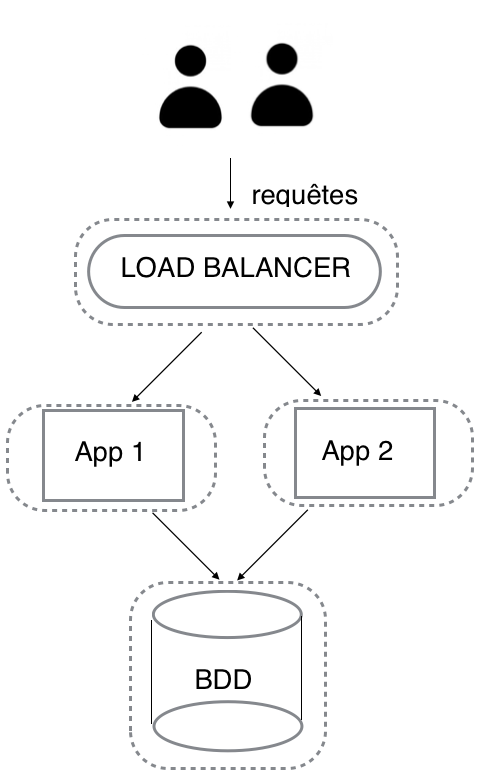

AWS cuenta con balanceadores de carga de tipo PaaS con el servicio Elastic Load Balancing. 
Elastic Load Balancing cuenta con tres tipos de balanceadores de carga: Application Load Balancers, Network Load Balancers y Classic Load Balancers.  
Application Load Balancers se utilizan para redireccionar el tráfico HTTP / HTTPS (o Capa 7). Los Balanceadores de carga de red y los Balanceadores de carga clásicos se utilizan para redireccionar el tráfico TCP (o Capa 4).

Para generar un balanceador de carga en AWS iremos a la seccioné EC2 y seleccionaremos `Balanceadores de carga`

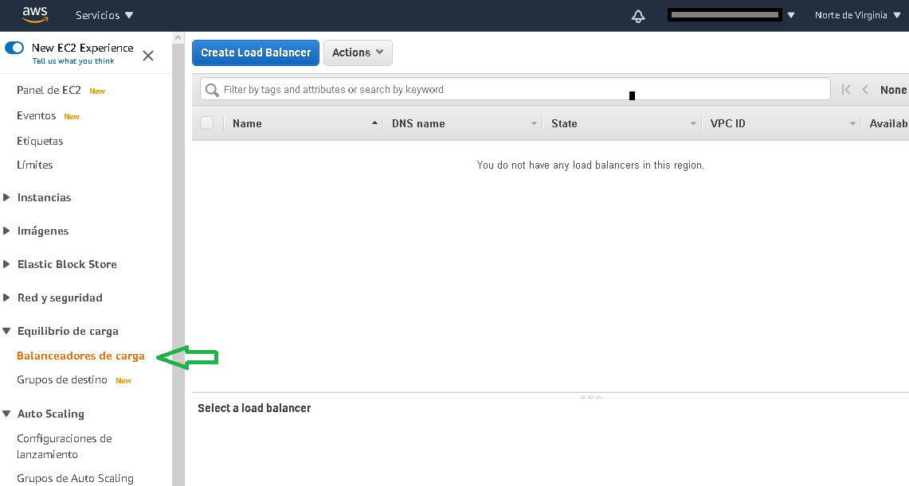

Seleccionamos el tipo de balanceador de carga que deseamos, dependiendo del tipo seleccionado tendremos diferentes opciones de configuración.
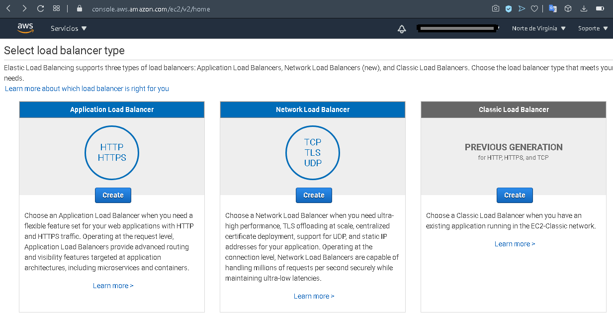

En caso de seleccionar Application Load Balancer tendremos que especificar un nombre para el balanceador de carga (1a), si será un balanceador de carga interno para manejar tráfico con origen y destino entre subredes o externo para manejar tráfico de origen desde internet (1b), se debe especificar si se requiere trabajar con ipv6 además de ipv4 (1c), especificar los puertos de escucha (1d), por el momento solo se pueden manejar los protocolos http y https con posibilidad para seleccionar un número de puerto no estandard, por último seleccionaremos la VPC dentro de la que se habilitará el balanceador teniendo que seleccionar las zonas de disponibilidad y las subredes entre las que habrá balanceo de carga, muy importante tomar en cuenta a la hora de diseñar el balanceo de carga, solo se puede escoger una subred por zona de disponibilidad.
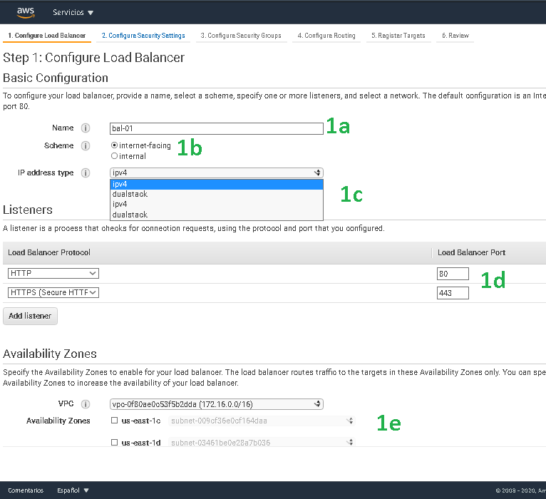

En la siguiente sección debemos seleccionar como se debe manejar el cifrado de la conexión, tendremos la opción de subir nuestro propio certificado SSL en caso de ya contar con uno de un proveedor externo o podremos escoger alguno ya hecho en AWS Certificate Manager (1a), después debemos seleccionar  los protocolos de cifrado que se usarán para establecer el canal seguro (1b)
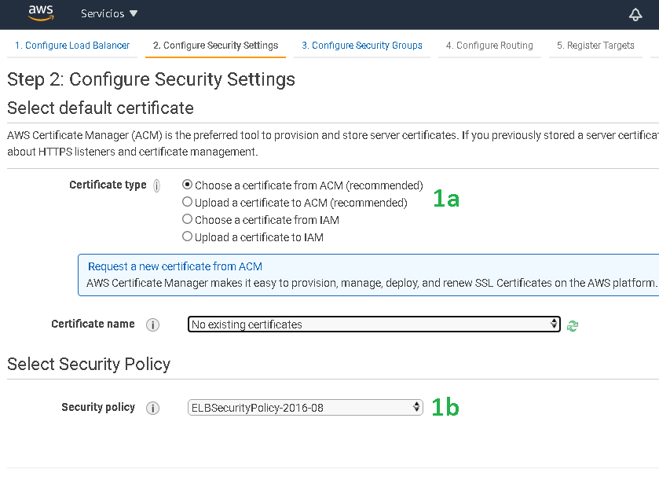
Dependiendo de `security policy` seleccionada serán los protocolos de cifrado que dispondrá el balanceador de carga para negociar con los clientes que se conectarán.
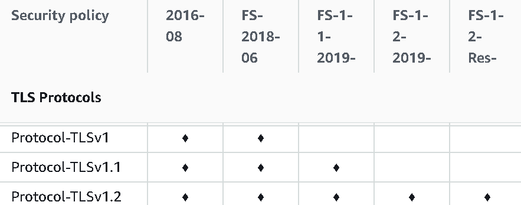

En la siguiente fase debemos seleccionar entre grupos de seguridad, con ello tendremos control sobre las direcciones IP de origen y destino permitidas para el balanceador de carga
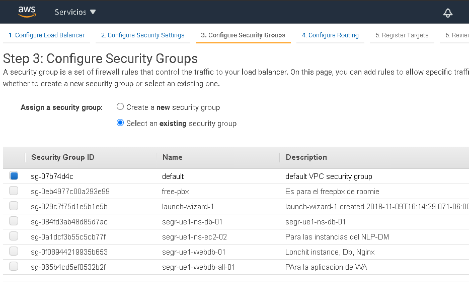

Es necesario seleccionar el grupo de servidores hacia donde serán transferidas las peticiones.
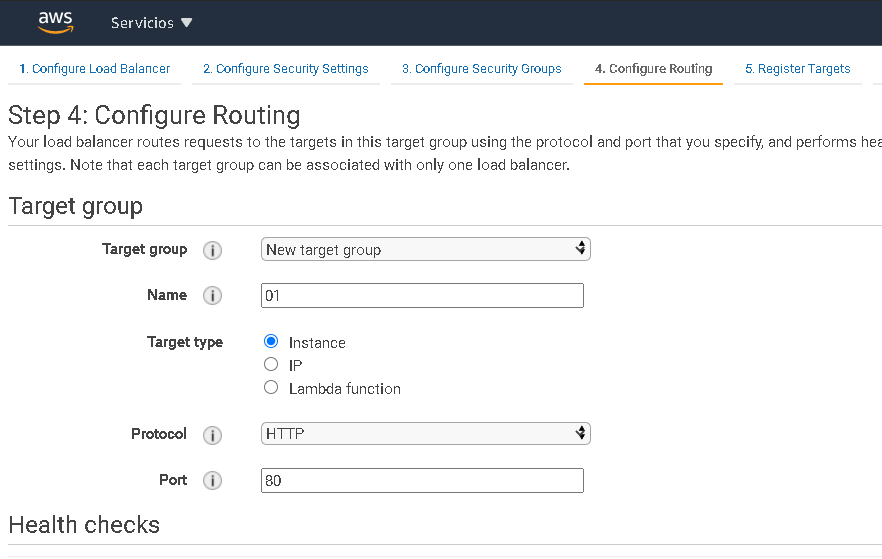

Seleccionaremos las instancias (se pueden seleccionar direcciones IP o funciones de AWS Lambda también dependiendo lo seleccionado en Target Type en el paso anterior) que atenderán las peticiones redirigidas por el balanceador.
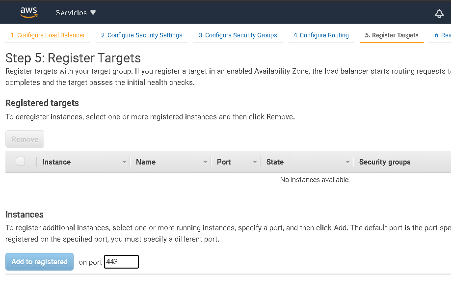

# Amazon CloudFront
Es el servicio para la entrega de contenido (Content Delivery Network) para distribución global de vídeo, datos, aplicaciones de baja latencia.
Para poder entregar el contenido con baja latencia, Amazon cuenta con los llamados _edge locations_,  cuando un usuario solicita un contenido es dirigido a un edge location que provee la latencia mas baja de forma que el contenido sea entregado con el mejor performance posible. Se cuenta con 200  puntos de entrega de contenido distribuidos en 34 países y 77 ciudades
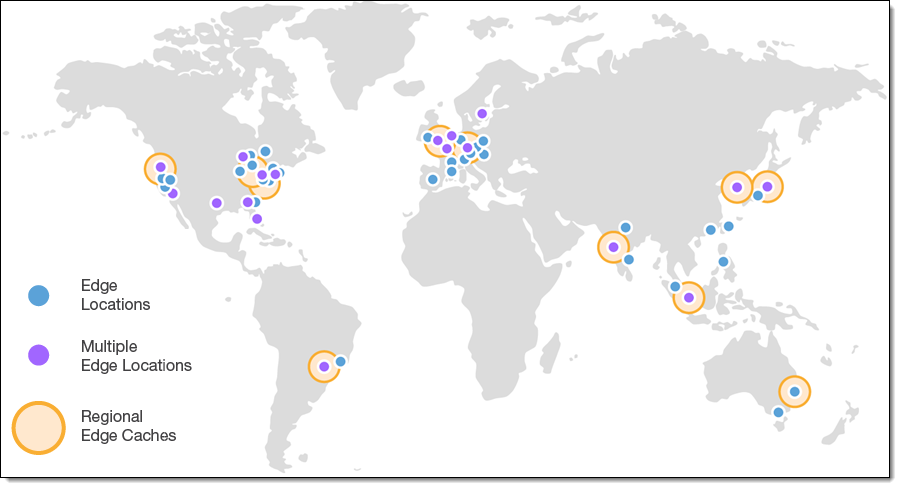
Soporta todo el contenido que pueda ser provisto mediante HTTP o HTTPS, incluyendo HTML, JS, CSS, audio, video, media y binarios.
CloudFront se integra con AWS Shield para mitigación de ataques DDoS, también con AWS WAF para mitigación de ataques SQL Injection, XSS entre otros, para brindar transporte de datos seguro con https se integra con AWS Certificate Manager.
Al momento de configurar el servicio CloudFront se debe especificar el origen de los datos para replicar a la edge location, el origen puede ser un Bucket S3 configurado en modo web hosting, un balanceador de carga o una instancia EC2.

El siguiente ejemplo muestra una distribución con origen de datos desde un Bucket S3 configurado como web hosting.
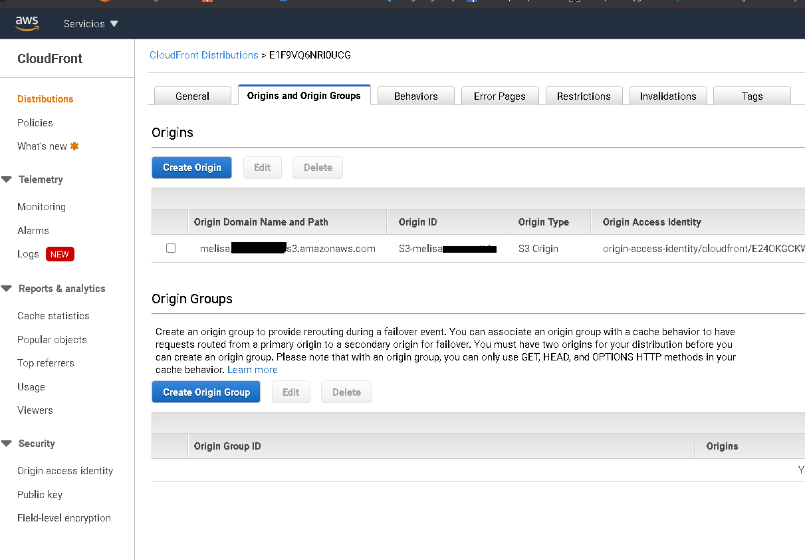

Los casos de uso destacados son:
Servir a los usuarios finales un sitio web estático con posibilidad de uso de https y dominio propio, distribución de paquetes de software, en general es recomendado si los usuarios finales se encuentran distribuidos geográficamente por todo el mundo.
