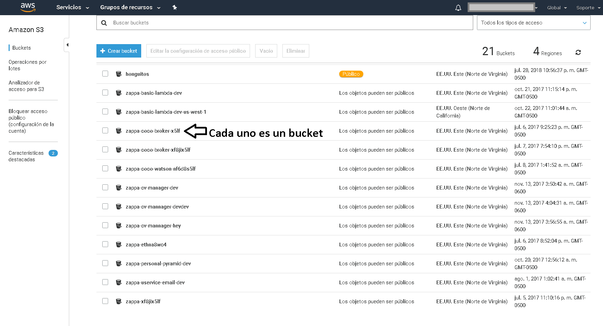
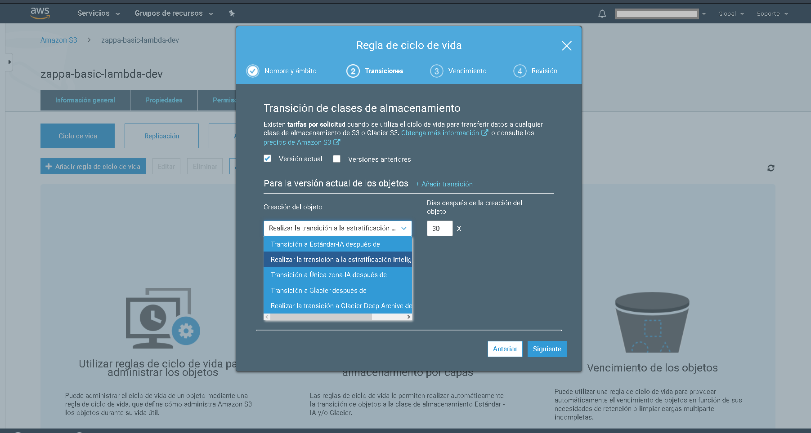

# Amazon Simple Storage Service (S3)

El servicio para guardado de datos prácticamente "infinito", de simple no tiene nada, es un servicio muy interesante para guardar gigas y gigas de archivos (también conocidos como objetos) sin necesidad de tener conectado este storage a ningún sistema operativo, simplemente con una conexión http se puede hacer uso de él. Tiene un 99.999999999% de durabilidad de archivos por año, lo que quiere decir que si se almacenan 10000 objetos se espera en una pérdida de un objeto cada 10,000,000 de años, aunque esto dependerá mucho de como se configuran los buckets. 
Los buckets son la unidad lógica mínima donde se guarda información, antes de de poder guardar cualquier tipo de archivo se debe crear un bucket, se puede  visualizar como una carpeta con configuraciones bien definidas para cifrado, niveles de servicio, políticas de acceso, replicación, manejo del ciclo de vida de los archivos, esta última muy interesante. Es posible definir el momento en que los archivos deben moverse a otros niveles de servicio de S3 en pro de reducir costos, ej: mueve todos los archivos XML de facturas del bucket a un nivel mas barato si en 90 días no se usan. 
S3 proporciona mecanismo para brindar almacenamiento en distintos niveles de servicio, se pueden guardar archivos a precios más baratos aunque no ofrecería acceso de manera inmediata si no que puede tardar el acceso a los archivos desde varios minutos hasta varias horas, también se puede escoger una configuración especial para guardar archivos sin replicación entre zonas de disponibilidad, por defecto S3 replica la información por medio de varias zonas de disponibilidad, de poner los archivos en esta configuración se pueden perder si es que AWS perdiera por algún motivo la zona de disponibilidad.

A continuación se ve el detalle de los distintos niveles de servicio:

|                          Storage | Precio                   | Desempeño y latencia                        | Disponibilidad | Durabilidad   |
|---------------------------------:|--------------------------|---------------------------------------------|----------------|---------------|
| S3 Estándar                      | 0,023 USD por GB / Mes   | Baja latencia y alto nivel de procesamiento | 99,99%         | 99.999999999% |
| S3 Intelligent-Tiering           | 0.023 USD por GB / mes   | Mismo de S3 Estándard                       | 99.99%         | 99.999999999% |
| Estándar – Acceso poco frecuente | 0.0125 USD por GB / mes  | Mismo de S3 Estándard                       | 99.9 %         | 99.999999999% |
| S3 Única zona                    | 0.01 USD por GB / mes    | Mismo de S3 Estándard                       | 99.5%          | 99.999999999% |
| S3 Glacier                       | 0,004 USD por GB / mes   | Minutos u horas                             | 99.99%         | 99.999999999% |
| Glacier Deep Archive             | 0.00099 USD por GB / Mes | Horas                                       | 99.99%         | 99.999999999% |
| Reduced Redundancy Storage       | 0.024 USD por GB / Mes   | Mismo de S3 Estándard                       | 99.99%         | 99.99%        |

Los conceptos clave de la tabla anterior son durabilidad y disponibilidad, la primera refiere a la probabilidad de perder un objeto cada año, la segunda es el porcentaje de tiempo que un objeto será accesible en un año.

Ejemplos de buckets.

Transición a los distintos almacenamientos:

# Hosting en Amazon S3
AWS S3 permite hospedar sitios web estáticos sin necesidad de instalar un servidor como Apache o Nginx para tal. 
La desventaja es que si se quiere usar un dominio propio (AWS brinda un dominio específico al habilitar un bucket como servidor de archivos) habrá que usar el servicio Cloud Front, y si se requiere brindar soporte para el protocolo https se tiene que hacer en conjunto con Cloud Front y AWS Certificate Manager, el uso de Cloud Front incurre en costos extras a los de S3, hay que tomar en cuenta también que los buckets quedan expuestos al público por lo que se recomienda que los buckets configurados como web servers no tengan datos sensibles, los datos sensibles deberían manejarse en buckets totalmente privados. La gran ventaja de usar S3 como webserver es que no hay necesidad de preocuparse por la redundancia, disponibilidad, escalado, balanceo de carga, en general se puede ver como un PaaS para el hosting de sitios.

# Glacier Deep Archive
Es un tipo especial de storage de objetos muy económico, el precio se logra manteniendo los datos en una capa donde al requerir los objetos estos pueden tardar horas en estar listos antes de poderlos descargar. Hay que tener en cuenta la criticidad de la información y los RTO y RPO a la hora de seleccionar este tipo de storage, si la organización requiere tiempos de recuperación (RTO) del orden de algunos minutos Glacier no es la opción para estos casos.

# Elastic Block Store
AWS Elastic Block Storage (EBS) es la solución de almacenamiento a nivel de bloque de Amazon usado con el servicio en la nube EC2 para almacenar datos persistentes. Significa que los datos se mantienen en los servidores AWS EBS incluso cuando las instancias de EC2 se apagan o terminan. EBS ofrece la misma alta disponibilidad y baja latencia rendimiento dentro de la zona de disponibilidad seleccionada permitiendo a los usuarios la capacidad de almacenamiento en la escala modelo de precios bajos basado en suscripción. Los volúmenes de datos se pueden unir de forma dinámica, separados y escalados con cualquier instancia de EC2, al igual que una unidad de almacenamiento de física en un servidor tradicional. Es un servicio en la nube altamente fiable, EBS garantiza la disponibilidad del 99,999%.
EBS representa diferentes escalas de costos, **NOS** brinda General Purpose SSD, Provisioned IOPS SSD para cargas de trabajo demandantes, Throughput Optimized HDD para storage de bajo costo que no necesita velocidades altas  y Cold HDD si se requiere bajar los costos lo mas posible.
EBS cuenta con Snapshots o instantáneas. Esta función permite el almacenamiento de volúmenes de datos de forma incremental, mientras que solo se cobra por el cambio en el volumen de datos. Por ejemplo, si se agregaron 5 GB de datos a un bloque de almacenamiento de 100 GB existente con la instantánea, AWS solo cobrará por los 5 GB adicionales de datos. Las instantáneas se pueden expandir, replicar, mover, compartir, copiar, modificar, administrar y organizar dentro y entre las zonas de disponibilidad de AWS utilizando Amazon Data Lifecycle Manager y la función de etiquetas. Todas las instantáneas de EBS se almacenan en AWS S3 que garantizan hasta 99.999999999% de durabilidad. Las instantáneas no se almacenan como objetos accesibles para el usuario, sino a través de la API de EBS. Las instantáneas se almacenan detrás de las imágenes de máquina de Amazon (AMI), lo que proporciona toda la información necesaria para recuperar datos y lanzar instancias EC2 en la nube.
Los snapshots  es clave para los planes de continuidad de negocio para aplicaciones y servicios de misión crítica. Los administradores pueden definir los objetivos de tiempo de recuperación (RTO) y objetivos de punto de recuperación (RPO)  gestionando las instantáneas y servidores EC2 para cumplir con esos objetivos. Además de los objetivos de copia de seguridad de datos y recuperación de desastres, los administradores también utilizan instantáneas de EBS para replica de ambientes de pruebas y producción, de producción tomas una instantánea del ambiente, se renombra, se agrega a una nueva instancia EC2, la instancia se configura con sus política propias de networking y se tiene listo un servidor para desarrollo en minutos.

# Elastic File System
 Amazon EFS **NOS** genera la posibilidad d de contar con un almacenamiento de alto rendimiento no conectado directamente al sistema operativo como es el caso de EBS si no **NOS** conectaremos por medio del protocolo de red NFS , por si mismo NFS da la posibilidad de conectarse a un mismo EFS desde distintas instancias EC2 (escala de cientos o miles de ellas), EBS solo puede ser accedido desde la instancia a la que esta asociada. EFS escala sin problemas hasta capacidades del orden de PetaBytes, el storage va creciendo a la par que **NUESTRO**s datos y lo interesante es que igual se va reduciendo a  medida que eliminamos datos.
 EFS se integra con IAM para ofrecer una solución apegada a la seguridad empresarial, es posible configurar políticas de IAM que limiten los permisos con los que una instancia se conecta o forzarlos a conectarse solo si se cumplen condiciones como el cifrado, inclusive es posible administrar el acceso a un volumen EFS desde otras cuentas de AWS. AWS Key Management Se integra con EFS para brindar soporte a volúmenes cifrados. 
 Es posible establecer también un esquema híbrido entre las instalaciones e infraestructura local y EFS conectando a servidores locales un volumen EFS por medio de una AWS VPN. No solo se puede acceder a un volumen EFS desde instancias EC2, también se puede hacer desde AWS Lambdas, Elastic Container Services, Elastic Kubernetes Service y AWS SageMaker. En sistemas de storage avanzados de la marca NetApp se tiene la inteligencia necesaria para mover información poco usada a discos duros mas lentos (y mas baratos), esta característica también la comparte EFS, ahorrándo**NOS** un poco en costos dependiendo de la cantidad de información que maneje el volumen, la decisión se hace por medio de una barrera de tiempo.
 Al generar un volumen **PODEMOS** especificar a partir de cuantos días los datos no son accesados moverlos a una "capa" de EFS mas económica, también **PODEMOS** definir la VPC donde se conectará e volumen y las redes sin dejar pasar el control de acceso por medio de grupos de seguridad, para complementar la seguridad de **NUESTRO** volumen podremos definir políticas de cifrado de tránsito, acceso de solo lectura y restricción de acceso a la raíz del volumen.
 La verdad es que es muy rápido generar un volumen EFS, después de 10 minutos de lectura y algunos clicks **tendremos** un volumen listo para ser usado. 
 
 
 
 

# Data Transfer con AWS Snowball
Snowball es el servicio de AWS diseñado para la transferencia de altos volúmenes de datos desde y hacia los centros de datos de AWS.
Snowball son dispositivos físicos de unos 21 kilogramos de peso, de 50x30x50 cm con capacidad de almacenamiento de 42 TB y 72TB, con conexiones 10 gigabit para transferencia de datos diseñado para llevar datos desde **NUESTRO** propio centro de datos hacia AWS S3 y de regreso en el caso de tener tantos datos que sería inviable la transferencia por Internet en periodos cortos de tiempo.
Los dispositivos son resistentes a la extracción no autorizada de información (tramper), protegidos por cifrado 256 bits con AWS KMS, físicamente son resistentes a los tratos rudos, el propio dispositivo es el contenedor de envío.

En cuanto a precio, ronda los 300 USD por 10 días de uso.

# Aurora
Es un motor no open source de base de datos relacional compatible con MySQL y Postgres con capacidad de autoescalado y almacenamientos de hasta 64 TB
Es compatible con snapshots para backups, cifrado con llaves KMS, es compatible con operación por instancia, **NOSOTROS** decidimos el tamaño de instancia al crear la base de datos, aunque también ofrece un modelo de precio basado en `serverless` especialmente atractivo en aplicaciones de uso poco frecuente donde la aplicación es accesada pocos minutos varias veces en un día,  es posible también adquirir un contrato con plazo de 1 o 3 años consiguiendo un mejor precio por instancia por hora.
Aurora brinda un rendimiento aproximado 5X cuando **hablamos** de bases de datos MySQL tradicionales y 3X al hablar de Postgres, esto se logra con su motor propietario optimizado para ejecutarse sobre una configuración de hardware específica de SSD.
Si es posible modificar el tamaño de la instancia, la memoria y el número de CPUs, sin embargo no es en `caliente`, se tiene que entrar en un periodo de mantenimiento (la instancia deja de estar disponible) hasta que los cambios se realicen, es el análogo a reiniciar la instancia para que se ajuste a los nuevos valores.

# Amazon Relational Database Service (RDS)

Servicio PaaS de base de datos relacionales. Soporta motores MySQL, MariaDB, Oracle, SQL Server y Postgres.
Al ser un PaaS no hay mucho que administrar, incluso si se desea replicación en múltiples zonas de disponibilidad el PaaS lo hace prácticamente transparente, incluso ante falla el cambio de base de datos a otra zona de disponibilidad es transparente a la aplicación. 
Las copias de seguridad están cubiertas con la tecnología de snapshots, se puede establecer la frecuencia (RPO) en que se tomarán los snapshots al igual que el tiempo que mantendremos esas copias de seguridad disponibles para restaurar por que se debe tomar en cuenta que estas copias de seguridad ocupan espacio en disco duro y el espacio tiene un costo monetario.
Un punto base de RDS es la configuración de VPC para tener una instancia funcionando. Al generar una nueva instancia será necesario generar un _grupo de subred_, no es mas que una figura que conjunta subredes de VPC de diferentes zonas de disponibilidad para conectar la instancia RDS a la red, dicho de otro modo, se requerirán subredes en mínimo dos zonas de disponibilidad distintas para provisionar una instancia RDS, es de especial importancia tomar esto en cuenta a la hora de diseñar la arquitectura de red VPC.
La seguridad de datos en reposo cambien esta garantizada al ser un servicio compatible con KMS. La seguridad de autorización y autenticación también garantizada, hay compatibilidad con IAM y CloudTrial.
El servicio RDS da la flexibilidad para escalar la base de datos a una instancia con mayor memoria o CPU de manera flexible, solo hay que tomar en cuenta que para modificar el tamaño de la instancia se debe pasar por un periodo de reinicio de la instancia lo que dejará inaccesible la base de datos a las aplicaciones que se conectan a ella por unos 15 minutos.

# Amazon DynamoDB
DynamoDB es un tipo de base de datos NoSQL, en específico una base de datos  documental (soporta formato JSON).
El esquema de precios de DynamoDB es difícil de calcular, en resumen el precio es calculado  por el almacenamiento de datos, escrituras y lecturas de información.

Unidades de lectura: Una unidad de lectura o escritura (RCU y WCU) representan las lecturas y escrituras por segundo que una tabla de DynamoDB puede proveer.

Lectura consistencia final: Es posible que la respuesta no refleje los resultados de una operación de escritura completada recientemente. La respuesta puede incluir algunos datos obsoletos. Si repite la solicitud de lectura después de un corto período de tiempo, la respuesta debe devolver los datos más recientes.
Requiere 1 RCU para datos de hasta 4KB

Lectura alta mente coherente: Cuando solicita una lectura altamente  coherente, DynamoDB devuelve una respuesta con los datos más actualizados, reflejando las actualizaciones de todas las operaciones de escritura anteriores que se realizaron correctamente.
Requiere 2 RCU para datos de hasta 4KB

Lecturas transaccionales:
Con ellas se garantizan los principios [ACID](https://www.essentialsql.com/sql-acid-database-properties-explained/), con es posible generar flujos complejos de que incluyan crear, actualizar o borrar elementos en una única operación llamada transacción. Estas lecturas consumen 2 RCU.

Escritura:  Cuenta con escrituras estandar y consistencia final, las escrituras estandar requieren una WCU hasta elementos de 1KB mientras las transaccionales consumen 2  WCU por datos de hasta 1 KB. 

Precios bajo demanda aplican bajo los conceptos WCU y RCU,  las solicitudes de lectura cuestan 1.25 USD por millón de solicitudes y 0.25 USD por millón de solicitudes de escritura.

El almacenamiento o storage representan un costo de 0.25 USD por GB al mes. A los cargos anteriores **DEBEMOS** sumar costos de copias de seguridad, restablecimientos de los datos.
En el caso de tablas globales (múltiples regiones) las solicitudes de escritura tienen costo así como la transferencia de datos por ser entre regiones.
En caso de requerir aceleración por medio de cache (Dynamo DAX) dependiendo del tamaño de la instancia se aplican costos extra. 
Si se requieren generar acciones ante eventos en tablas específicas habrá de habilitarse DynamoDB Streams para poder conectar con AWS Lambda y ejecutar la tarea requerida, ambos servicios tienen costos adicionales.

A continuación se muestra un registro u elemento en una tabla de Dynamo DB.

# Amazon Elasticache 
Dentro de la gran familia de las bases de datos NoSQL **ENCONTRAMOS** a Redis y Memcached.
Redis es muy bueno para resolver cierto tipo de problemas que representan tradicionalmente un cuello de botella en bases de datos relacionales o sistemas de archivos.
Por ejemplo, el carrito de compra de una web sin problema puede ser guardado ya sea en sesión o directamente en la base de datos, ambos enfoques se pueden mejorar bastante en rendimiento al usuario final si en lugar de guardar la información del carrito de compra en disco duro se guarda en memoria RAM por medio de Redis, al estar en memoria RAM la transacción de agregar o eliminar productos del carrito aumentará de manera notable. Lo mismo se puede hacer con Memcached, pero si es requerimiento mantener los carritos de compra en disco persistente (se desea tener esta información en el data lake para luego llevarla a un data warehouse) Redis es la opción, tiene la opción de persistir los datos que maneja en RAM en un periodo configurable, Memcached no cuenta con esto.  
Las principales diferencias son:

| Característica    | Redis                                                | Memcached                                             |
|-------------------|------------------------------------------------------|-------------------------------------------------------|
| Tipos de datos    | string,list,set,hash,bit,geo espacial principalmente | string                                                |
| Manejo de memoria | Puede guardar datos en disco si la RAM se ha agotado | Soporta guardado en memoria con la extensión extstore |
| Límite de datos   | Puede manejar strings de hasta 512 MB                | solo 1MB                                              |
| Replicación       | Soportada con herramientas externas                  | No soportada                                          |
| Esquema pub/sub   | Soportado                                            | No soportado                                          |
| Modo cluster      | Soporte nativo                                       | Soporte parcial                                       |

AWS Elasticache es el servicio para implementar nodos Redis o Memcached completamente administrado con capacidad de escalado de 256 nodos y hasta 170 TB de capacidad para almacenamiento de RAM. Es posible implementarlo dentro de una VPC o fuera de ella, en ambos casos se tienen que configurar grupos de seguridad para especificar quien si puede acceder al cluster de nodos y quien no. En el caso de seleccionar Redis como motor se puede optar por un soporte de para múltiples zonas de disponibilidad ofreciendo conmutación por error de nodos automática. 
Importante a tomar en cuenta en Elasticache, Memcached no es apto para manejar datos de tarjetas de crédito al no cumplir con la certificación PCI DSS, Redis si la cumple. Memcached no tiene la capacidad para realizar un backup y restauración de datos, Redis si tiene esa capacidad.

# Amazon Redshift
Múltiples aplicaciones generando datos, sistemas ERP, puntos de venta, chats de atención al cliente, grabaciones de audio y vídeo, emails, son muchos los datos y la diversidad de datos generados por una organización. Los datos desde cada generador tienen formatos distintos, binarios, json, txt, pst en email, reportes de Excel, etc, sin problema pueden ser guardados en un bucket S3 a modo de `Datalake`, un lugar donde es viable guardar tanto datos estructurados como no estructurados. 
Pero la información así no sirve de mucho, para transformar esos datos en información es necesario darles una estructura, la información debe responder a las preguntas ¿donde?, ¿que?, ¿quien?, ¿cuando?, en ventas importa por lo menos saber quien vendió que cosa en que fecha y la localización de la venta por ejemplo. Para estas tareas es especialmente valioso contar con un  Data Warehouse como respaldo a las tareas de Business Intelligence, analítica y reportes de la organización para tomar decisiones en la operación diaria y análisis de datos históricos.

Los Data Warehouse deben tener la capacidad de manejar grandes volúmenes de información a la hora de extraer datos hacia un reporte, no es atractivo tener reportes que tarden minutos o hasta horas en generarse, 

** por lo cual se demandan recursos que puedan manejar la demanda.

AWS Redshift es el Data Warehouse de Amazon, es un entorno PaaS con lo que en unos cuantos clicks se tendrá un cluster listo para ingestar datos y procesarlos siempre con la flexibilidad de escalamiento desde unos pocos GB hasta PB de datos, la arquitectura de Redshift permite extraer información de los datos en poco tiempo aún trabajando sobre GB de datos y miles de consultas simultáneas. Ofrece un esquema de precios flexible al escoger el tamaño de RAM y CPU del cluster, facilita las copias de seguridad, es altamente tolerante a errores, se integra bien con el lenguaje de consultas SQL, puede trabajar incluso con tipos de datos espaciales especialmente importante en aplicaciones de entrega de productos donde hacer cálculos con referencias geográficas es importante. 
Se integra con otros servicios de AWS como DynamoDB o S3 para ingesta de datos, tiene capacidad para cifrar los datos en tránsito y reposo con SSL y AES-256, el monitoreo esta cubierto con la integración a CloudTrail registrando las consultas hechas, quien las hizo, los cambios realizados y los intentos de conexión.

# AWS Storage Gateway
Es un servicio que **NOS** permite conectar aplicaciones on premise con storage basado en la nube.
Soporta conexión con tres tipos de storage, File gateway (almacén en S3) compatible con el protocolo NFS y SMB integrando con IAM, KMS para cifrado, CloudWatch para monitoreo , Volume gateway (almacén en EBS) y Tape gateway (Almacén en S3 Glacier).
El servicio puede ser hosteado en una maquina virtual on premise en hypervisores ESX VMWare, HyperV o lanzar una instancia EC2.

Un ejemplo es el uso de la solución de respaldos Backup Exec de Symantec. Es posible provisionar un nodo de storage Gateway de tipo Tape y conectar Backup Exec para guardar los respaldos directamente en S3.

Otro ejemplo:
**TENEMOS** dos oficinas cada una en diferentes ciudades, montando una instancia de AWS Sotrage Gateway de tipo File en cada oficina con acceso a un bucket específico de S3 ambas localizaciones tendrán acceso a los archivos del bucket de forma fácil en sus sistemas operativos, en el caso de Widows se refleja como una unidad de red montada.

# AWS DocumentDB
Las bases de datos de documentos o documentales se centran en métodos de almacenamiento y acceso optimizados para documentos en lugar de filas o registros en una base de datos relacional. La forma de modelar   datos es un conjunto de colecciones de documentos que contienen colecciones de valores clave. En un almacén de documentos, los valores pueden ser otros documentos o listas anidadas y  valores escalares. Los nombres de los atributos no están predefinidos en un esquema global, sino que se definen dinámicamente para cada documento en tiempo de ejecución. A diferencia de las bases de datos relacionales, se autoriza una amplia gama de valores. 

| RDBSM          | Mongo DB        |
|----------------|-----------------|
| Base de datos  | Base de datos   |
| Tabla          | Colección       |
| Registro/Tupla | JSON            |
| Columnas       | Campos del JSON |

AWS DocumentDB es una base de datos especializada en el guardado de información en formato JSON. Es compatible con la API MongoDB 3.6, en principio bastaría con modificar la cadena de conexión de la aplicación para migrar a AWS DocumenrDB.
Es un servicio PaaS, no hay necesidad de preocuparse por administrar provisionamiento de hardware, red, parches de seguridad, configuración o instalación, incluso los respaldos están cubiertos con capacidad para respaldar directamente en S3.
En cuanto a precio, DocumentDB se divide en cuatro dimensiones: costo por instancia, costo por E/S de datos, espacio de almacenamiento y respaldos. Un estimado en la AWS Pricing Calculator **NOS** da el [siguiente resultado](https://calculator.aws/#/estimate?id=a8d70de522d91d5266c310c057038c7dcdde557c).

# AWS Keyspaces

AWS  Keyspaces Amazon permite tener cargas de trabajo de base de datos Cassandra en la nube, no hay servidores para gestionar; no hay necesidad de provisión, configuración u operación por ser un servicio PaaS; no hay necesidad de añadir o eliminar manualmente  nodos ni necesidad de balancear carga entre nodos. Tradicionalmente los clusters Cassandra demandan alto grado de especialización, la configuración y mantenimiento son muy demandantes para los administradores.
El servicio cobra por la cantidad de lecturas y escrituras hechas, por el almacenamiento en GB requerido por los datos y por la transferencia de datos en la red ya sea de entrada y salida desde y hacia otros servicios de AWS en diferentes regiones. 
Los respaldos también incurren en costos extra al requerir espacio de storage para almacenarlos.

# AWS Neptune
Las bases de datos relacionales modelan bien datos que no tienen alta tasa de relación entre ellos, para modelar datos con mucha relaciones es posible utilizar bases de datos orientadas a grafos.
Las bases orientadas a grafos centran el guardado de información en las relaciones entre entidades.

AWS ofrece Amazon Neptune como un PaaS (no hay necesidad de preocuparse por hardware, parches, provisionamiento, configuración o backups) con soporte Gremlin de Apache TinkerPop como el lenguaje de consulta SPARQL del formato de datos [RDF](https://skos.um.es/TR/rdf-sparql-query/).
Neptune ofrece disponibilidad de 99.99%, lo logra replicando la base de datos en tres zonas de disponibilidad totalmente transparente, en caso de fallo de una zona de disponibilidad el cambio a otra zona de disponibilidad tarda unos 30 segundos en realizarse sin necesidad de intervención del administrador. Soporta tasas de hasta 100 000 queries por segundo con capacidad de almacenar  64 TB  de información. Se integra con VPC para el networking y con AWS KSM para el cifrado de la información.
Después de llenar un formulario en AWS Console es posible tener funcionando una instancia de base de datos de Neptune lista para operar.

Un [ejemplo](https://twitter.com/omarsar0/status/1309106152106602497?s=20) de visualización de datos con este tipo de base de datos.

# Amazon Timestream
Otro tipo de base de datos que sale de lo común de las bases de datos relacionales son las bases de datos para series temporales (time series database), se especializan en el almacenamiento y procesamiento de datos con `estampas de tiempo` a altas tasas de ingestión con optimización para la recuperación de información con el parámetro principal del tiempo.
Las aplicaciones comunes son procesamiento de datos financieros para hacer trading, autos autónomos con la cantidad de información generada por las cámaras, radares y sensores. 
Timestream es un servicio PaaS, unos cuantos click bastarán para despreocuparse sobre clusters, infraestructura, tipos de storage para tener lista una base de datos funcionando.
Aunque el servicio fue anunciado en el AWS re:Invent 2018 el servicio no esta abierto a todo público, no se puede seleccionar en AWS Console, en su lugar habrá que llenar un formulario que AWS evaluará para dar acceso al servicio.

# Amazon Quantum Ledger Database

Amazon QLDB es una base de datos diseñada para mantener todo el historial de las transacciones hechas inmutable, el historial de las transacciones no puede ser modificado, eliminado u alterado garantizando la integridad de las transacciones por criptografía. 
Esta característica hace de QLDB especialmente interesante en aplicaciones del ramo bancario donde debe quedar un registro inalterable y verificable de cada movimiento financiero de las cuentas bancarias.
QLDB no soporta por el momento ningún tipo de restauración de datos ni respaldo, solo es posible exportar los datos a un bucket S3, para garantizar la disponibilidad de la información se replica a todas las zonas de disponibilidad de la región donde se ejecuta el servicio.
QLDB tiene cifrado por defecto habilitado además es compatible con conexiones VPC privadas.

Literal en dos click **TENEMOS** una instancia ejecutándose. 

En la propia consola de QLDB **PODEMOS** ejecutar consultas con el lenguaje [PartiQL](https://partiql.org/faqs.html#what-is-partiql).

