## Postwork Sesión 6

### 1. Objetivo :dart:
- Asegurar el cifrado de información en reposo y tránsito para el bucket configurado como servidor web estático de la sesión 2.

### 2. Requisitos :clipboard:
- Acceso a una cuenta de AWS por medio de AWS Console

### 3. Desarrollo :bookmark_tabs:

Para asegurar el tráfico sobre el protocolo https se generará un certificado de seguridad. Para ellos seguir los pasos:

1. Acceder a la Consola de administración, seleccionar "Certificate Manager"

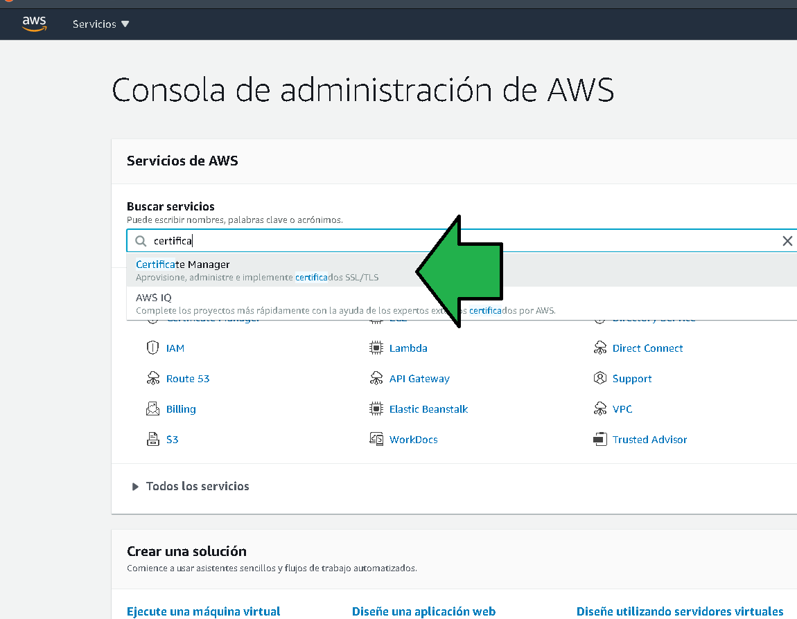

2. Seleccionar "Aprovisionar certificados"

3. Seleccionar "Solicitar un certificado público"
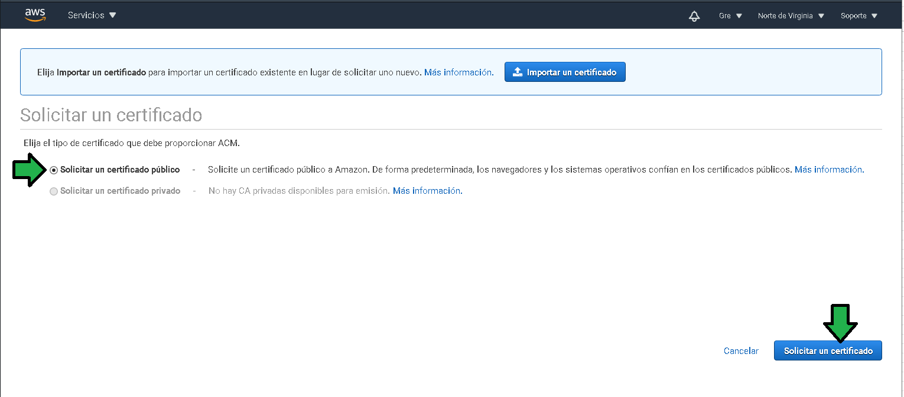

4. Se deberá especificar el o los subdominios para los que el certificado será emitido, como ejemplo se emitirá un certificado wildcard para el dominio edupractice.tk

5. Antes de seguir con la generación del certificado se debe comprobar la propiedad del dominio, en este caso se hará la comprobación por medio de un registro en el DNS.

6. Especificar las etiquetas que el recurso tendrá, útiles a la hora de analizar costos o administrar recursos.

7. Revisar el o los dominios para los que se solicitará el certificado, proceder con la solicitud
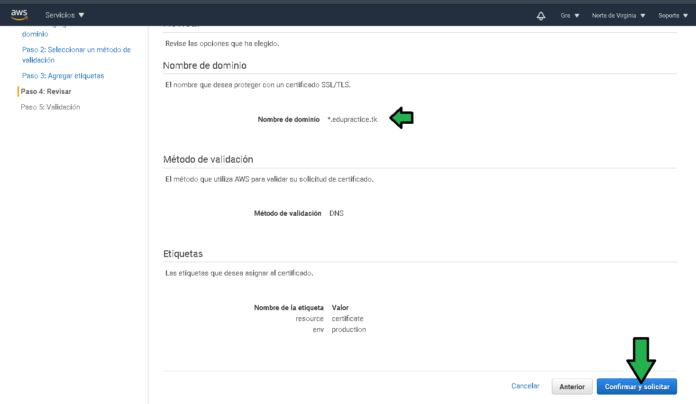

8. Las instrucciones para comprobar la propiedad del certificado son generadas, en el caso de manejar el DNS con Route 53 el registro CNAME es generado automáticamente, en caso de no manejar el DNS con Route 53 se tendrá que generar el registro CNAME de forma manual con los valores que aparecen en las instrucciones.
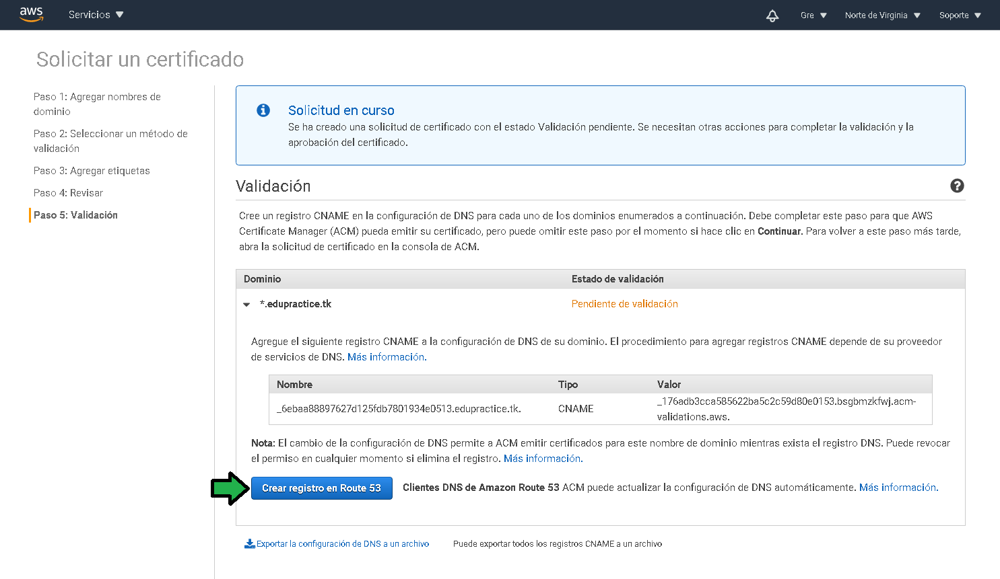

9. El registro DNS se genera y el certificado será generado al cabo de unos minutos.

El paso siguiente: Ya se cuenta con un bucket S3 configurado con un sitio web estático funcional, este bucket será conectado con AWS Cloudfront para proporcionar los assets por el protocolo https, esto debe ser así ya que S3 no soporta adjuntar un certificado de seguridad directamente.

1. Acceder en la consola de administración seleccionando "CloudFront.

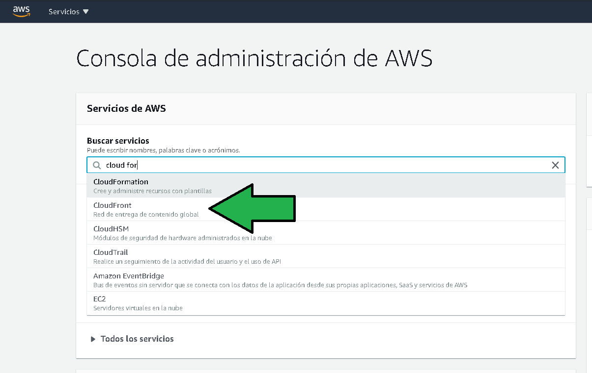

2. Seleccionar:
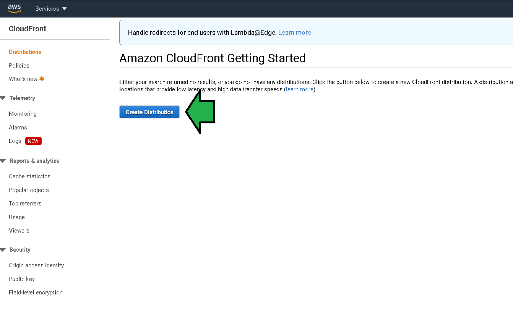

3. Comenzar con la configuración.
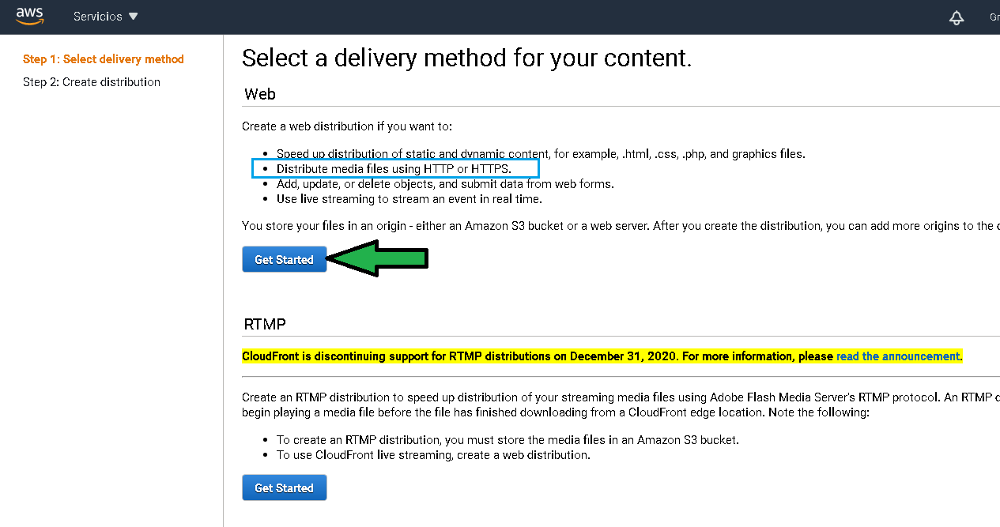

4. Hay varios parámetros a configurar, se señalan los mas icónicos.
- a) Se debe el origen de los datos del dominio, en este caso el bucket con el sitio previamente configurado.
- b) Se actualizará la política de acceso al bucket, así, Cloud Front puede acceder a los datos del bucket S3.

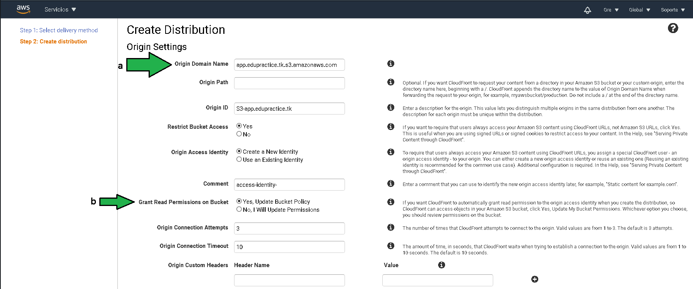

- c) Especificar acceso HTTPS y en caso de acceder por HTTP se redirecciona a HTTPS
- d) Se especifica una política de caché, la política de cache dicta el tiempo en que CloufFront servirá archivos desde el propio CloudFront antes de ir a traer los archivos desde el bucket S3, esto es lo que hace que las peticiones al CloudFront sean mas rápidas, un request en lugar de recorrer grandes distancias hasta la ubicación del bucket recorre uan menor distancia hasta un [Edge location de CloudFront](https://aws.amazon.com/es/about-aws/whats-new/2018/01/cloudfront-adds-six-new-edge-locations/). Por defecto son 24 horas.
- e) Se especifica la política de Origin request, la política dicta cuales son los tipos de archivo que CloudFront copiará a los Edge Locations en cuanto el tiempo de la política de cache llega a su expiración. Por defecto se copian todos los archivos del origen en este caso el bucket.

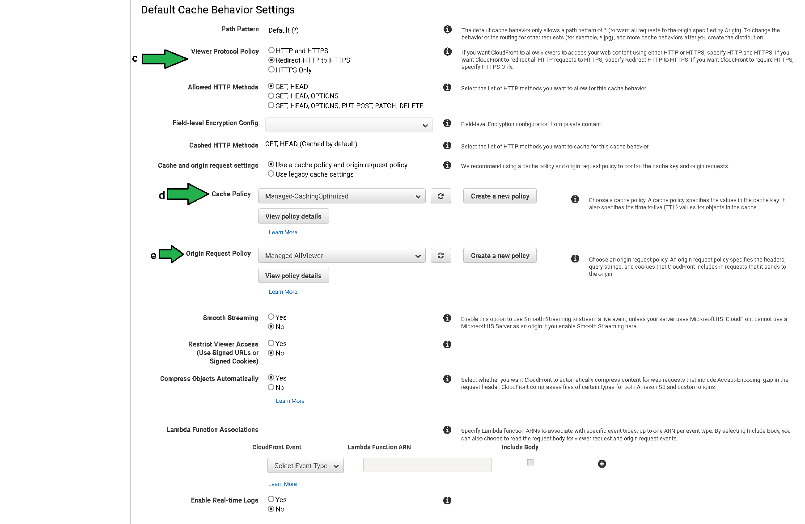

- f) Price Class define que Edge Locations copiarán el contenido del origen, cada Edge Location cuenta con precios distintos, el Price Class seleccionado impactará en el precio pero también en la latencia de los usuarios, en general si se agregan mas Edge Locations habrá menos latencia al contenido de los usuarios pero el precio del servicio aumentará.
- g) Al generar una distribución de CloudFront, CloudFrotn genera una URL con un dominio de CloudFront (ej: f111111abcdef8.cloudfront.net), para poder utilizar CloudFront con un dominio propio se debe especificar el dominio propietario para pasar de d111111abcdef8.cloudfront.net a www.example.com donde example.com es el dominio propietario. Además esta opción dará paso a poder seleccionar esta distribución en Route53. 
- h), i) Aquí se selecciona el certificado de seguridad, se puede seleccionar alguno de los certificados disponibles en AWS Certificate Manager.
- j) Se especifica la familia de protocolos de cifrado utilizados para el aseguramiento de la información, se recomienda siempre tener la última versión aunque hay que ser cuidadosos ya que una política mas actualizada puede no ser compatible con navegadores viejos o desactualizados.
- k) Especifica la versión del protocolo HTTP a ser usado, se recomienda seleccionar la compatibilidad para la [versión 2](https://developers.google.com/web/fundamentals/performance/http2).
- l) Define que archivo debe ser servido por defecto en caso de hacer el request al dominio raíz.
- m) Por último se define el estado del la distribución, se deja como habilitado para utilizar en cuanto este listo.
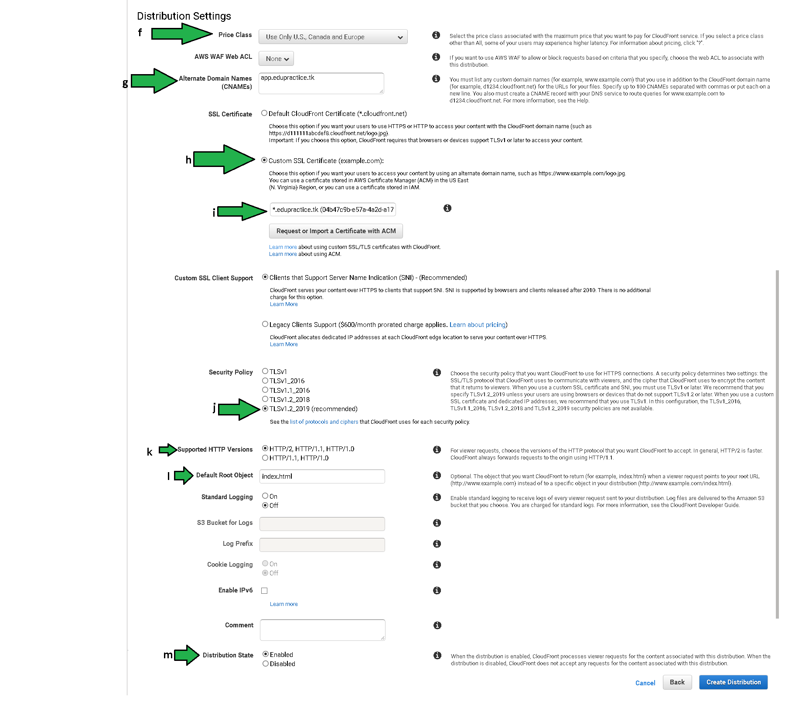

5. La distribución de CloudFront comienza a ser creada, después de unos 5 minutos estará lista. 
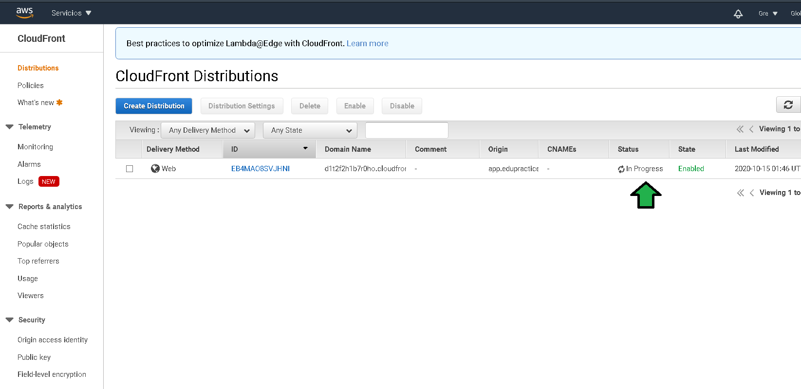

6. Al probar el acceso al sitio se observa que no funciona, ¿qué ha faltado?
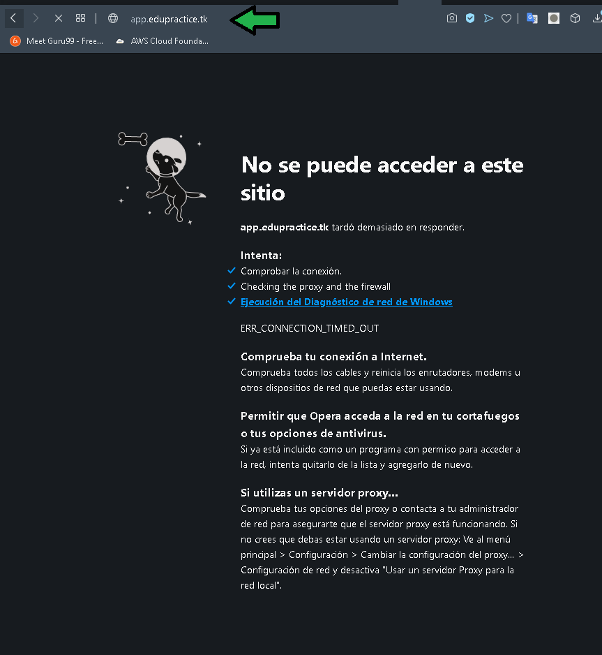

7. Recordemos que el bucket era el que estaba configurado como recurso que sería el que resuelve en cuanto la url sea solicitada, pero el bucket ya será el recurso que debe ser resuelto al acceder la url, se debe redireccionar a la distribución recién creada de CloudFront para lo cual hay que dirigirse a la zona hospedada del dominio en Route53.
 ##### Notar que el registro CNAME creado automáticamente por CloudFront al configurar la distribución del CloudFront (subpaso g en el paso 4). También notar como es el bucket el destinado como valor hacia donde se redirigirá el tráfico en este ejemplo al acceder a app.edupractice.tk.
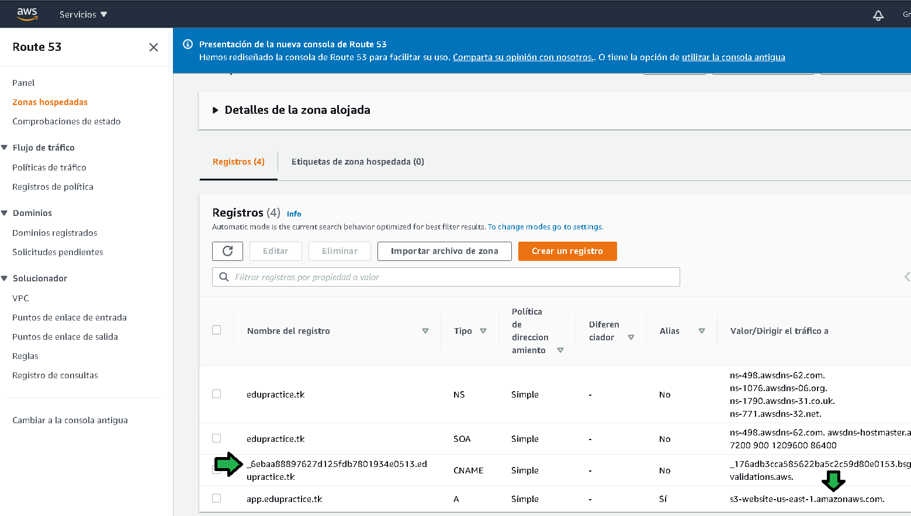
 
 8. Seleccionar el registro y editarlo:
 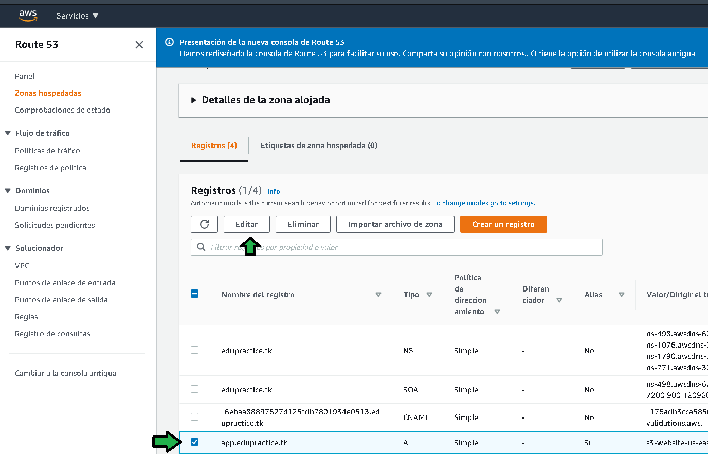

9. Habrá que pasar de bucket de S3 hacia CloudFront (a), posteriormente seleccionar la distribución de CloudFront adecuada. Guardar los cambios.

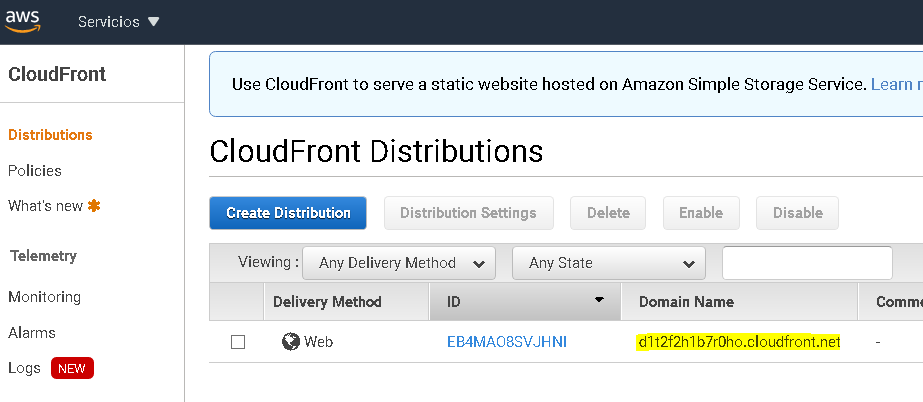

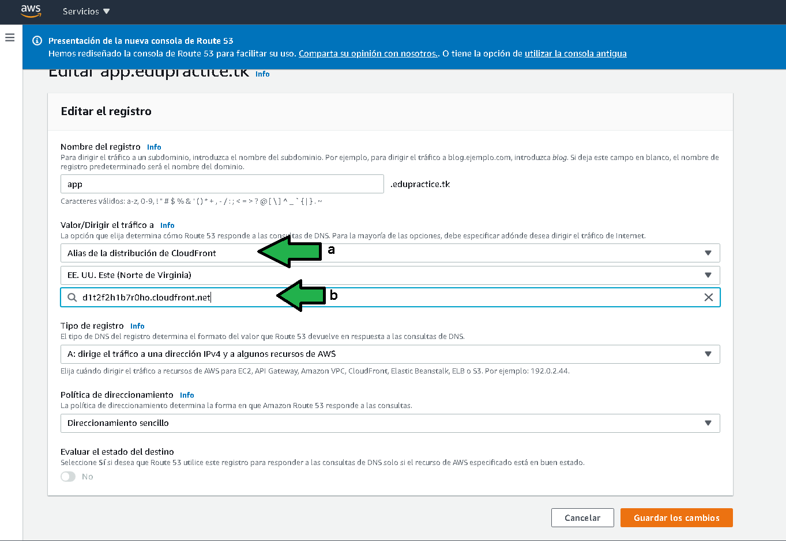

10. Después de algunos minutos se tendrá el sitio web funcionando con HTTPS, asegurando los datos en transporte.
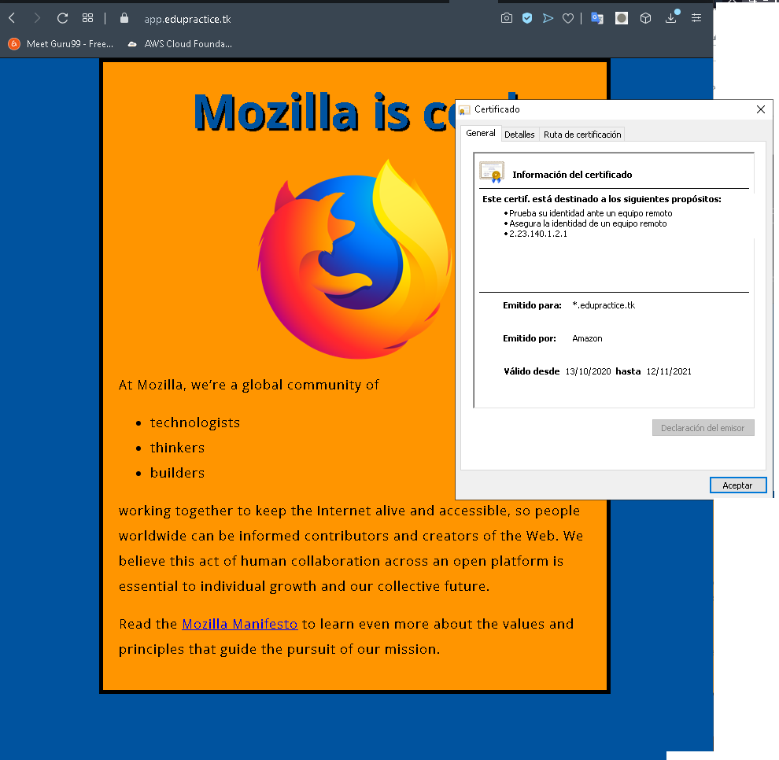