## Sesión 6 - Ejemplo 3

### 1. Objetivo :dart:
- En un bucket S3 buscar información sensible.

### 2. Requisitos :pushpin:
- AWS CLI instalado y configurado.
- Un bucket S3 con algunos archivos que simularán ser archivos con información sensible.

### 3. Desarrollo :bookmark_tabs:

1. Ingresar a la consola de AWS buscando el servicio Amazon Macie.
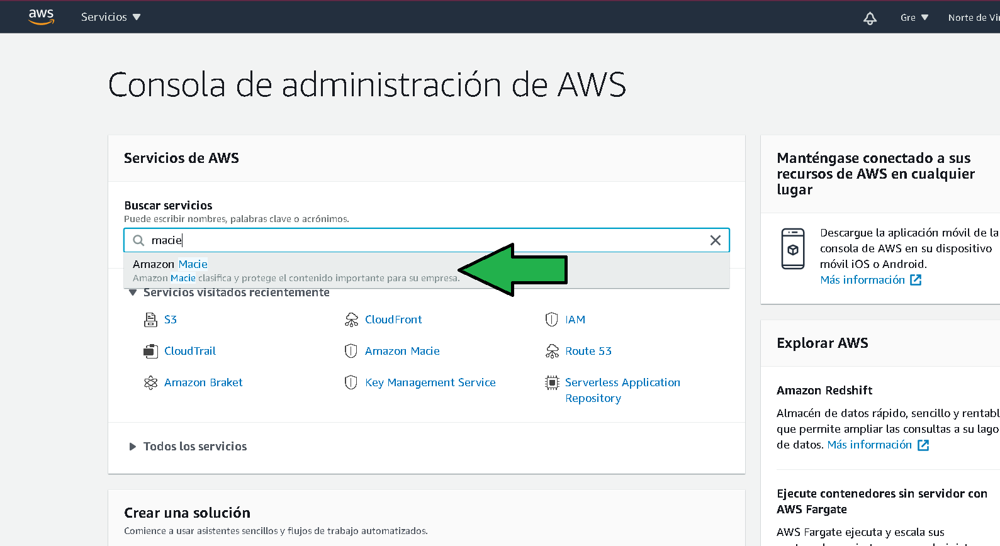

2. Habilitar Macie, al habilitarlo se genera un rol con la política necesaria para que el servicio acceda al servicio S3.

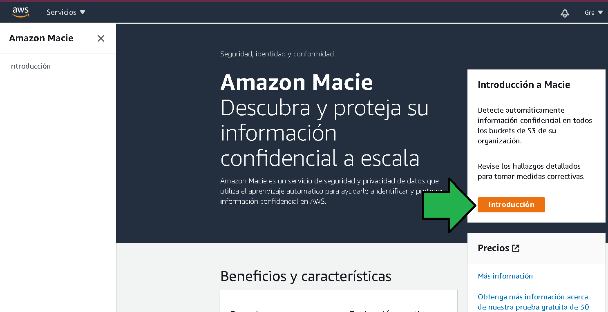

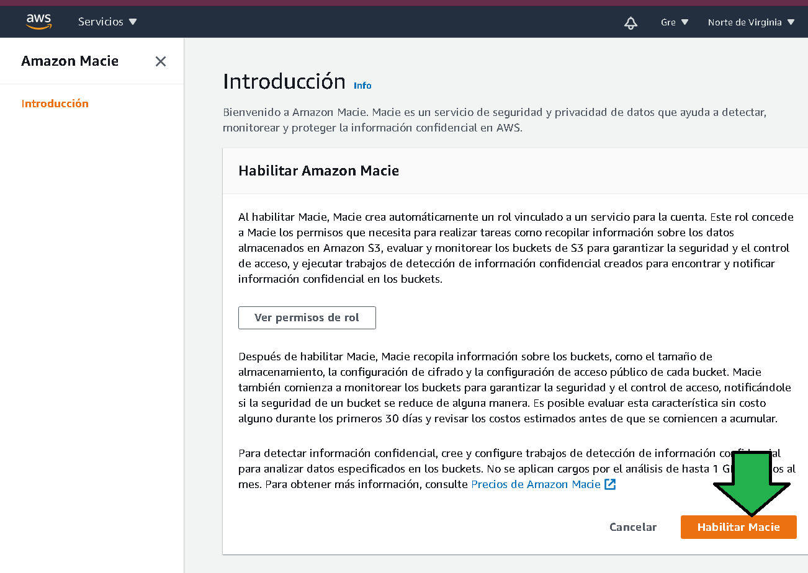

3. Al habilitar el servicio, Macie  da un reporte de los buckets a los que tiene acceso. Habrá que ejecutar un trabajo de escaneo

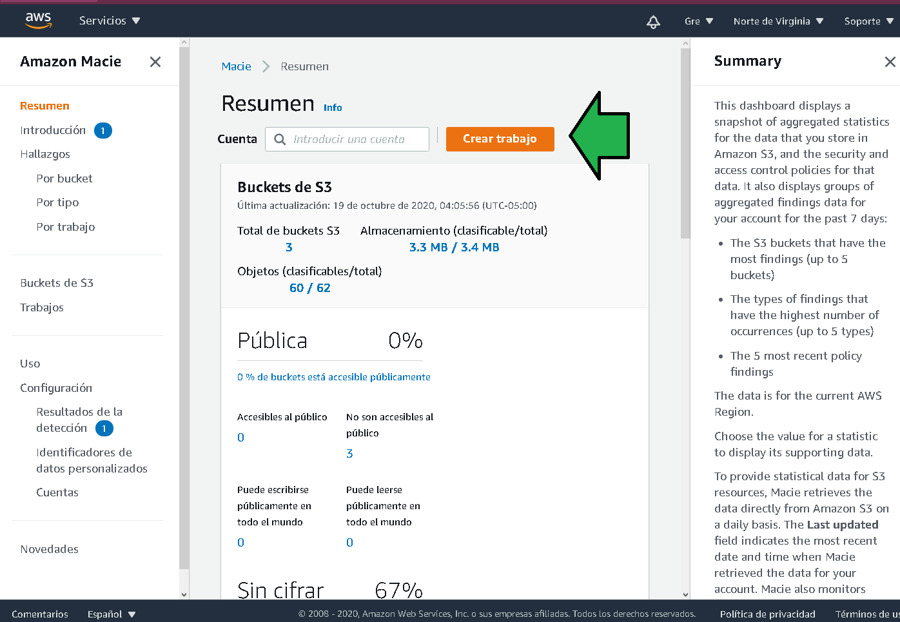

4. Se debe seleccionar el o los buckets para ser analizados.

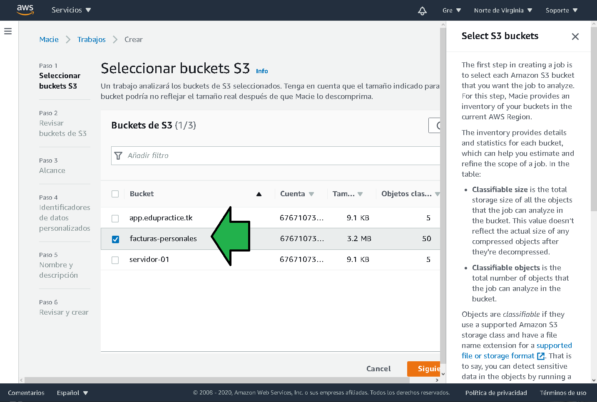

5. Confirmar el bucket y el costo estimado.
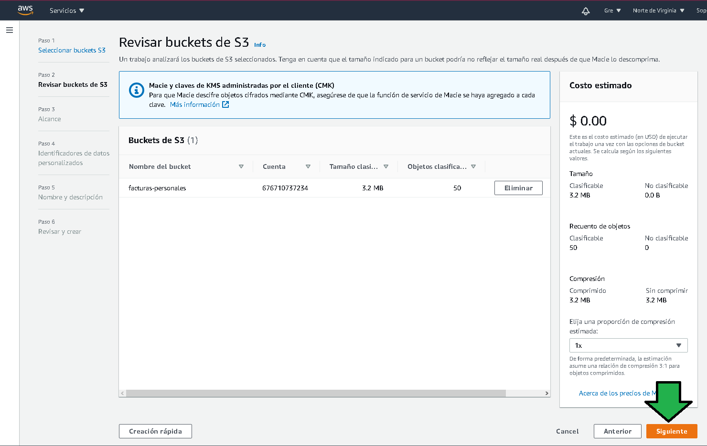

6. Para no incurrir en costos periódicos se deberá seleccionar como trabajo único.
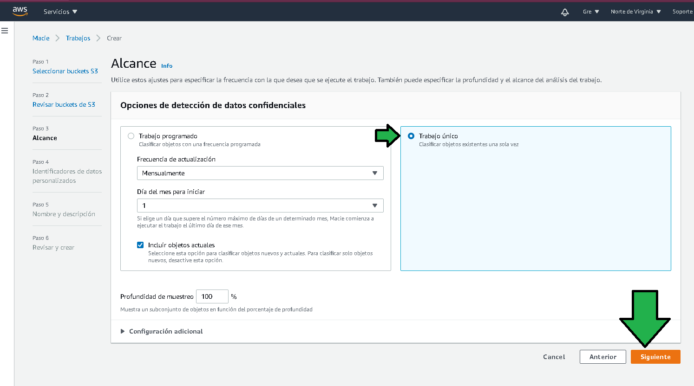

7. En la siguiente pantalla se pueden escoger identificadores personales, son patrones basados en regex o palabras clave que deben ser identificados como información sensible, por defecto Macie ya detecta nombres,direcciones y números de tarjetas de crédito.
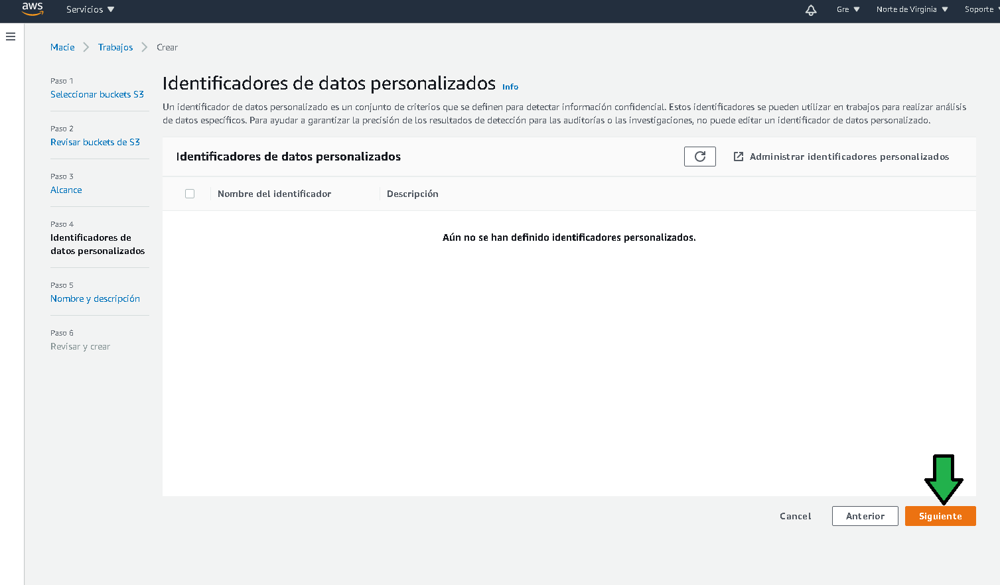

8. Se asigna un nombre y descripción para el trabajo.
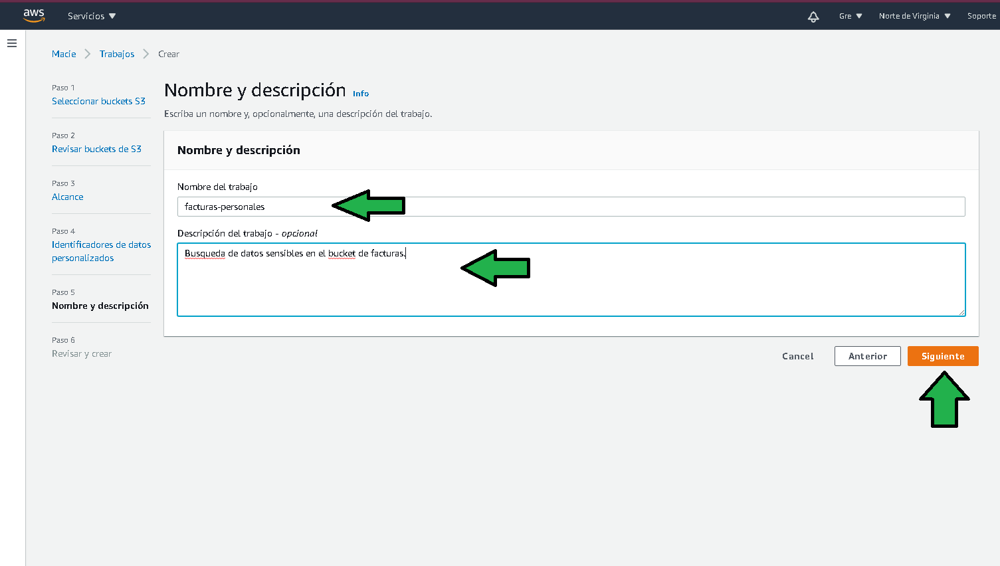

9. Se revisan los datos configurados, de ser correctos se finaliza la configuración.
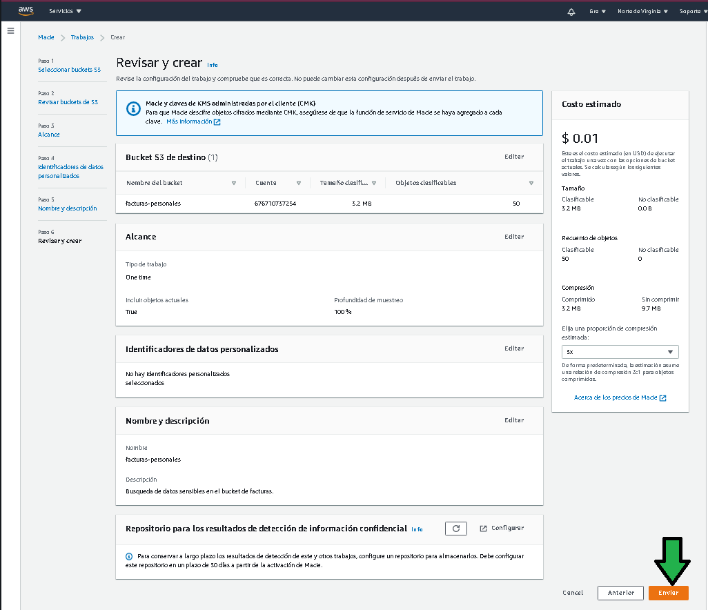

10. El trabajo comienza a ejecutarse.
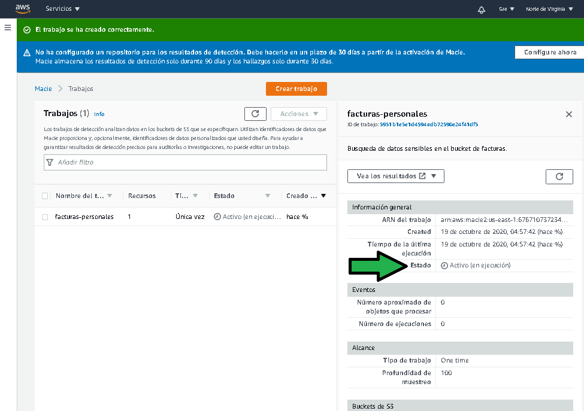

11.  Completado el trabajo se tendrá acceso a un reporte de hallazgos.

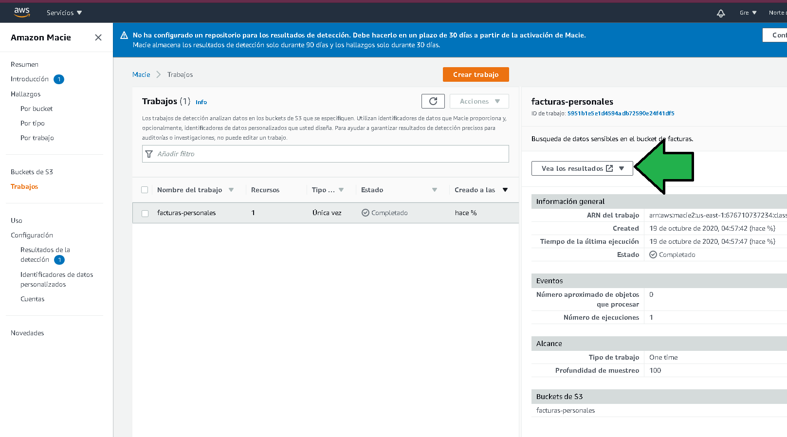

12. Verificando el contenido del archivo se puede ver que son 4 nombres encontrados y reportados.
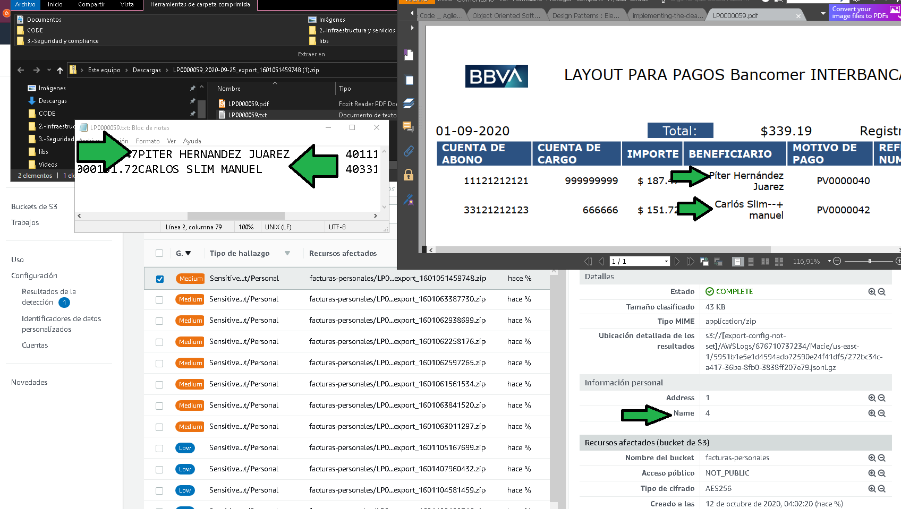

