# Ejemplo 2

# 1. Objetivo 🎯
- Crear un repositorio para alojar código, el repositorio es compatible con git.

# 2. Requisitos 📌
-  [Git 1.7.9 o superior](https://git-scm.com/downloads).

# 3. Desarrollo 📑


1. Ir al servicio IAM para generar un nuevo usuario con el que poderse conectar al repositorio. Click en "añadir usuario".


2. Establecer un nombre para el usuario, guardar este usuario, será usado en pasos posteriores.


3. Establecer por medio de una política el servicio al que tendrá acceso esta cuenta.
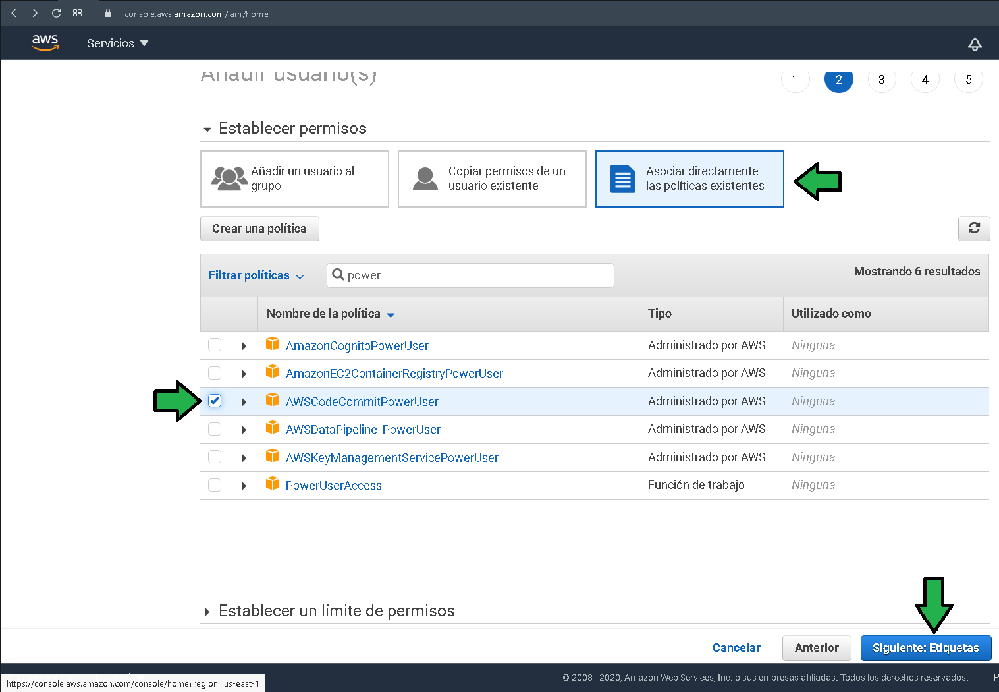

4. Añadir una etiqueta solo para propósitos administrativos.
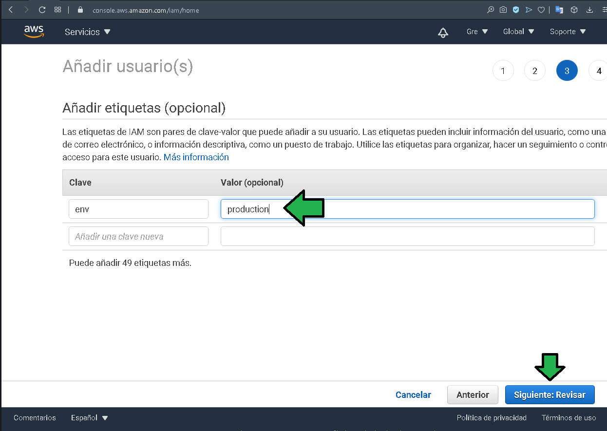

5. Proceder a la creación de usuario dando click en "Crear un usuario".
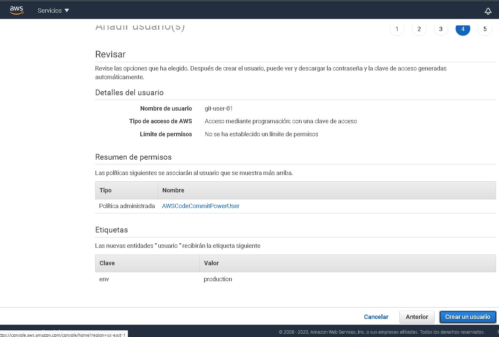


6. Descargar las credenciales para poder conectar con el repositorio. Se recomienda usar un [gestor de contraseñas](https://bitwarden.com) para guardarlas.
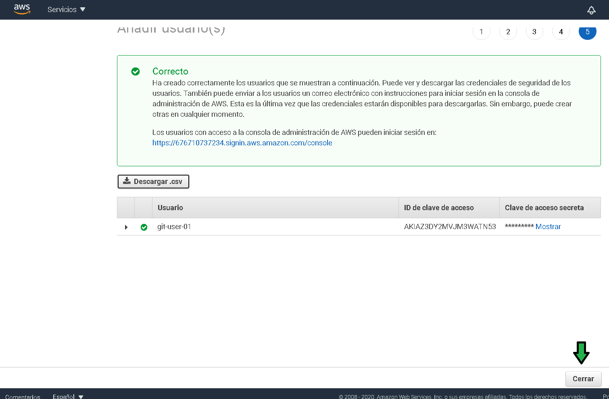

7. Moverse dentro del servicio IAM a la parte de usuarios, seleccionar el usuario recién creado, dar click en "generar las credenciales".
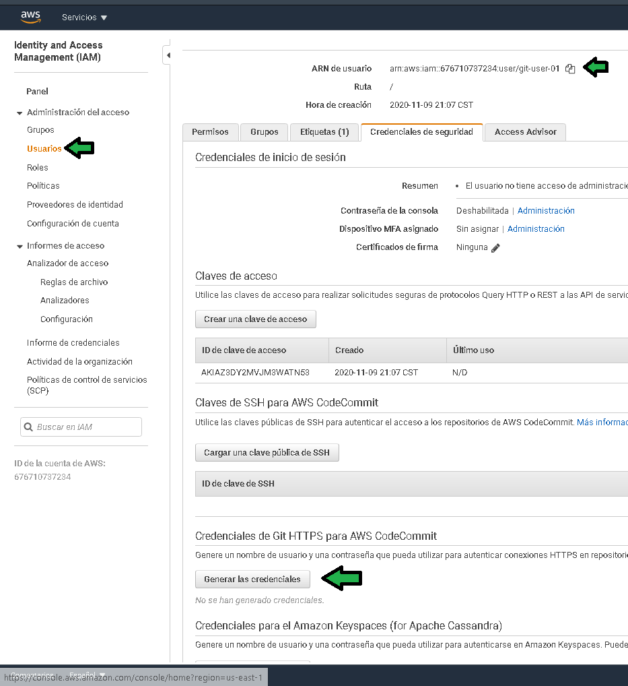

8. Se generará una credencial para conectar con los repositorios., descargar el archivo de credenciales.


9. Ahora habrá que ir al [repositorio de código](https://github.com/bay007/leads) que se subirá (este código será usado para el trabajo postwork) .  Click en "Download ZIP" para descargar el código.
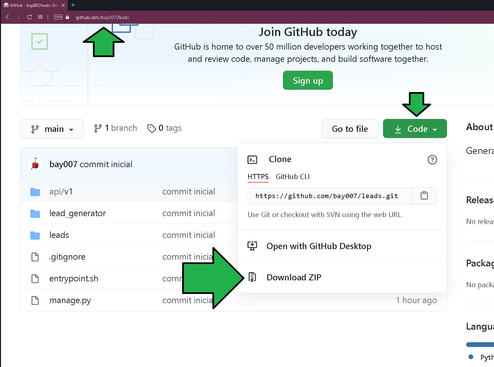


10. Descargado ZIP con el código hay que descomprimirlo, navegar en una línea de comandos hacia la carpeta descomprimida. 
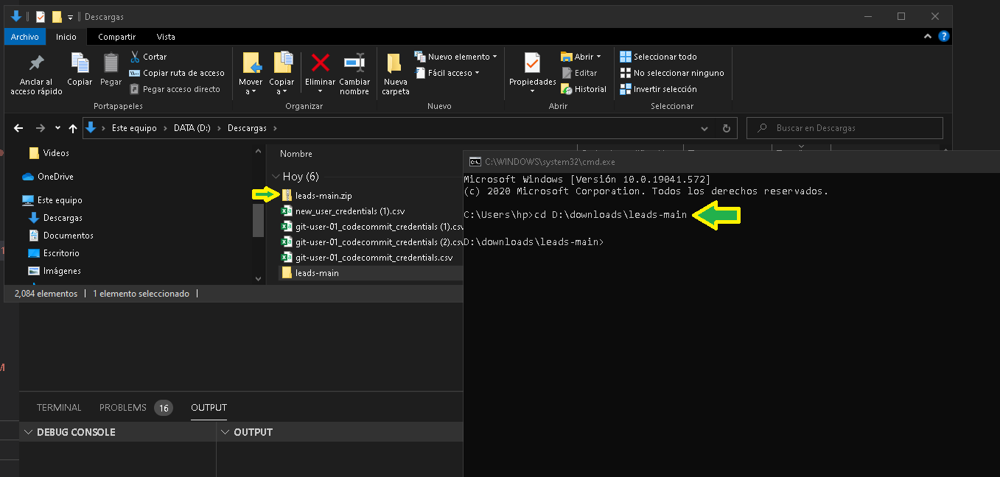


11. Buscar y seleccionar el servicio "CodeCommit".

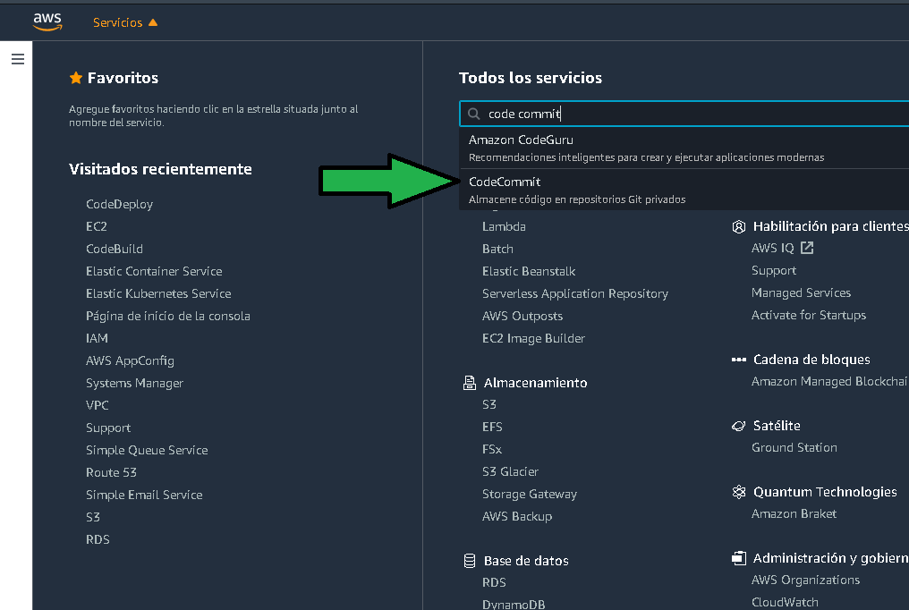

12. Seleccionar la opción "Crear el repositorio".
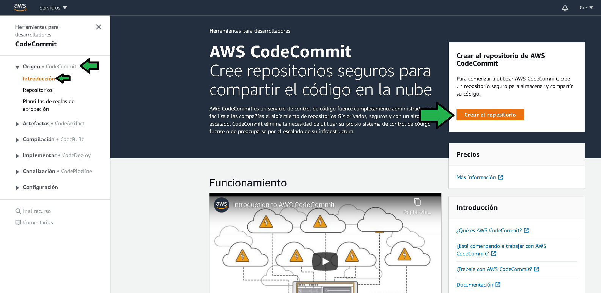


13. Establecer un nombre del repositorio y una descripción, dar click en "Crear".
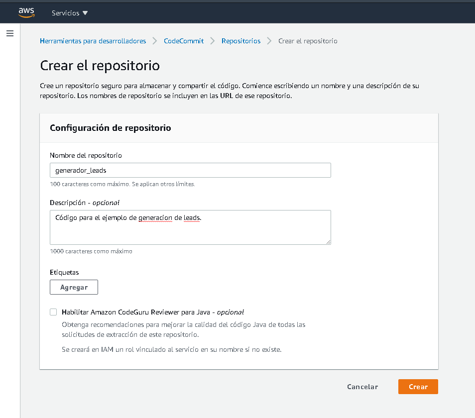


14. Para poder ingresar código en el repositorio habrá que clonar el repositorio a local, para lo cual (a) hay que hacer click en repositorios , (b) seleccionar el repositorio recién creado y después dar click (c) en "Clonar  HTTPS".


Se copiará en el portapapeles la url del repositorio, en este caso https://git-codecommit.us-east-1.amazonaws.com/v1/repos/generador_leads, para poder clonar el repositorio habrá que usar el comando `git clone ` añadiendo como argumento la url del repositorio, para este caso el comando completo queda como 

```bash
git clone https://git-codecommit.us-east-1.amazonaws.com/v1/repos/generador_leads
```
Ejecutar el comando en una linea de comandos.


15. El comando pedirá unas credenciales para poder conectarse al repositorio, ingresar las credenciales descargadas, al clonar el repositorio se genera una nueva carpeta.


16. Hay que copiar el contenido del ZIP descomprimido del paso 10 a esta nueva carpeta.


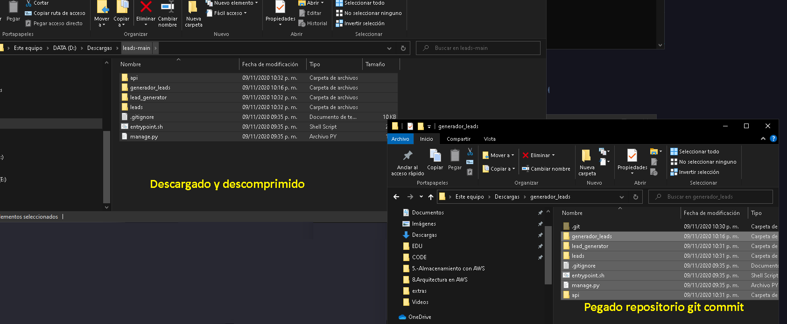


17. Ejecutar sobre la linea de comandos en la carpeta del repositorio clonado el comando `git status`, se mostrarán los archivos pendientes por ser añadidos al repositorio.
Ejecutar el comando `git add *`, el comando dicta a git que archivos deberían ser agregados al repositorio, en este caso con `*` se especifican que todos.
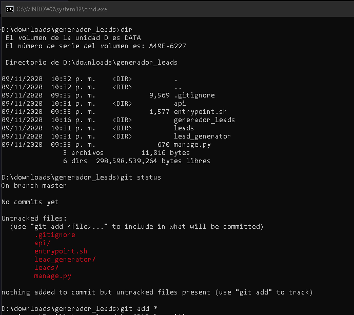

18. Ejecutar el comando `git commit -m "Primer commit"`, con el comando se confirman los cambios de código, en este caso se confirma la agregación de todos los archivos.


19. En este punto se está listo para subir el código, se hace con el comando `git push`.
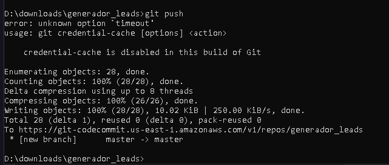

Regresando a CodeCommit se pueden ver los archivos.


