# Postwork

# 1. Objetivo 🎯

# 2. Requisitos 📋
-

# 3. Desarrollo 📑

#### El siguiente ejemplo y código están destinados únicamente a fines educativos. Asegúrese de personalizarlo, probarlo y revisarlo por su cuenta antes de usar cualquiera de esto en producción.

------Acceso a IAM para roles del cluster--

-----

----------------------------------
1. Antes de ejecutar el pipeline se deberá crear un registro para almacenar la imagen de docker que vaya resultando de la etapa de "Build", 
para ello hay que ir al servicio "Elastic Container Registry" 

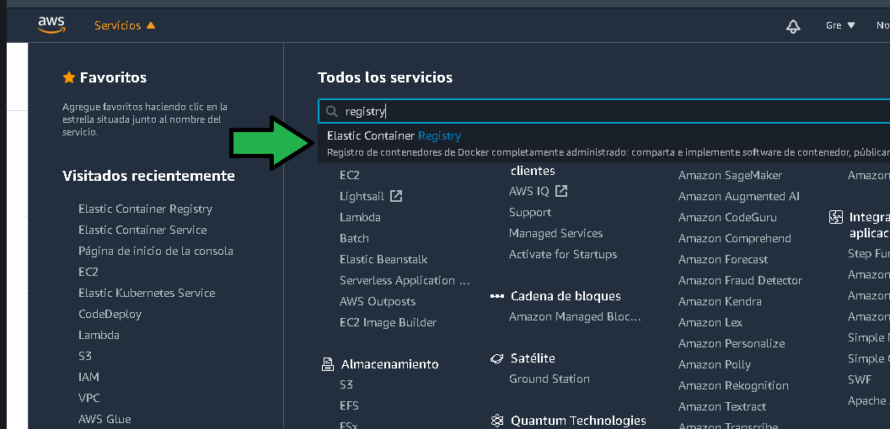

2. Click en "Get Started"
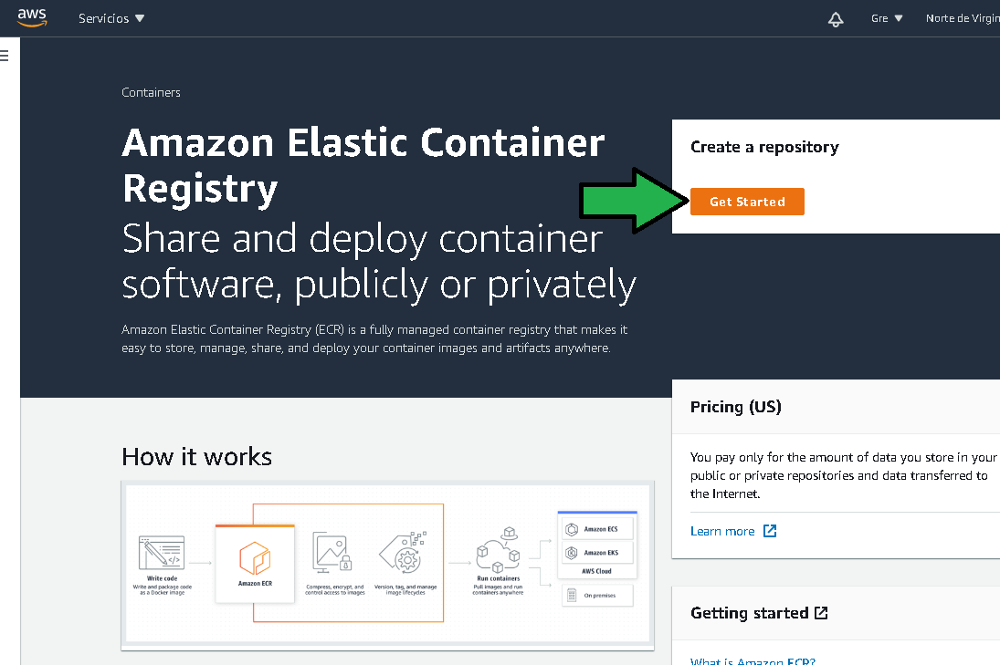

3. a) Establecer la visibilidad del registro, se establecerá como privado, b) Seleccionar un nombre para el repositorio. 

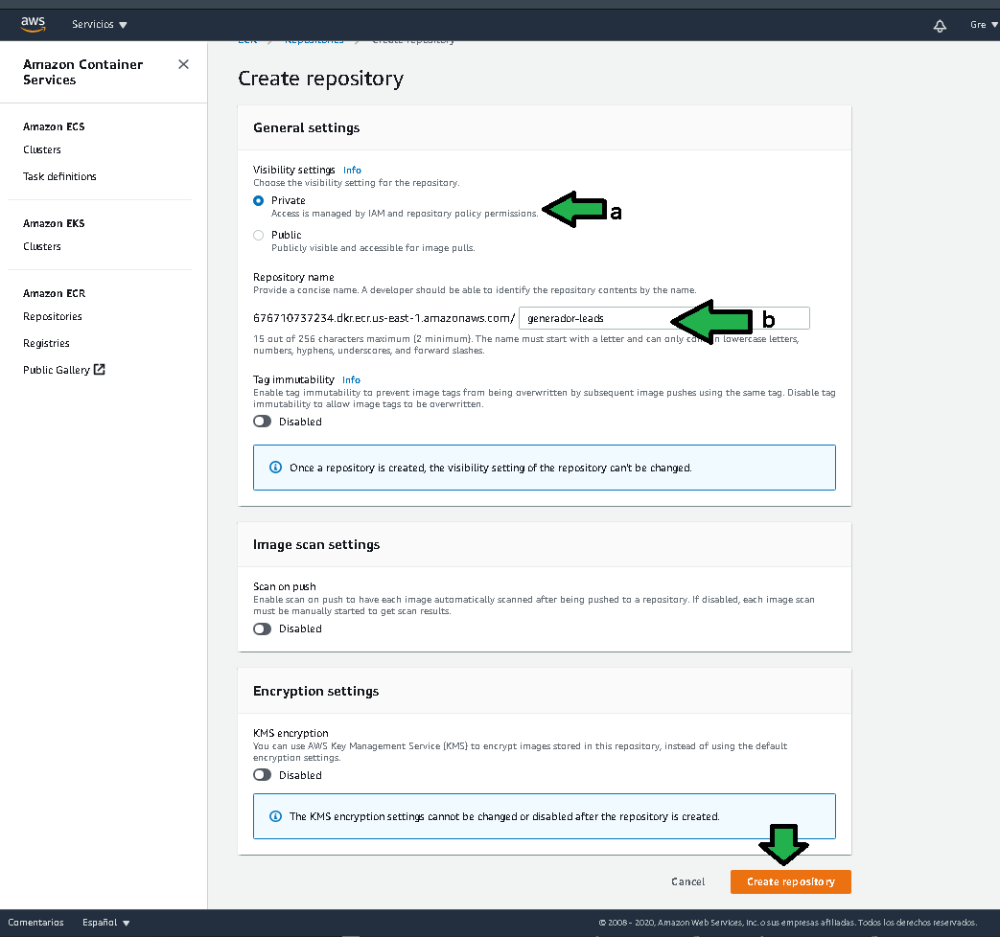

El repositorio es creado:
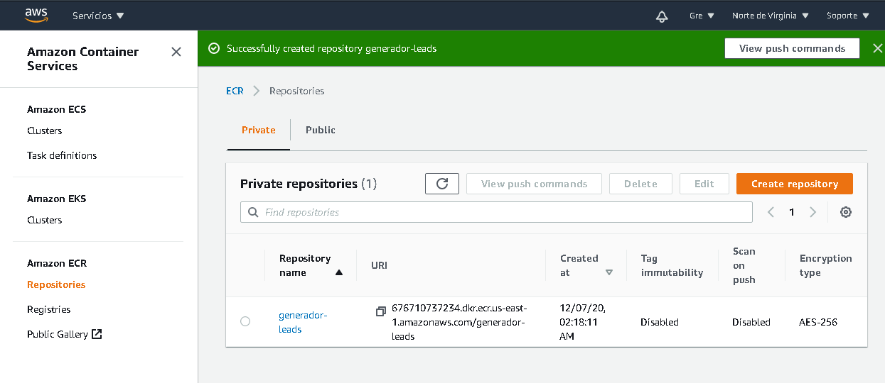

---------------------------------

Para configurar la etapa de Build se deben seguir los siguientes pasos:

1. Buscar el servicio "Code Build" e ingresar a él.

2. Click en "Crear el proyecto de compilación"

3. Al ingresar a la configuración se deberá establecer los siguientes datos:
a) Establecer un nombre para el proyecto de compilación.
b) Establecer de donde saldrá el código a ser compilado, para ello se seleccionará el servicio "CodeCommit"
c) Se seleccionará el repositorio git.
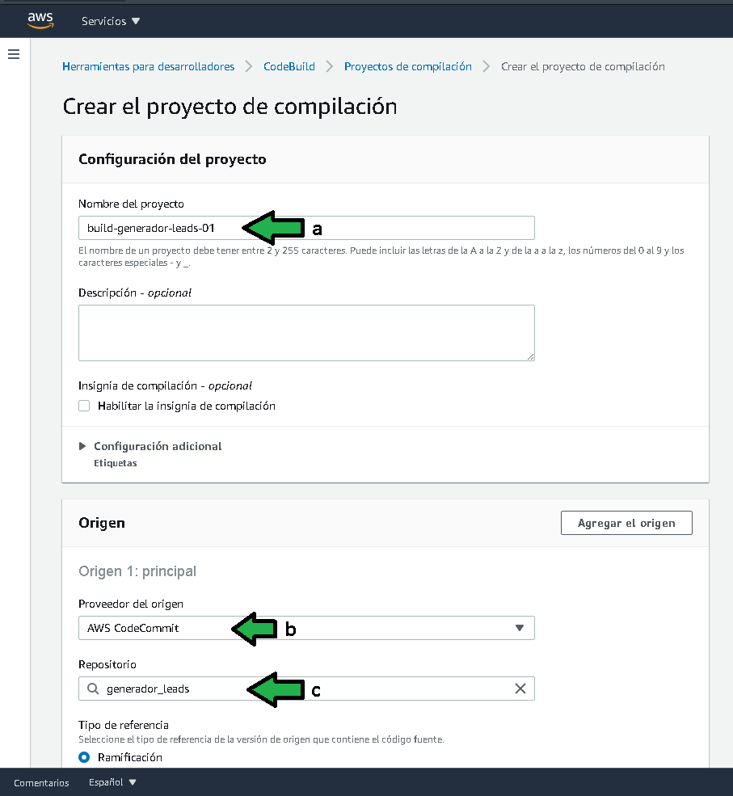

4. Seleccionar la rama de la que se deberá extraer el código fuente.
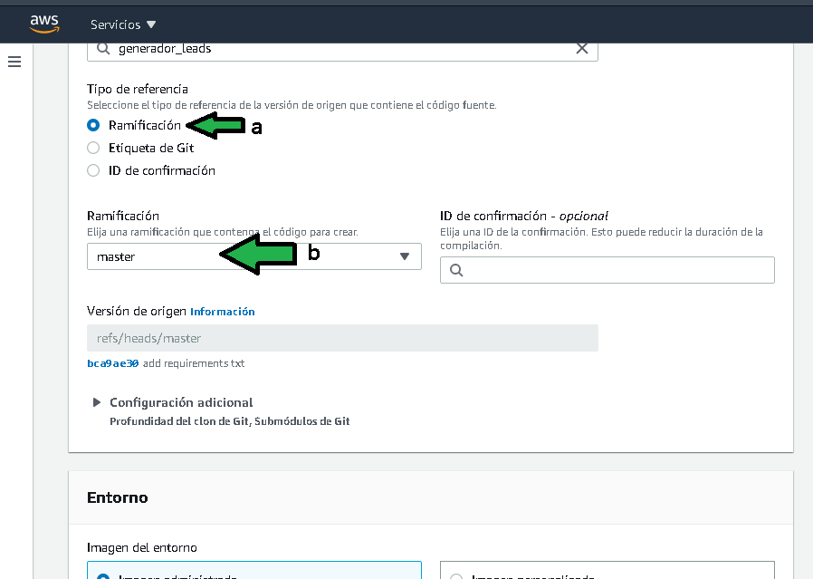

5. Para configurar el entorno donde se construirá la imagen se deberá especificar:
a) Seleccionar imagen administrada
b) Seleccionar el sistema operativo Amazon Linux 2
c) Seleccionar "Standard"
d) Seleccionar la imagen más reciente
e) Seleccionar la imagen mas reciente de la imagen
f) Seleccionar tipo de entorno "Linux"
g) Habilitar el modo "privilegiado" ya que se generará una imagen de Docker.
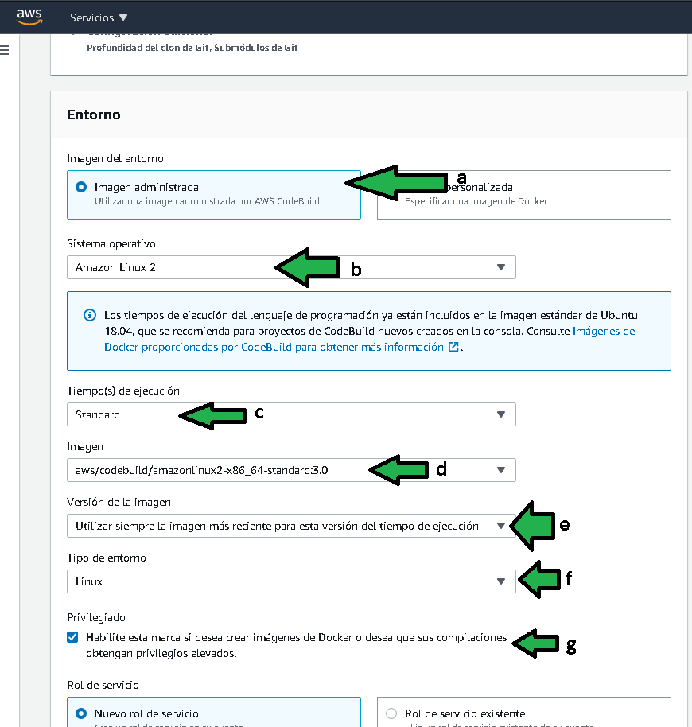

a) Seleccionar un nuevo rol, el rol es necesario para acceder al repositorio git con el código fuente.
b) Establecer un nombre descriptivo para el rol.
c) El tiempo de espera se debe establecer en 10 minutos
d) El tiempo de espera en cola se deberá establecer en 15 minutos
e) No se debe instalar ningún certificado.
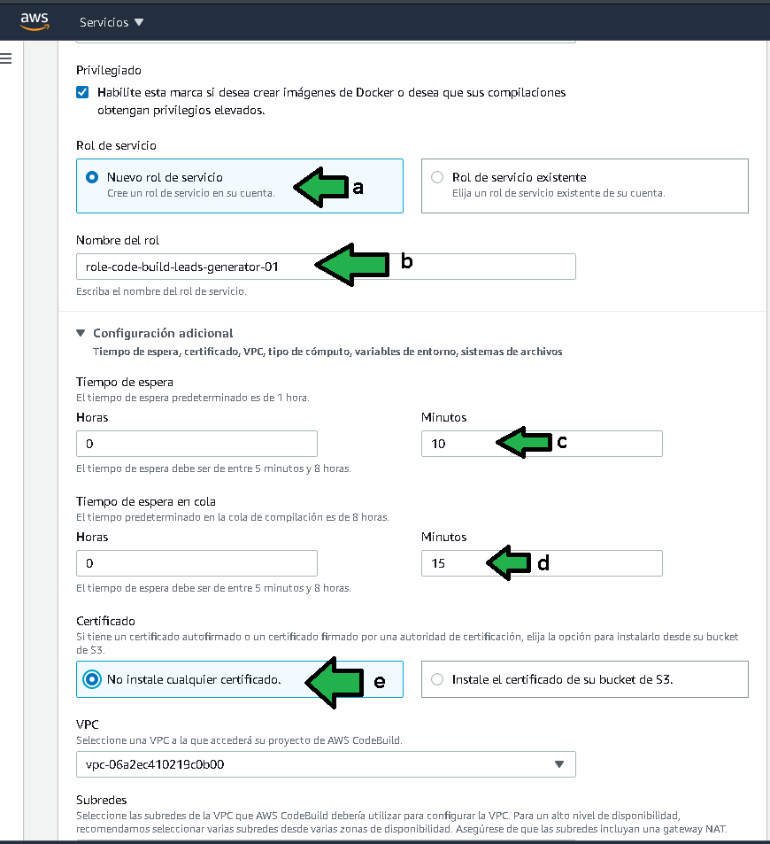

5. a) Establecer la VPC en la cual se conectará la instancia de Code buil para generar la imagen,
b) Seleccionar subredes privadas que tengan el acceso por NAT Gateway hacia internet.
c) Seleccionar un grupo de seguridad con acceso hacia internet, los grupos que se han manejado hasta ahora no tienen restricción en tráfico de salida.
d) Dar click en "Validar la configuración de la VPC", e) Se deberá mostrar un mensaje confirmando el acceso a internet.
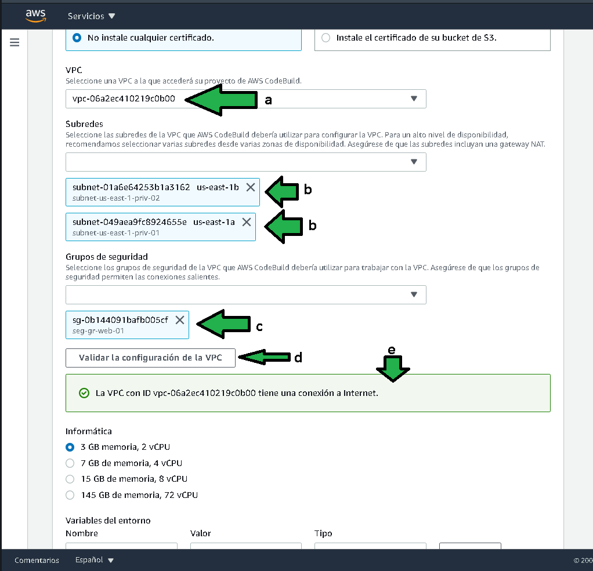

6. Se debe especificar el tamaño de la instancia donde se generara la imagen de docker
a) El programa no es nada pesado, se puede especificar el tamaño de la instancia en la más pequeña
b) Establecer la variable de entorno `AWS_DEFAULT_REGION` con el valor `us-east-1`
c) Establecer la variable de entorno `AWS_ACCOUNT_ID` con el valor  del número de cuenta, dicho valor puede ser consultado en el menú superior derecho.
d) Establecer la variable de entorno `IMAGE_TAG` con el valor `latest`
e) Establecer la variable de entorno `IMAGE_REPO_NAME` con el nombre del repositorio de imágenes docker recién creado.
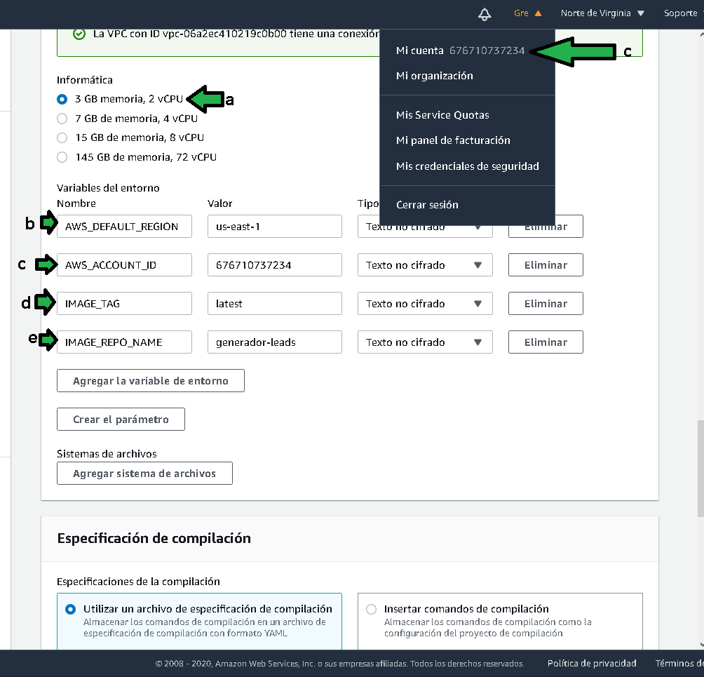

7. EL archivo de especificación es un archivo que viene en la raiz del proyecto, se llama `buildspec.yml`, en él se definen los pasos a seguir para generar la imagen docker.
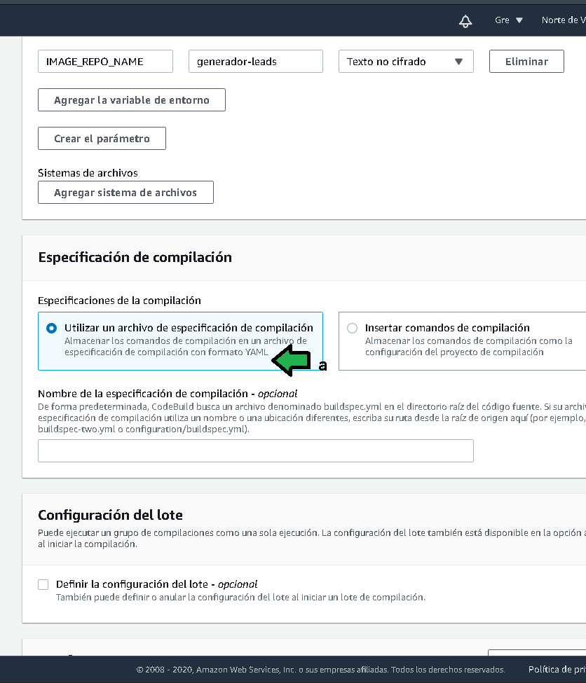

8. a) Especificar una construcción sin artefactos, b),c) Deshabilitar los logs. Finalizar dando click en "Crear el proyecto de compilación"
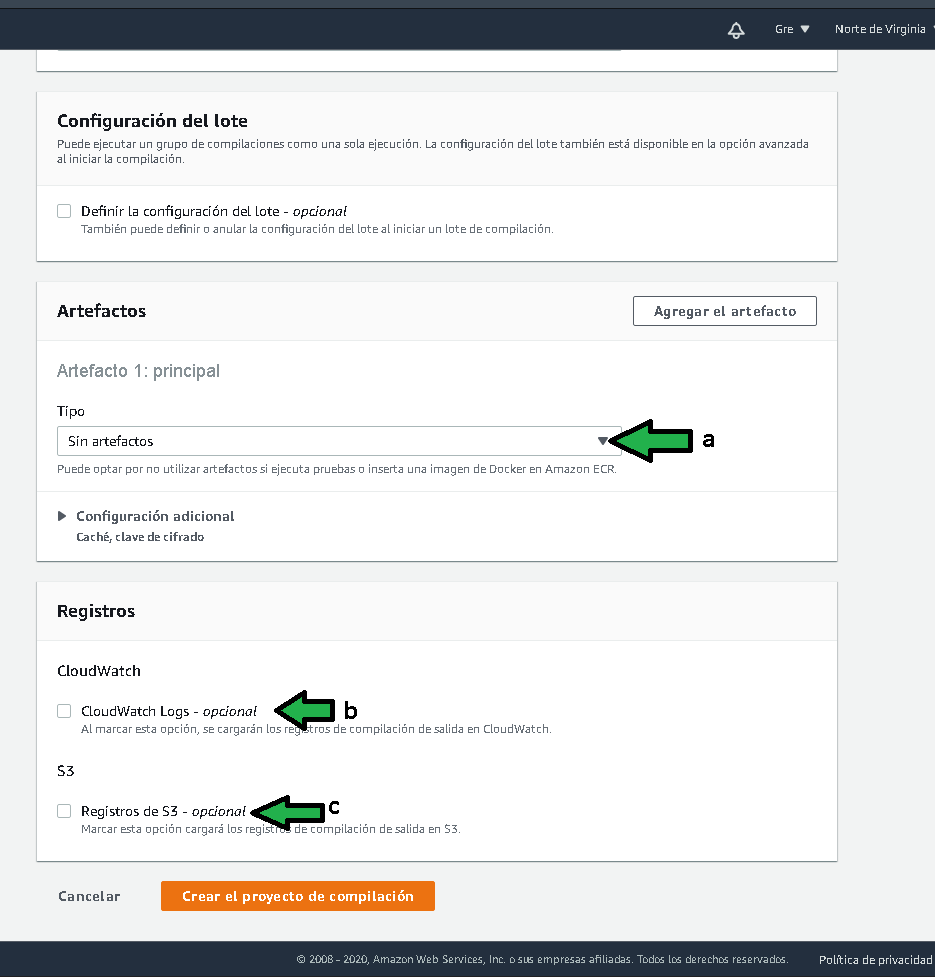

Después de un minuto el proyecto de compilación se genera.
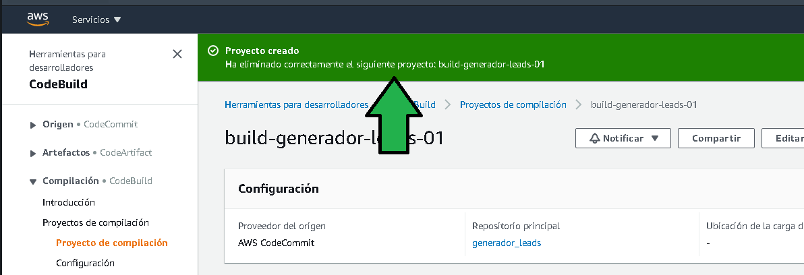

Antes de finalizar, habrá que ir al servicio IAM a agregar un rol a la política para asegurar que la imagen resultante se puede desplegar en el servicio ECR, para ello:

a) Buscar en los roles, el rol recién establecido en "Code Build", 
b) a dicho rol en la sección de "permisos"
c) Agregar la política "AmazonEC2ContainerRegistryPowerUser"
d) Una vez agregada la política se verá como ha sido agregada correctamente.
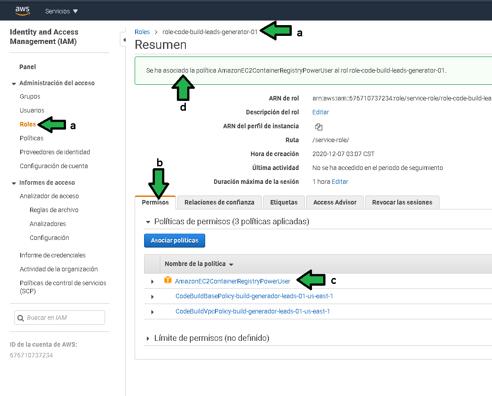

------------------------------------------

