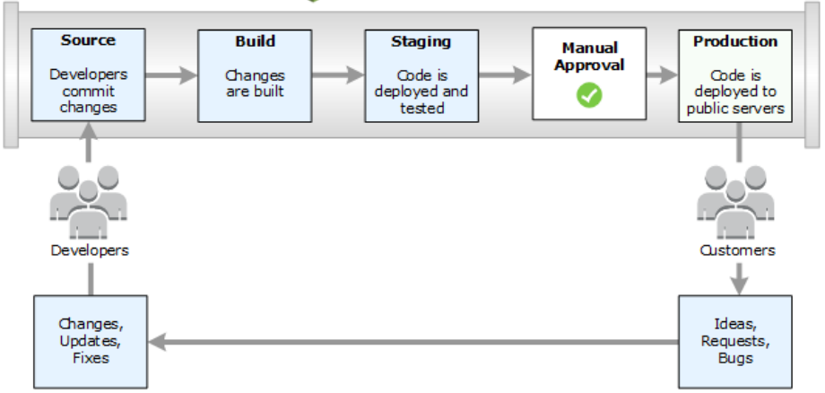
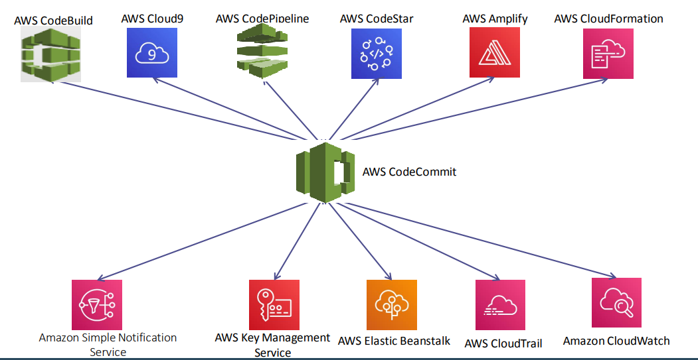
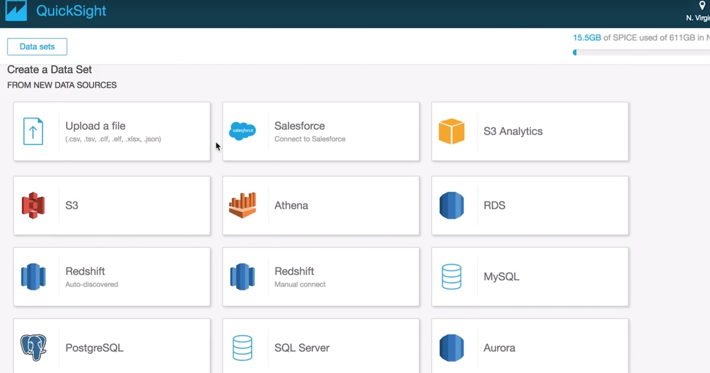
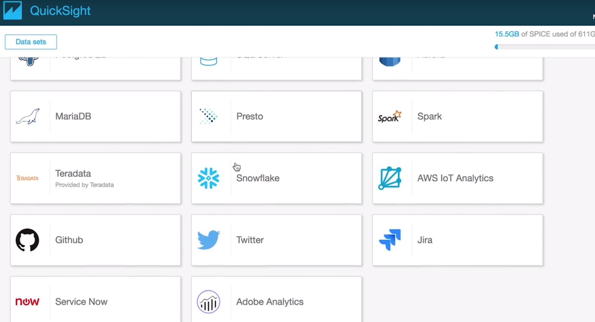
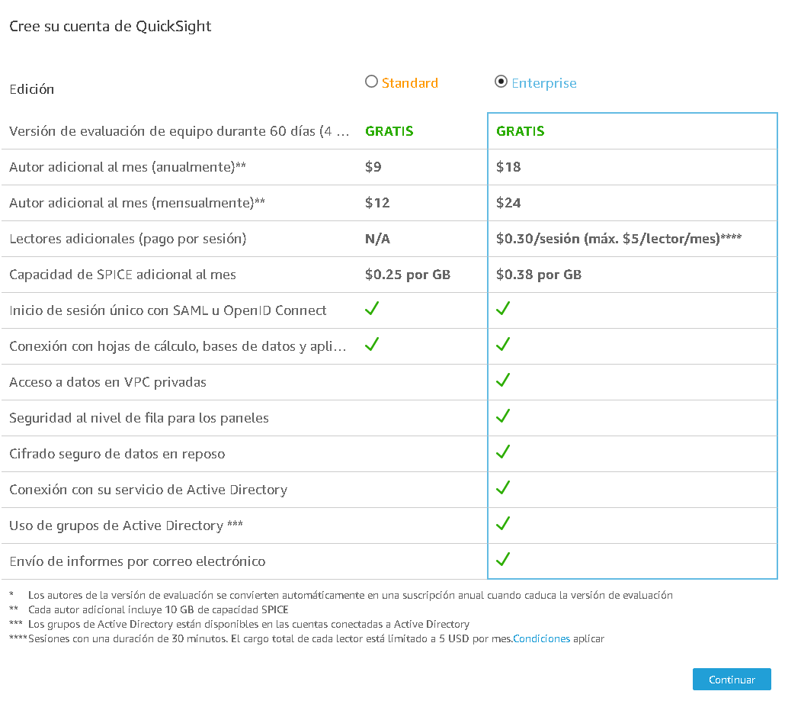
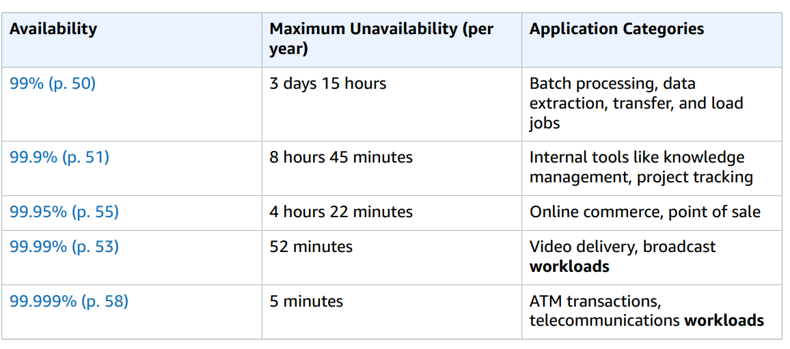

# Prework

# Introducción
Hay varios tópicos en AWS más avanzados, los anteriores fueron los bloques fundamentales que toda la nube de AWS está construida. 
Tópicos avanzados de AWS se construyen y manejan sobre los tópicos básicos, se dará por hecho que los tópicos básicos se conocen por lo que no se profundizará en ellos al ser mencionados.

# 1. Objetivo 🎯
- Conocer las herramientas para desarrolladores de AWS.
- Conocer como las mejores prácticas en el entorno AWS encajan y son consistentes a lo largo de los servicios.

# 2. Instrucciones 📋
- Se debe leer el contenido en un ambiente libre de distractores físicos y electrónicos atendiendo a los enlaces en el texto.

# 3. Desarrollo 📑

# AWS Developer Tools

La forma de desarrollo de software que aún es común implica que los cambios de software se trabajen de manera aislada por periodos largos de tiempo, después de algunos días se trata de combinar y desplegar código a producción lo que resulta difícil con probabilidad alta de inserción de errores lo que provoca malestar y desconfianza por parte de los clientes, eso sin contar con la lentitud ante cambios de requerimientos.

El flujo de integración continua de código es una práctica de desarrollo de software en la que a cada cambio de en el repositorio central se construyen paquetes de código desplegados ejecutando pruebas automáticas tradicionalmente `unit testing`, si la etapa de testing falla el paquete con código no pasa a ser desplegado a producción, la idea es detectar fallos en etapas tempranas en el desarrollo de software.

La integración continua se conforma de una fase de creación y pruebas unitarias del proceso de publicación de software. Cada commit enviado al repositorio activa automáticamente la creación y las pruebas.

AWS cuenta con herramientas para implantar los flujos de integración continua, para la fase source se cuenta con CodeCommit, para construir el entregable  (build) se tiene CodeBuild, para desplegar a producción CodeDeploy hará el trabajo, finalmente para orquestar todas las etapas se tiene a CodePipeline.

- CodeCommit: Es un control de versiones de software compatible con Git, es totalmente administrado por lo que no hay que preocuparse de servidores, es similar a otros proveedores de control de versiones de código administrados como Bit Bucket o GitHub, la ventaja es que se integra bien con varios servicios de AWS para facilitar tareas de desarrollo de software entre ellos cifrado de repositorios con AWS Key Management Service (KMS) y AWS IAM para el control de acceso a los mismos.

- CodeBuild: 
Encargado de la compilación de código fuente y ejecución de pruebas, produce paquetes de software listos para ser ejecutados.
Cuenta con soporte para S3, Github y Bitbucket como orígenes de código.
Se debe especificar  el origen código fuente y el entorno de compilación, junto con otras especificaciones de compilación en un archivo buildspec.yml , AWS aprovisionará automáticamente un entorno aislado basado en contenedores para ejecutar la compilación. En contenedor puede ser un contenedor administrado y mantenido por AWS aunque también es posible utilizar contenedores propietarios o de terceros.
La variedad de contenedores que pueden ser usados abre la puerta a soporte para código escrito en Android, Java, Python, Ruby, Go y un largo etcétera, todo dependerá de lo que pueda soportar Docker.
La forma de cobro de CodeBuild es costo por minuto medido desde que se lanza el contenedor para comenzar con el testeo y se finaliza construcción de un paquete de software. 
Es posible integrar webhooks a CodeBuild, imaginar mandar un commit al repositorio, se ejecutan los test, y en caso de falla CodeBuild puede avisar en un canal de [Slack o levantar un ticket en Jira sobre el problema](https://github.com/aws-samples/aws-codebuild-webhooks).

- CodeDeploy:
Es necesario después de generar un paquete de software ya testeado implementar o desplegar en un entorno de ejecución para ser usado. CodeDeploy soporta despliegue de software en instancias EC2, Lambda, servidores locales y claro Contenedores de Docker. Con esto es posible automatizar los despliegues que antes debían ser de forma manual, en entornos de producción puede que no quite mucho tiempo pero para entornos de desarrollo donde continuamente se liberan nuevos cambios o features la distracción para quien se encargaba del despliegue se vuelve representativo en la productividad del día a día.
CodeDeploy puede desplegar código en cualquier lenguaje de programación, lo único que hay que hacer es especificar una secuencia de comandos para el despliegue en un archivo AppSpec en formato YAML. CodeDeploy se basa en la instalación de un agente en los servidores a desplegar por lo que ademas de soportar despliegues para Amazon Linux, Red Hat Enterprise Linux, Ubuntu Server y  Windows Server  se puede usar en otros sistemas operativos compilando e instalando el agente en ellos.
En cuanto a precios, no hay costos asociados en los despliegues hechos en EC2, ECS o Lambda, solo hay costo si es un despliegue local.

-CodePipeline
Finalmente la orquestación e integración de todas estas etapas se vuelve un factor clave para el éxito de una estrategia de entrega continua de código. Con CodePipeline se define un flujo de entrega de software en mira de minimizar el tedioso trabajo de construcción de desplegables, testing y despliegue y con ello también el error humano. Todos los pasos son altamente configurables por la Consola de AWS, API, SDK, AWS CLI y CloudFormation, especialmente interesante AWS CLI y CloudFormation por sus capacidades de automatización.
CodePipeline no queda relegado a trabajar con servicios de AWS, también se integra bien con Github, Jenkins o TeamCity, BlazeMeter, Ghost Inspector entre otros.

# Alta disponibilidad  y Tolerancia a fallas
En entornos productivos sistemas fiables, tolerantes a fallos y altamente disponibles son altamente apreciados, que ganan la confianza de los clientes y deriva normalmente en mejores ganancias para las organizaciones. Ningún sistema en la actualidad esta libre de errores, incluso gigantes con todo el poder económico, infraestructura y de talento humano como [YouTube](https://twitter.com/YouTubeEspanol/status/1326687906291998721) puede fallar.
Históricamente lograr estos objetivos requería especialistas con buena experiencia, adquisición de hardware y software, acondicionamiento, múltiples centros de datos (muchas veces inviables económicamente), hoy día con la explosión de la oferta de cómputo en la nube es relativamente sencillo conseguir aplicaciones con niveles de disponibilidad prácticamente a la par de empresas líderes en el sector.
La propia distribución de las regiones y zonas de disponibilidad de AWS proporciona facilidad para despliegue en zonas geográficas distintas sin sacrificar la cercanía de las soluciones al usuario final. El servicio ELB es clave en la estrategia de distribución de tráfico hacia distintas zonas de disponibilidad dando pie al diseño de arquitecturas resistentes a fallas (pasivas) o tráfico intensivo (activas). 
La replicación y generación de clusters de base de datos con el servicio RDS libera a los administradores de las tareas de configuración, es fácil generar un servicio de base de datos con réplica en 3 distintas zonas de disponibilidad con capacidad de redirección de tráfico en caso de que uno de los nodos del cluster falle.
La etapa de servidores es igualmente fácil de escalar, el servicio EC2 se integra fácilmente con ELB para tolerancia ante fallas, con el advenimiento de contenedores Docker es aún más sencillo generar arquitecturas altamente tolerantes a fallos por la propia naturaleza autocontenida de toda la configuración necesaria para que una aplicación funcione, en AWS se hace uso de servicios como ELK o ECS.
Otros servicios totalmente administrados de AWS como SQS, SES, Lambda, S3, VPC, Toda la suite de Macchinne Learning, API Gateway y una larga lista de otros servicios indudablemente con los niveles de servicios que ofrecen podemos tener certeza que las arquitecturas diseñadas prácticamente no tendrán puntos únicos de falla.

# Arquitectura de datos
Al hablar de arquitectura de datos las primeras preguntas que se deben responder para seleccionar la mejor estrategia son:
* ¿Qué tal grande es el set de datos a procesar?
* ¿Cuál es la tasa de crecimiento del set de datos?
* ¿Los datos son estructurados o no estructurados?
* ¿Es realmente redituable para la organización procesar los datos (oferta de valor)? 
* ¿Los resultados se esperan en tiempo real, en horas, en días?
* ¿Cuál es el costo par ael negocio no llegar a contar con los resultados del procesamiento de los datos?
* ¿Que necesidades de integración entre quien produce los datos y requiere de la información resultante son requeridas?

- Amazon EMR:
Es el servicio de AWS para procesamiento distribuido de lagos data sets procesando a través de clusters dinámicos de instancias EC2 compatible con el ecosistema de Hadoop, herramientas como Spark, Hive, MapReduce, Apache HCatalog, Apache Pig estarán a disposición. ERM pondrá a disposición el procesamiento pero igualmente importante  servicio de analítica. Lo atractivo de EMR es que se encarga del mantenimiento y manejo del cluster de Hadoop, el escalado automático es muy importante en este tipo de soluciones de cluster a la hora de aminorar costos asociados a los nodos del mismo.

¿A que se hace referencia al hablar de distribución?, bien EMR se encarga de reducir sets de datos a ser procesados en trabajos pequeños a través de las múltiples unidades de cómputo que conforman el cluster, las tareas pueden tener relación  con trabajos de  [ETL](https://www.coursera.org/lecture/clinical-data-models-and-data-quality-assessments/the-etl-task-U2ZUR) , procesamiento de logs, forecasting, [bioinformatics](https://www.genome.gov/genetics-glossary/Bioinformatics), [deep learning](https://machinelearningmastery.com/what-is-deep-learning/), [simulaciones científicas](https://home.cern/science/computing/processing-what-record), [análisis financiero](https://corporatefinanceinstitute.com/resources/knowledge/finance/types-of-financial-analysis/) por mencionar algunas.

Se puede tener mucha información sensible en el cluster EMR por lo que la seguridad es crítica, para solventar la necesidad EMR se integra bien con IAM, Cloud Trail, VPC, AWS Key Management Service y los grupos de seguridad de las instancias EC2.

EMR no es recomendado en sets de datos pequeños, es decir en sets de datos que pueden fácilmente ser procesados en memoria en una sola instancia, no se recomienda para tareas que requieran transacciones [ACID](https://www.ibm.com/support/knowledgecenter/SSGMCP_5.4.0/product-overview/acid.html).

- Amazon Elasticsearch Service
Elasticsearch es el servicio de log analitycs por excelencia, Elasticsearch funciona en modo cluster en producción por lo que poner a punto un cluster puede llegar a ser retador. Amazon Elastic Service quita esa complejidad de los hombros del administrador al ser un servicio totalmente administrado.
Casos de uso son log analitycs, búsqueda en textos, monitoreo de aplicaciones web, monitoreo de eventos como clicks, visualización de datos, combinación de información y análisis, análisis de datos en stream, monitoreo de aplicaciones móviles. ¿Quién se imaginaría que [Tinder](https://www.elastic.co/es/elasticon/conf/2017/sf/tinder-using-the-elastic-stack-to-make-connections-around-the-world) en su núcleo no es más que un motor de búsqueda?, aunque no hay que demeritar, las necesidades de búsqueda contemplan 50 lenguajes y multitud de parámetros de cada persona millones de veces al día.

El servicio es provisto bajo el modelo paga lo que usa, dependiendo del tipo y tamaño de las instancias que conforman al cluster será el precio a pagar a final de mes, se pueden optar por instancias pequeñas si es que el precio es un problema o si se esta haciendo una prueba de concepto.
La integración con otros servicios hace atractivo el uso de Elasticsearch Service, va bien con las herramientas Kibana y Logstash propias del ecosistema de Elasticsearch, aunque se puede integrar bien con los servicios Kinesis Firehose, AWS Lambda y cloudwatch.

En general Elasticsearch no se lleva bien con transacciones ACID.

- Amazon QuickSight
El servicio de Business Intelligence de tipo serverless, no hay que desplegar infraestructura, no hay que mantener infraestructura.

Como servicio de BI se requiere una fuente de datos para presentar los dashboard, se puede conectar con AWS Athena,  Redshift, subir archivos csb, tsv, xlsx, json o conectarse a un Bucket S3 para extraer los datos de él recordando que un bucket S3 puede ser usado como un data lake se puede conectar a redes VPC privadas lo que abre la posibilidad de conectar con bases de datos que se conecten a esas redes en una instancia EC2 de tipo Postgres o MySQL o en todo caso conectar con una instancia de RDS. 
A continuación una vista de las distintas fuentes de datos soportadas.

Una característica muy atractiva es que se puede construir el dashboard e insertar (embedding) dentro de las aplicaciones. Como desventaja es que para que esto funcione habrá que hacer que los usuarios finales se autentiquen por OpenID, SAML o Cognito, aunque considerando que los dashboards a vienen con drilldown y filtros realmente el ahorro de trabajo y mantenimiento puede tener sentido económicamente hablando.

Cabe destacar que se pagan 30 centavos de dólar por cada usuario _reader_ que entre a ver el dashboard por 30 minutos con un máximo de 5 USD al mes esto para usuarios que son muy activos. Por otro lado se tienen a los usuarios _author_, por ellos se cobrará 18 USD al mes si el autor se suscribe de manera anual, todo en este caso se refiere a los costos de la versión Enterprise.
Actualmente se puede con herramientas de Machine learning para detección de anomalías, forecast y análisis de lenguaje natural (NLP), hay que tomar en cuenta que estas características incurren a un costo extra al mostrado en la imagen.

Los siguientes son unos ejemplos de dashboards hechos con QuickSight. Hay que resaltar la cantidad de horas en desarrollo que hacer algo así desde cero tomaría a un desarrollador o a varios hacer.

[Retail Analytics Powered by Ironside](https://d2lzvqq4w5ulk4.cloudfront.net/?dashboardName=retailSales)
[Hospital Predictive Profitability](https://d2lzvqq4w5ulk4.cloudfront.net/?dashboardName=healthcare)
[Thermostat Predictive Maintenance Records](https://d2lzvqq4w5ulk4.cloudfront.net/?dashboardName=iot)

- Amazon Glue
Glue es el servicio totalmente administrado de extracción, transformación y carga (Extract-Transform-Load) de datos. Permite limpiar datos, filtrarlos, seleccionarlos y catalogarlos entre repositorios de información. AWS Glue es catalogado como un servicio serverless, así que no hay necesidad de manejar o provisionar  infraestructura. 
Glue se conecta con fuentes de datos como S3,  RDS, Redshift, JDBC, MongoDB y más, como destino S3 será el servicio de preferencia.

Glue no esta diseñado para trabajos con stream de datos, para un requerimiento así existen opciones de la familia del servicio Kinesis, en todo caso lo que se puede hacer es guardar todo el stream de datos en un bucket S3 o en Redshift para después procesar los datos en batch con Glue.
Glue por el momento no es compatible con base de datos relacionales, las base de datos no relacionales carecen de un esquema por lo que hacer una tarea de ETL no esta soportada.

# AWS Well-architected Framework
Es un marco de buenas prácticas que ayuda a quienes diseñan soluciones en AWS a a crear aplicaciones resilientes, eficientes, de alto rendimiento con soporte a altas cargas de trabajo. 

Se basa en el cumplimiento de 5 pilares:

- Excelencia operativa:
* Se recomienda el uso de IaC (Infraestructura as Code) en pro automatizar la ejecución de tareas. 
* Hacer cambios pequeños en favor de poder hacer rollback con el menor impacto de esos cambios en caso de ser necesario. 
* Buscar continuamente oportunidades para mejorar procedimientos operativos.
* Anticiparse a fallos revisando periódicamente el diseño y el performance de la solución.
* Aprender de todos los incidentes haciendo retrospectiva una vez solucionados para que no se vuelvan a repetir.

- Seguridad:
* Toda aplicación debería contar la aplicación del [principio del mínimo privilegio](https://www.securelink.com/blog/what-are-the-benefits-of-the-least-privileged-principle/) en todas las escalas de la aplicación, desde las redes VPC, balanceadores de carga hasta las instancias que ejecutan el aplicativo, IAM puede ayudar en esta tarea ofreciendo mecanismos de acceso granular a los servicios de AWS con credenciales fijas o temporales.
* La automatización el clave para la reducción de la brecha del error humano ya sea intencionado o no. Toda la suite de integración continua compuesta principalmente por CodeBuild, CodeBuild, CodeDeploy y CodePipeline es un buen ejemplo.
* Sin monitoreo se vuelve muy complicado dar tiempos de respuesta razonables ante una falla, degradamiento o intermitencia en el servicio ofrecido por la aplicación, siempre debería existir una buena [observabilidad](https://youtu.be/fr1QvKg_6MU?list=PLZVwXPbHD1KMRRUApy-cVI7q6B5QhoF3H&t=1373) de todas las capas que componen al aplicación tanto de hardware como de software. Los servicios relacionados con monitoreo son CloudWatch, CloudTrail, y GuardDuty
* El cifrado de datos en tránsito y reposo con estándares de la industria como AES a fin de evitar [leaks de datos](https://twitter.com/luisitomx/status/444172249180811264).

- Fiabilidad:
* Cambios deben ser automatizados a fin de disminuir errores humanos, los cambios deben ser en código pero también en infraestructura, AWS OpsWorks puede ayudar con la encomienda.
* Escalamiento horizontal basado en agregar nuevos recursos, es preferible manejar pequeños recursos que pueden ser añadidos si la carga de trabajo lo requiere en lugar de usar un gran recurso. AWS Lambda va bien con este principio aunque EC2 con instancias pequeñas balanceadas con ELB también va bien. No olvidar RDS que puede ajustarse fácilmente el tamaño de la instancia.
* Nunca basta con solo hacer backups, hay que hacer test que ellos funcionen, que se pueda recuperar la o las aplicaciones al 100% y que todo marche sobre ruedas, hay que recordar la historia de terror de GitLab por no hacer este procedimiento hace [algunos años](https://about.gitlab.com/blog/2017/02/01/gitlab-dot-com-database-incident/), el servicio de base de datos RDS y de cómputo EC2 cuentan con Snapshots como mecanismo básico de backups.
* La recuperación automática ante una falla siempre debe ser preferencial a esperar a una recuperación manual, Route53 cuenta con estrategias de FailOver para redirigir tráfico en caso de detectar caída en un sitio, ELB también tiene mecanismos para detectar la salud de los nodos que son balanceados a fin de reorganizar el algoritmo de redirección de tráfico.
Todas las estrategias anteriores van enfocadas al aumento en la disponibilidad de los servicios ofrecidos medidos en tiempo de No disponibilidad al mes normalmente.

- Eficiencia de rendimiento:
* Afinidad mecánica: Es necesario enfocarse en lo que requieren las soluciones y servicios a ofrecer para seleccionar la tecnología de AWS más acorde.
* Siempre probar, con las herramientas de automatización de AWS es posible hacer pruebas comparativas con diferentes tipos de instancias, configuración y almacenamiento.
* Globalizar las aplicaciones siempre será agradecido por los usuarios finales si es que están distribuidos alrededor del mundo.
* Considerar arquitecturas sin servidor a fin de eliminar la carga operativa que conlleva administrar instancias ante las cambiantes cargas de trabajo que se pueden presentar dependiendo la temporalidad.
* Algunas tecnologías como machine learning demandan personal especializado, por lo que contar con servicios de AWS que quiten de los hombros a la empresa (sobre todo empresa en fase inicial de operación) hace que la tecnología especializada sea mas alcanzable.

- Optimización de costos:
* Al igual que otros pilares, el ramo financiero debe tener atención a fin de tener un buen retorno de inversión después de todo es esfuerzo implementado a lo largo de semanas en la implementación y mantenimiento de la solución a los clientes.
* Se ofrece en varios servicios pago por uso en horas, hay que aprovechar esta flexibilidad por ejemplo una instancia EC2 en desarrollo no es necesario que esté disponible las 24 horas del día, se puede apagar fuera de horario laboral y fines de semana.
* Medir siempre lo que se gasta y en que se gasta da mucha claridad y la información suficiente para emprender nuevas estrategias de venta y monetización, AWS Cost Explorer  es ideal para esta tarea.
* Dejar de gastar en mantenimiento de infraestructura, operaciones, mantenimiento y personal puede ser beneficioso para la organización. Así es más fácil centrarse en clientes y proyectos en lugar de preocuparse por la infraestructura.

