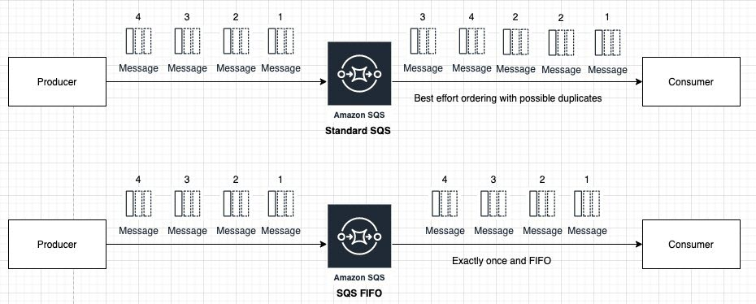
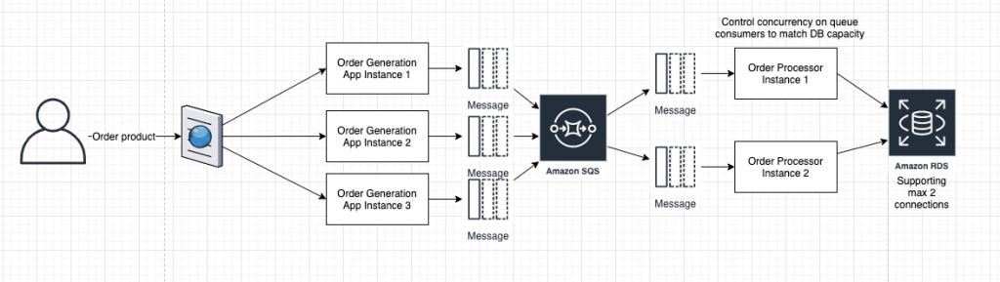
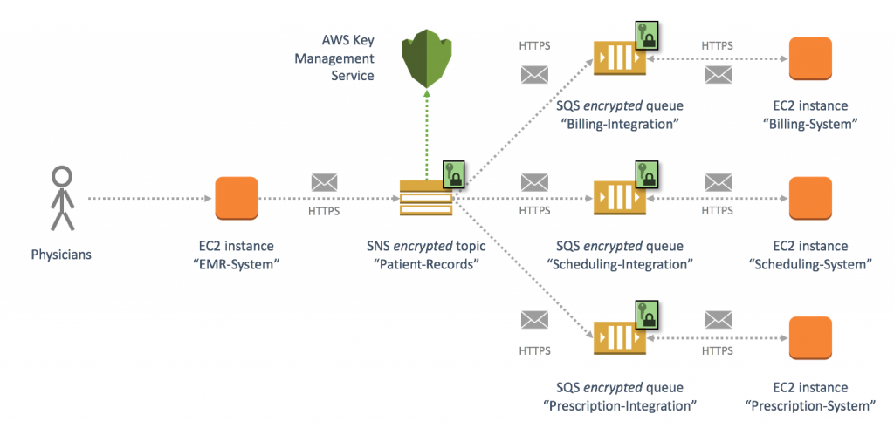
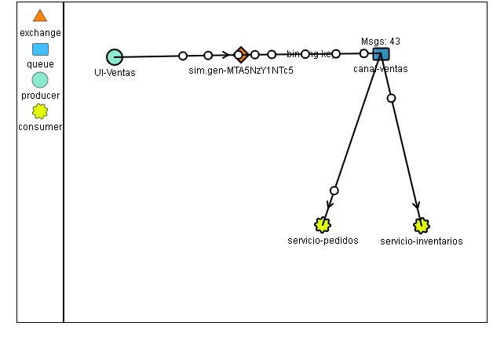
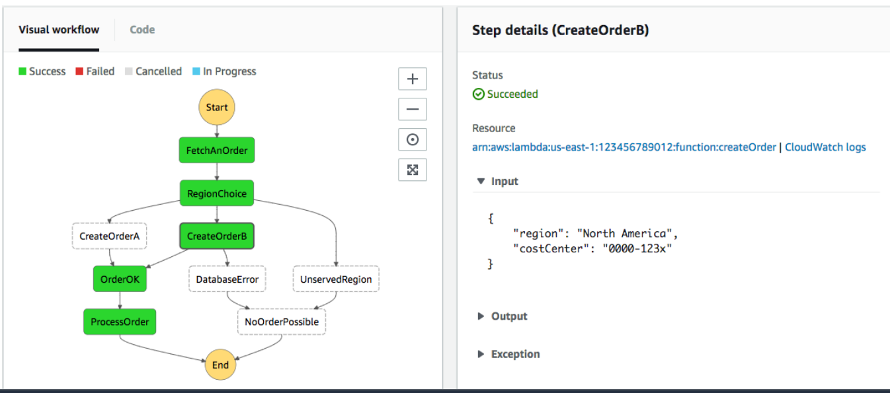

# Prework

# Introducción
Hay varios tópicos en AWS más avanzados, los anteriores fueron los bloque fundamentales que toda la nube de AWS está construida. 
Tópicos avanzados de AWS se construyen y manejan sobre los tópicos básicos, se dará por hecho que los tópicos básicos se conocen por lo que no se profundizará en ellos al ser mencionados.

# 1. Objetivo 🎯
- Conocer los mecanismos para comunicación básica entre servicios de AWS.
- Conocer los mecanismos para monitoreo, configuración y cumplimiento de normas y estándares.

# 2. Instrucciones 📋
- Se debe leer el contenido en un ambiente libre de distractores físicos y electrónicos atendiendo a los enlaces en el texto.

# 3. Desarrollo 📑

# App Integration Services

- Amazon SQS:
* Servicio de colas de mensajes especialmente útil en sistemas distribuidos, de microservicios y serverless totalmente administrado, no hay que preocuparse por mantener servidores y recursos para que funcione, escala de forma automática pasando de 1 mensaje a millones de mensajes sin esfuerzo. La característica principal brindada a las aplicaciones desarrolladas es el desacople entre componentes y manejo de tareas asíncronas, precisamente el hecho de asincronismo es la característica principal de SQS ya que los clientes deben estar preguntando a SQS constante por la llegada de nuevos mensajes para procesar en un modelo de sondeo.
El principio de funcionamiento es sencillo, se ven involucrados solo tres actores, el primero es el _productor_; es encargado de generar información, el siguiente es la _cola de mensaje_ en ella se guardan los mensajes hasta que un _consumidor_ se conecte a la cola para recuperar los mensajes y procesarlos.
Los mensajes se basan en dos modelos, el modelo FIFO y el modelo estándar, en el primero se garantiza que así como llegan los mensajes a SQS en ese orden saldrán (First Input First Output), mientras en el segundo no se garantiza.

¿En qué casos de uso es útil?
Un sistema de e-commerce puede manejar millones de transacciones en temporadas como el buen fin, se pueden ir guardando todas las ordenes de compra de los clientes en SQS para ir siendo procesadas pro múltiples "Order Processors" o _workers_ sin que se sienta como un cuello de botella al cliente final ya que SQS escala automáticamente.

Se recomienda leer el siguiente [artículo](https://aws.amazon.com/es/blogs/compute/solving-complex-ordering-challenges-with-amazon-sqs-fifo-queues/) para profundizar más.

Se integra con otros servicios como DynamoDB, RDS, ECS, Redshift, EC2, S3 y Lambda, especialmente interesante la integración con  Lambda para el procesado de mensajes de forma Serverless, recordar que Lambda y API Gateway escalan automáticamente por lo que no habría en principio cuellos de botella en la aplicación.
El esquema de cobro es basado en el tamaño del mensaje que SQS debe procesar, y las acciones de sondeo, borrado y alta de un mensaje. Las colas de tipo FIFO  y estándar tienen distintos precios, FIFO tiene un precio más alto por el procesamiento extra para garantizar el orden de los mensajes.

- Amazon SNS
* Es el servicio diseñado parara comunicar Aplicaciones y personas mediante el envío de mensajes SMS, push notificaciones y email, también Aplicación a Aplicación por medio del modelo [pub-sub](https://hackernoon.com/publish-subscribe-design-pattern-introduction-to-scalable-messaging-781k3tae) (publicador-suscriptor) hacia SQS,  Lambdas o webhooks con http/https. Al igual que SQS el principal beneficio de SNS es el desacople de aplicaciones, pero a diferencia SNS los clientes no tienen que sondear por mensajes ya que SNS hace push de los mensajes en uno o varios canales (a.k.a temas), los clientes se suscriben a los canales necesarios y comienzan a recibir los mensajes. SNS va bien con aplicaciones que tienen que ver con monitoreo, notificaciones de eventos como cambio de inventarios, baja de productos, detección de anomalías sobre un producto, apps móviles. Para usarlo basta con generar un "tema" (se conoce igual como canal o tópico) se puede ver como una sala de chat, después los clientes se pueden suscribir a este tema para recibir los mensajes (al igual que en un chat dependiendo del tema de interés una persona se suscribirá al canal para recibir todos los mensajes relacionados a él). La naturaleza de SNS es síncrona, por lo que no hay necesidad de hacer sondeos periódicos por parte de los clientes. Una forma conocida y usada de SQS con SNS es usar SNS como receptor de un mensajes con capacidad de entregar mensajes a múltiples colas SQS para ir siendo procesadas por estas al ritmo que cada una requiera. En cuanto a la facturación dependerá de los clientes que se suscriban a los temas o canales, es diferente la entrega de mensajes por medio de email que por SMS. 

El siguiente es un ejemplo como un sistema de historia clínica (Electronic Medical Record) usa SNS y SQS en conjunto para despachar acciones que genera el médico al interactuar con el sistema hacia otros subsistemas o microservicios, en este caso son el servicio de cuentas (Billing), el de Prescripción médica y el sistema de información y recordatorios sobre citas y recordatorios (Scheduling).

- Amazon MQ:
Con el advenimiento de aplicaciones cada vez mas complejas el modelo monolítico ha dejado poco a poco de tener relevancia en la industria, por lo menos en aplicaciones que exigen alta transaccionalidad (decenas de millones de peticiones al día), aquí surgen a la luz las arquitecturas basadas en eventos (Event Driven Architecture EDA). EDA es una forma de arquitectar aplicaciones de forma muy distinta al monolito, en EDA la aplicación es fragmentada en distintos "servicios", cada uno especializado en hacer una cosa, cada uno de estos servicios cuenta con su propia base de datos, su propia interfaz y protocolo de comunicación y sus propias reglas de negocio, incluso puede cada uno estar hecho en lenguajes de programación distintos. Estas características obligan a implementar mecanismos de comunicación eficientes entre cada servicio, un error común es querer comunicar servicios de forma encadenada, donde el servicio A llama al servicio B y el servicio B llama al servicio C, en este caso si el servicio C falla, A y B lo harán también, por lo que la forma de comunicarse debe cambiar, normalmente es hacerlo por medio de un bus de comunicación, un canal al que todos los servicios estan comunicados ya sea mandando mensajes dirigidos a servicios específicos o recibiéndolos para procesarlos. El bus es el eje central de las arquitecturas EDA por lo que tener un bus fiable se vuelve crítico, una de las características de los microservicios es que si uno falla o tiene un rendimiento degradado los otros servicios no tienen que verse afectados, pero si el bus falla toda la aplicación fallaría con el riesgo incluso de inconsistencia de datos.
Para tal uso AWS ofrece un bus de mensajes totalmente administrado, con alta disponibilidad compatible con los buses de mensajería populares en la industria como RabbitMQ y ActiveMQ.
Imaginar un entornos con un aplicativo de ventas en fechas de navidad, el tráfico será muy alto, seguramente el servicio que da vida a la interfaz de la aplicación se verá altamente saturado, en menor medida el sistema de pedidos ya que por cada diez visitas y búsquedas solo cinco se concretan a una venta. La interfaz gráfica donde se hacen los pedidos será el _productor_ (producer) de mensajes (cada mensaje es una orden de compra) y el sistema de pedidos e inventarios serán consumidores, tomarán las ordenes de compra y cada uno ejecutará las tareas para las que fue diseñado para cada orden de compra.

[http://tryrabbitmq.com](http://tryrabbitmq.com)

- Amazon SWF:
SWF es un orquestador o manejador de flujo de tareas entre servicios de aplicaciones distribuidas. SWF puede ayudar a acelerar el desarrollo de aplicaciones en las etapas donde se requiere guardar un estado de la aplicación es decir saber cuales tareas se han completado y cuales siguen su curso siendo no necesario implementar bases de datos y software para el monitoreo, ¿qué sucede con la comunicación de tareas? algunos procesos de negocio requieren que algunas tareas se ejecuten antes que otras por lo que las tareas deben estar al tanto de lo que hacen las otras, el desarrollador se puede ahorrar el desarrollo de canales de comunicación sin comprometer la integridad de la información, otra ventaja es contar con esta lógica de flujo centralizada en un solo lugar con las ventajas de mantenimiento que esto trae. Siguiendo con el seguimiento de estado, algunas aplicaciones requieren en su flujo de operación la aprobación antes de pasar al siguiente flujo, imaginar un sistema de pagos, se generan varias ordenes de pago a proveedores y al final del día el director financiero debe revisarlas y aprobarlas todas, con SWF este estado de "pendientes de aprobar" queda latente hasta que el director financiero explícitamente en la aplicación las pase a estado "aprobado".
Se tienen por un lado los _workers_ y los _deciders_, los primeros se encargan de la ejecución de las tareas y devolución de resultados una ves ejecutada, se pueden ejecutar sobre instancias EC2 o Lambdas, los _deciders_ coordinan la lógica de ejecución definiendo el paso a paso en el procesamiento, por ejemplo, se pueden reintentar tareas en caso de fallas, omitir tareas dada una condición específica por parte de un worker con lo que se puede cambiar el flujo de la aplicación fácilmente. Una gran característica de SWF es el control por medio de su propio SDK de desarrollo, el llamado AWS Flow Framework, con él es posible generar flujos complejos de coordinación de tareas (deciders). Al generar un flujo con el SDK el programa se comunica con SWF para ejecutar los flujos correspondientes en el tiempo preciso.

- AWS Step Functions:
Step functions es un orquestador de tareas para aplicaciones distribuidas generalmente basadas en microservicios. Step Funcions permite de modo visual y/o gráfico ordenar y visualizar los servicios de las aplicaciones en una serie de pasos ordenados en base a los flujos que el negocio requiera. 
Step Funcions en realidad es la implementación comercial de una [_máquina de estados_](https://whatis.techtarget.com/definition/state-machine), cada estado tiene una serie de instrucciones definidas en base a parámetros específicos. La desventaja de Step Funcions ante SWF es que es mas limitado en los casos de uso soportados, Step Funcions se limita a definir el comportamiento de la máquina de estados a un archivo JSON, por lo que modelar flujos complejos y mantenerlos puede llegar a ser una tarea retadora. Ante flujos complejos se recomienda el uso de AWS SWF.

- Amazon AppFlow:
AppFlow permite la integración de SaaS de la industria como Salesforce, Datadog, Slack, Zendesk o ServiceNow con servicios de AWS como S3 o RedShift o incluso con otros SaaS del mercado sin necesidad de contar con personal altamente calificado y esperar meses de desarrollo antes de ver resultados. 
Se basa en el principio de mapeo de información por flujos. Primero habrá que definir un flujo en el que se dicta cuál es el software as a service que se desea conectar, posteriormente se define el destino de la información que será extraída como puede ser un bucket de S3, luego habrá que definir un mapeo entre los datos de origen y destino ya que cada SaaS maneja diferentes esquemas de datos, definido eso se debe especificar si la tarea será una tarea recurrente o bajo demanda, posteriormente se debe especificar bajo que condiciones la información debe ser transferida, por ejemplo se podría configurar solo transferir información de Salesforce hacia un bucket de S3 con todas las ventas mayores a 100,000 USD, o especificar que los datos de una determinada campaña de Google Analitycs se transfieran a [UpSolver](https://www.upsolver.com) para su procesamiento.

- Amazon EventBridge:
EventBridge se puede definir como Serverless Event Bus, se especializa en la escucha de eventos que suceden en los propios servicios de AWS (más de 90) o de terceros, los eventos son por ejemplo el cambio de estado de una instancia EC2, este evento puede ser puesto a disposición de otros servicios por medio de un bus por defecto del servicio o uno hecho a medida hacia el servicio AWS SNS sería posible definir el envío de un mensaje SMS a un número dado si es que alguna instancia es encendida por ejemplo.
Quien define este comportamiento son las reglas de ejecución, en ellas se especifica el evento y por ende el servicio que detonará una regla, se debe especificar si esta regla se debe ejecutar en una periodicidad dada o responda a un evento, después se deberá escoger el tipo de evento que se desea escuchar por ejemplo si se selecciona como fuente un bucket S3 solo se podría especificar la  escucha de eventos PutObject.

[https://aws.amazon.com/es/blogs/mt/bbva-automated-responses-through-event-management-scale/?nc1=b_rp](https://aws.amazon.com/es/blogs/mt/bbva-automated-responses-through-event-management-scale/?nc1=b_rp)

# AWS Messaging Services
- Amazon Pinpoint:
La herramienta de AWS para marketing y engagement de clientes por medio los canales de mensajes SMS, llamadas de voz, email y push notifications. Es compatible con otros servicios de AWS, en general es posible trabajar _campañas_ para uno o varios _segmentos_ de  usuarios, se pueden definir mensajes predeterminados o mensajes basados en atributos para dar una sensación de mensajes personalizados a los clientes.
El envío de mensajes según el segmento permitirá hacer exclusión de clientes, determinar si el envío es de una única vez o periódicamente, se puede programar la hora de envío de mensajes incluso se pueden enviar mensajes según ciertas acciones del usuario, finalmente será posible analizar el comportamiento de los usuarios por ejemplo saber si los emails enviados fueron abiertos y en cuanto tiempo a partir del envío.

- Amazon Kinesis
Streaming data son datos generados continuamente "sin fin" por cientos de fuentes que pueden ser utilizados aun sin necesidad de ser descargados primero. Se puede ver como el agua que fluye en un río, de forma similar, los datos son generados por varios tipos de fuentes en formatos diversos y volúmenes distintos, desde aplicaciones, dispositivos de red, dispositivos IoT, transacciones en sitios web, datos de ubicación, etc. Por ejemplo, cuando un usuario de servicios de transporte privado llama un servicio se genera un stream de datos proveyendo la localización del usuario, por otro lado se debe juntar el stream de datos sobre el tráfico, con ellos se debe poder calcular el precio a cobrar todo en tiempo real. Ese solo fue un ejemplo, los casos de uso típicos son actualización de inventarios, forecasting, monitoreo de logs, actividad de los usuarios, detección de fraude, datos de localización, pool services o servicios en coincidencia (como car pool) combinando localización y presupuestos de los usuarios basados en proximidad, destino y precios. 
Kinesis es el servicio de alta disponibilidad con soporte para manejo de mensajes bajo la arquitectura _producer_ y _consumer_.
Kinesis se subdivide en servicios especializados de acuerdo a necesidades específicas,  Kinesis Data Streams es más acorde para el desarrollo de aplicaciones de streaming de necesidades específicas, incluso el provisionamiento de capacidad de manejo de mensajes es controlado por el administrador, tiene capacidad de retención de datos de hasta siete días, prácticamente diseñado en tiempo real. Kinesis Data Firehose es el servicio listo para ingesta de datos en streaming depositándolos directamente en un lago de datos como S3 o Redshift, indexado de información como Amazon Elasticsearch Service o incluso puntos de enlace http, proveedores como New Relic y Mongo DB también son soportados. Es un servicio totalmente administrado aunque no cuenta con retención de datos, el valor agregado de Firehose es que se pueden modificar o preparar los datos antes de ser cargados en el data lake, aunque esto puede impactar un poco en el performance, Kinesis Data Analytics permite el análisis de datos en tiempo real sobre un stream de datos, se evita esperar horas o días antes de ser procesada la información, en su lugar deberán ser solo segundos o minutos. 
por último Kinesis Video Streams diseñado para la transmisión de vídeo en vivo no solo a otras personas, también a modelos de machine learning para análisis, en tiempos de pandemia se vuelve interesante transmitir vídeo para detectar zonas o puntos rojos donde no se usan mascarillas faciales, al final esos datos se pueden coorrelacionar para formar mapas de calor par establecer un cerco sanitario.

- Agente de mensajes de AWS IoT:
Los agentes de mensajes permiten la transmisión de desde y hacia dispositivos IoT con soporte para protocolos MQTT y WebSockets. 

# Gobierno de cuentas con AWS CloudTrail

# AWS Config: seguridad reactiva

Especializado en auditoría y compliance, de ahí el término seguridad reactiva, básicamente AWS config permite poner en un dashboard todos los servicios utilizados en todas las regiones con el estado de compliance que se se defina en _reglas_ de trabajo. Por ejemplo, es posible definir el escaneo de todas las instancias de EC2 y comprobar que dichas instancias tengan solo el puerto 22 abierto a direcciones IP específicas, de no cumplir con esta regla habrá una alarma en el dashboard.
Hay una forma más eficiente de hacer auditoría de buenas prácticas dependiendo la industria o necesidades, es por medio de  _paquete de conformidad_  (Conformance Pack) , hay una serie de plantillas pre definidas, cada paquete esta compuesta de una regla, lo que hace muy eficiente a la hora de auditar, un ejemplo es el paquete **# Operational Best Practices for PCI DSS 3.2.1** que ayudará en el cumplimiento re las reglas que tienen que ver con el manejo de información de tarjetas de crédito, cuenta con unas 70 reglas a cumplir. 
Actualmente se cuentan con más de 65 paquetes de reglas listos para ser utilizados.
AWS Config se vuelve muy atractivo a la hora de auditar múltiples cuentas de AWS, es posible por medio de un _agregador_ concentrar los datos de otros servicios AWS Config de otras cuentas.
No es la herramienta más atractiva visualmente, pero la facilidad de integración es indiscutible, aunque esto es una de sus mayores desventajas pues solo soporta servicios de AWS, en caso de tener un esquema multicloud habrá que usar herramientas como Splunk o SolarWinds.
Vale la pena usar la herramienta, el hecho de poder tener un inventario de todo lo utilizado que ya es muy bueno se contará con capacidades para guardar todos los cambios de configuraciones que se hagan sobre los recursos, con esa información se puede reducir considerablemente el tiempo de resolución de fallas.

# AWS Systems Manager
System manager es una herramienta para gestión de infraestructura no limitado solo a recursos de AWS, se puede usar para la gestión de servidores on-premise físicos o virtuales.
Se basa en cuatro pilares; monitoreo, auditoría, optimización y ejecución. 

System manager se subdivide en:
- Administración de aplicaciones
* Grupos de recursos: Es una forma de organización de recursos de AWS haciendo fácil la administración de ellos, especialmente útil cuando hay una larga lista de recursos a administrar
* AppConfig: Tiene la capacidad de crear y manejar el despliegue de configuraciones de aplicación, puede ser usado para encender o apagar características de aplicaciones como un anuncio, otro caso de uso es permitir a usuarios de paga acceso a contenido exclusivo.
* Parameter Store: Provee un repositorio seguro de secretos, es posible guardar de forma segura passwords, cadenas de conexión de base de datos, códigos de licencias, etc. Es especialmente útil para incrustar contraseñas o información sensible en scripts, comandos, documentos de system manager y flujos de automatización.

- Administración de operaciones
* Explorador: Es un dashboard que reporta información sobre los recursos de AWS, normalmente incluyendo metadata de instancias EC2.
* OpsCenter: Permite al personal de operaciones manejar incidentes con la ayuda de métricas como utilización de CPU de las instancias EC2, cargos estimados de facturas, status check de instancias, espacio en discos EBS.
* Panel de CloudWatch: Son dashboards configurables que pueden ser usados para monitorear los recursos de AWS en una única vista aún siendo recursos en diferentes regiones.
* Personal Health Dashboard: Provee información sobre la salud de los servicios de AWS, la información se presenta en eventos  programados y en un histórico de eventos de los últimos 90 días.

- Acciones y cambios
* Automatización: Simplifica las tareas de mantenimiento comunes o repetitivas de algunos recursos de AWS entre ellos instancias EC2, permite el manejo de flujos de trabajo por medio de documentos json o yml. Las tareas de automatización pueden ser tan sencillas como apagar instancias, pero al hablar de decenas de instancias separadas por regiones esa simple tarea puede llevar mucho esfuerzo. 
* Cambiar calendario: Se pueden programar tareas de automatización, ¿se requiere un cambio a media madrugada?.
* Periodos de mantenimiento:  Permite definir tareas programadas que pueden potencialmente interrumpir las operaciones como lo son parches de seguridad sobre el sistema operativo o sobre software de aplicativos.

- Instancias y nodos: Provee las siguientes acciones en instancias EC2 o en servidores locales ya sea físicos o  virtuales, además de recursos de AWS.
* Conformidad: Usado para escaneo y comprobación de cumplimiento de parches de seguridad en instancias.
* Inventario: Provee la visibilidad necesaria de la recolección de datos de instancias EC2 o servidores locales. Los datos recolectados son guardados en un bucket S3 y después ser explotados para conocer que instancias están ejecutándose, que instancias requieren algún tipo de actualización por ejemplo. 
* Instancias administradas: Ver y administrar instancias centralizadamente ya sea EC2 o instancias locales incluyendo sistemas operativos Windows, Linux e incluso dispositivos Raspberry Pi. 
* Activaciones híbridas: Es el panel donde se pueden dar de alta recursos externos a AWS, el panel provee un mecanismo de autorización para poder agregar un recurso a AWS System manager de forma segura.
* Session Manager: Permite la conexión a instancias EC2 o servidores locales físicos o virtuales por medio de una consola de línea de comandos en una ventana web sin necesidad de abrir puertos, tener servidores de administración adicionales ni manejo de llaves SSH. Session manager ayuda al cumplimiento de políticas de seguridad corporativas relativas al acceso a recursos.
* Run Command: Permite remotamente manejar la configuración de instancias EC2 o servidores locales físicos o virtuales. Se pueden ejecutar comando relacionados con la construcción de flujos de despliegue de aplicaciones, captura de logs, unión de servidores a un dominio de Windows por ejemplo.
* State Manager: Permite establecer configuraciones específicas para instancias EC2 o servidores externos a AWS, las configuraciones son el estado que se desea mantener, una definición de estado puede establecer que se debe instalar un software específico y además ciertos puertos deben ser cerrados o abiertos.
* Patch Manager: Automatiza el proceso de mantener las instancias con las últimos parches de seguridad, soporta aplicación de parches para Windows, AWS Linux, CentOS, Debian, Red Hat, SUSE Linux y Ubuntu Server.
* Distribuidor: Permite empacar software por ejemplo antivirus, para instalar en instancias manejadas por System Manager. 

- Documentos: Bajo el contexto System Manager un documento (document) es una secuencia de acciones a seguir ya sea en YAML o JSON, con ello se reduce el error humano. Los documentos soportan versionado, se pueden tener documentos de meses anteriores disponibles para usarse en el momento que se requieran. System Manager incluye mas de 100 documentos preconfigurados clasificados en  Command document usados para ejecutar comandos y aplicar configuraciones sobre instancias, Automation document usado para ejecutar tareas de mantenimiento y despliegue, Policy document obligan al seguimiento de políticas de seguridad por último Session document para determinar una sesión de conexión por un túnel ssh o redirección de puertos.

# AWS Organizations y Control Tower

# Shared Responsibility Model

# Integración de datos On-premise

# Procesamiento, análisis de datos y machine learning